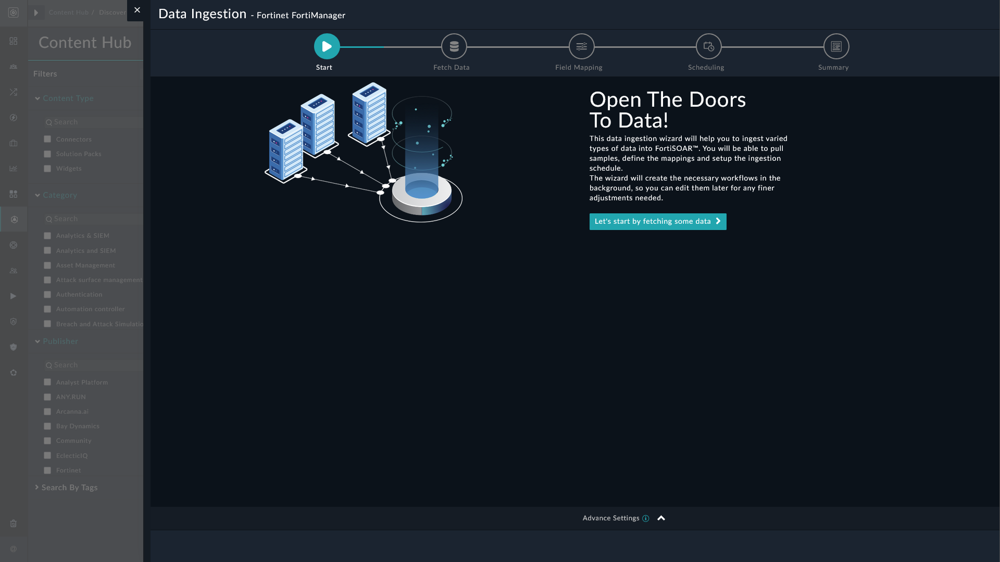
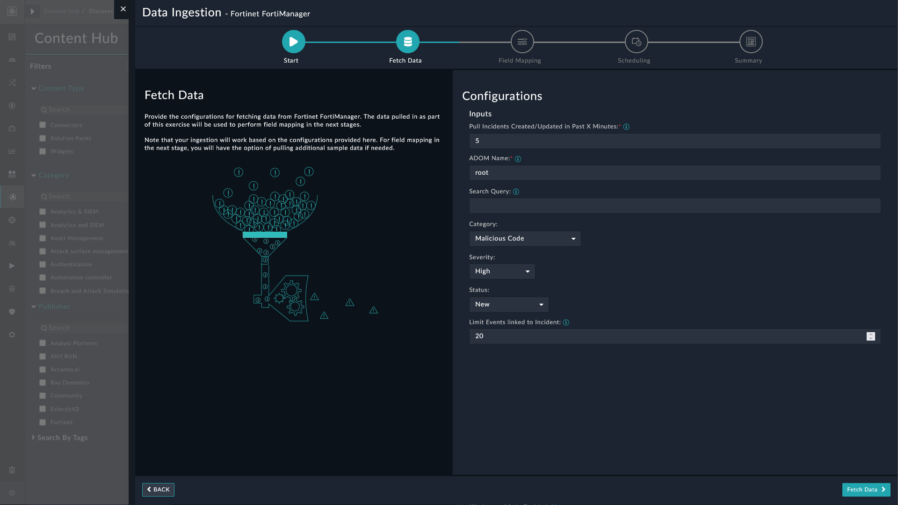
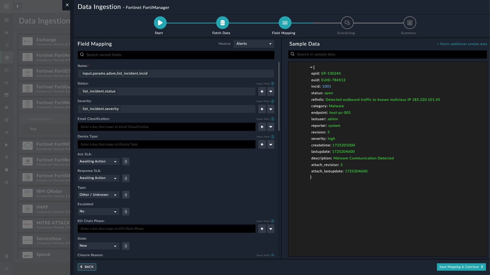
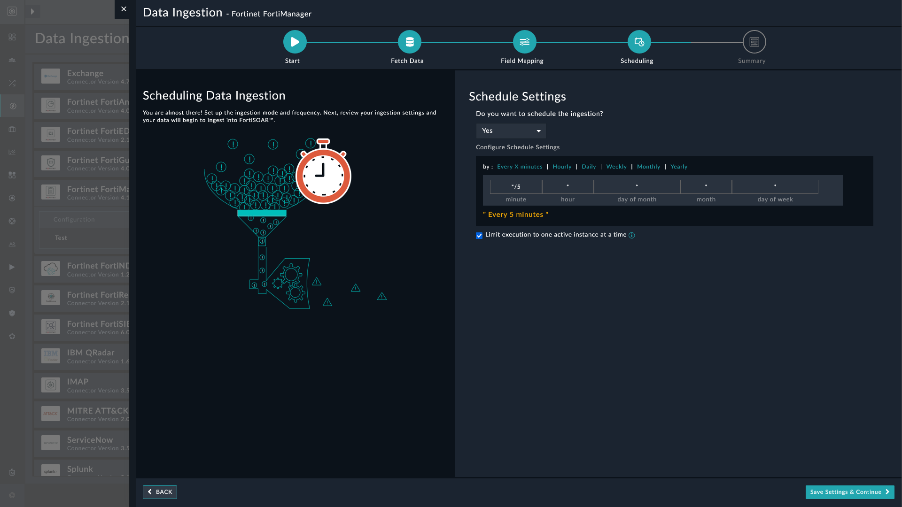
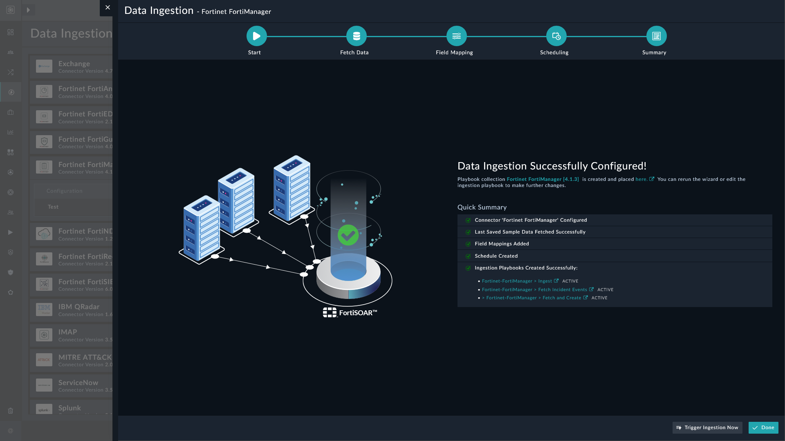

## About the connector

Fortinet FortiManager provides easy centralized configuration, policy-based provisioning, update management, and end-to-end network monitoring for your Fortinet-installed environment.

This document provides information about the Fortinet FortiManager Connector, which facilitates automated interactions with your Fortinet FortiManager server using FortiSOAR playbooks. Add the Fortinet FortiManager connector, as a step in FortiSOAR playbooks and perform automated operations such as retrieving a list of all devices configured on the Fortinet FortiManager server, creating and updating incidents on the Fortinet FortiManager server, and retrieving a list of all incidents from the Fortinet FortiManager server.

You can use FortiSOAR's Data Ingestion Wizard to easily ingest data into FortiSOAR by pulling incidents from Fortinet FortiManager. For more information, see the [Data Ingestion Support](#data-ingestion-support) topic.

### Version information

Connector Version: 4.1.3

FortiSOAR Version Tested on: 7.6.4-5662

Fortinet FortiManager Version Tested on: FortiManager Cloud v7.6.5 build3653 (GA)

Authored By: Fortinet

Certified: Yes

>[!NOTE]
>
>This connector supports ingestion of alerts. For details refer to [Alert Ingestion](#Alert_Ingestion_Support) section
>

### Release Notes for version 4.1.3

The following changes have been made to the Fortinet FortiManager Connector in version 4.1.3:

- Updated the action **Install Policy** to add a new parameter - *Policy Package/Folder Path*

- Updated the action **Re-Install Policy** to add a new parameter - *Reinstall Policy Package*

- Fixed the issue where sessions were logging out after 10 minutes.

- Resolved the nested subfolder issue for the actions **Install Policy** and **Re-install Policy**. These actions now support nested folders; previously, they worked only for a single directory structure.

## Installing the connector

Use the **Content Hub** to install the connector. For the detailed procedure to install a connector, click [here](https://docs.fortinet.com/document/fortisoar/0.0.0/installing-a-connector/1/installing-a-connector).

## Prerequisites to configuring the connector

-   You must have the IP address or hostname of the Fortinet FortiManager server to which you will connect and perform automated operations and credentials (username-password pair) to access that server.
-   You must enable *FortiAnalyzer Features* in FortiManager to perform the following operations:
    -   Create Incident
    -   List Incident
    -   Get Events Related to Incident
    -   Get Events
    -   Get Events Details
    -   Update Incident
-   You must enable the *Administrative Domain* features in FortiManager.
-   The FortiSOAR™ server should have outbound connectivity to port 443 on the Fortinet FortiManager server.
-   You must add the configurations required to block or unblock IP addresses, URLs, or applications in Fortinet FortiManager. For more information, see the [Blocking or Unblocking IP addresses, URLs, or applications in Fortinet FortiManager](#blocking-or-unblocking-ip-addresses-urls-or-applications-in-fortinet-fortimanager) section.

## Minimum Permissions Required

The minimum privileges that require to be assigned to users who are going to use this connector and run actions on Fortinet FortiManager are:

-   Admin Profile - Super User
-   JSON API Access - Read & Write

## Configuring the connector

For the procedure to configure a connector, click [here](https://docs.fortinet.com/document/fortisoar/0.0.0/configuring-a-connector/1/configuring-a-connector).

### Configuration parameters

In FortiSOAR, on the Connectors page, click the **Fortinet FortiManager** connector row (if you are in the **Grid** view on the Connectors page), and in the **Configurations** tab enter the required configuration details.

<table border="1">
    <thead>
        <tr>
            <th>Parameter</th>
            <th>Description</th>
        </tr>
    </thead>
    <tbody>
        <tr>
            <td>Hostname</td>
            <td>IP address or Hostname of the Fortinet FortiManager endpoint server to which you will connect and perform the automated operations.</td>
        </tr>
        <tr>
            <td>Username</td>
            <td>Username to access the Fortinet FortiManager server to which you will connect and perform the automated operations.</td>
        </tr>
        <tr>
            <td>Password</td>
            <td>Password to access the Fortinet FortiManager server to which you will connect and perform the automated operations.</td>
        </tr>
        <tr>
            <td>FortiManager Type</td>
            <td>Select the FortiManager type. You can choose from the following options:
                <ul>
                    <li><strong>FortiManager</strong>: Specify the port number to access the Fortinet FortiManager server in the <strong>Port</strong> field. By default, this is set to 443.</li>
                    <li><strong>FortiManager Cloud</strong>: Specify the client ID to access the Fortinet FortiManager server in the <strong>Client ID</strong> field. By default, this is set to FortiManager. For more information, refer to <a href="https://docs.fortinet.com/document/forticloud/latest/identity-access-management-iam/19322/accessing-fortiapis">Accessing FortiAPIs</a> section in FortiCloud Documentation.</li>
                </ul>
            </td>
        </tr>
        <tr>
            <td>ADOM</td>
            <td>Administrative domain names (ADOMs) of the Fortinet FortiManager server to which you will connect and perform the automated operations. Enter the ADOMs in the CSV or List format.</td>
        </tr>
        <tr>
            <td>Workspace Mode Enabled</td>
            <td>Specifies whether the Workspace(ALL ADOMs) mode is enabled. By default, this option is set to <code>False</code>.</td>
        </tr>
        <tr>
            <td>Verify SSL</td>
            <td>Specifies whether the SSL certificate for the server is to be verified.<br />
                By default, this option is selected, i.e., set to <code>True</code>.</td>
        </tr>
    </tbody>
</table>

## Actions supported by the connector

The following automated operations can be included in playbooks and you can also use the annotations to access operations:

Review the section <a href="#unsupported-actions">Unsupported Actions</a> for the list of actions not supported by FortiManager Cloud.

<table border="1">
    <thead>
        <tr>
            <th>Function</th>
            <th>Description</th>
            <th>Annotation and Category</th>
        </tr>
    </thead>
    <tbody>
        <tr>
            <td>Create Incident</td>
            <td>Creates an incident in Fortinet FortiManager based on the reporter name, endpoint name, and other input parameters you have specified.</td>
            <td>create_incident<br />
                Investigation</td>
        </tr>
        <tr>
            <td>List Incident</td>
            <td>Retrieves a list of all incidents or a specific incident from Fortinet FortiManager based on the search parameters you have specified.</td>
            <td>get_incidents<br />
                Investigation</td>
        </tr>
        <tr>
            <td>Get Events Related to Incident</td>
            <td>Retrieves details of events associated with a Fortinet FortiManager incident, based on the incident ID and other input parameters you have specified.</td>
            <td>get_incident_events<br />
                Investigation</td>
        </tr>
        <tr>
            <td>Get Device List</td>
            <td>Retrieves a list of devices from Fortinet FortiManager based on the search parameters you have specified.
                <p><strong>NOTE</strong>: If a parameter is left blank or null, then this operation will return devices matching all values.</p>
            </td>
            <td>get_devices<br />
                Investigation</td>
        </tr>
        <tr>
            <td>Get Events</td>
            <td>Retrieves a list of events from Fortinet FortiManager based on the search parameters you have specified.
                <p><strong>Note</strong>: If a parameter is left blank or null, then this operation will return events matching all values.</p>
            </td>
            <td>get_alert_event<br />
                Investigation</td>
        </tr>
        <tr>
            <td>Get Event Details</td>
            <td>Retrieves a list of event details (logs) from Fortinet FortiManager based on the alert IDs and other search parameters you have specified.</td>
            <td>get_alert_logs<br />
                Investigation</td>
        </tr>
        <tr>
            <td>Update Incident</td>
            <td>Update an incident in Fortinet FortiManager based on the incident ID and other input parameters you have specified.</td>
            <td>update_incident<br />
                Investigation</td>
        </tr>
        <tr>
            <td>List ADOM Policy Package</td>
            <td>Retrieves a list of all ADOM policy packages or a specific ADOM policy package from Fortinet FortiManager based on the search parameters you have specified.</td>
            <td>get_adom_policy_package<br />
                Investigation</td>
        </tr>
        <tr>
            <td>List ADOM Firewall Policies</td>
            <td>Retrieves a list of all ADOM firewall policies or a specific ADOM firewall policy from Fortinet FortiManager based on the search parameters you have specified.</td>
            <td>get_adom_policy<br />
                Investigation</td>
        </tr>
        <tr>
            <td>ADOM Level Get Blocked IP Addresses</td>
            <td>Retrieves a list of ADOM-level IP Addresses that are blocked on Fortinet FortiGate through Fortinet FortiManager based on the firewall policy, address group name, and other input parameters you have specified.</td>
            <td>get_blocked_ip<br />
                Investigation</td>
        </tr>
        <tr>
            <td>ADOM Level Block IP Address</td>
            <td>Blocks IP addresses at the ADOM level on Fortinet FortiGate based on the Firewall policy, address group name, and other input parameters you have specified.</td>
            <td>block_ip<br />
                Containment</td>
        </tr>
        <tr>
            <td>ADOM Level Unblock IP Address</td>
            <td>Unblocks IP addresses at the ADOM level on Fortinet FortiGate based on the Firewall policy, address group name, and other input parameters you have specified.</td>
            <td>unblock_ip<br />
                Remediation</td>
        </tr>
        <tr>
            <td>Re-install Policy</td>
            <td>Reinstalls a Firewall Policy in Fortinet FortiManager based on the ADOM Name and policy package name you have specified.</td>
            <td>reinstall_policy<br />
                Investigation</td>
        </tr>
        <tr>
            <td>List Global Policy Package</td>
            <td>Retrieves a list of all policy packages or a specific policy package from Fortinet FortiManager based on the search parameters you have specified.</td>
            <td>get_global_policy_package<br />
                Investigation</td>
        </tr>
        <tr>
            <td>List Global Firewall Policies</td>
            <td>Retrieves a list of all global firewall policies or a specific firewall policy from Fortinet FortiManager based on the search parameters you have specified.</td>
            <td>get_global_policy<br />
                Investigation</td>
        </tr>
        <tr>
            <td>Global Level Get Blocked IP Addresses</td>
            <td>Retrieves a list of Global (header/footer policy) level IP Addresses that are blocked on Fortinet FortiGate through Fortinet FortiManager based on the firewall policy, address group name, and other input parameters you have specified.</td>
            <td>get_blocked_ip<br />
                Investigation</td>
        </tr>
        <tr>
            <td>Global Level Block IP Address</td>
            <td>Blocks IP addresses at the global level on Fortinet FortiGate based on the firewall header/footer policy, address group name, and other input parameters you have specified.</td>
            <td>block_ip<br />
                Containment</td>
        </tr>
        <tr>
            <td>Global Level Unblock IP Address</td>
            <td>Unblocks IP addresses at the global level on Fortinet FortiGate based on the firewall header/footer policy, address group name, and other input parameters you have specified.</td>
            <td>unblock_ip<br />
                Remediation</td>
        </tr>
        <tr>
            <td>Assign Global Policy Package</td>
            <td>Assigns a global policy package to ADOM packages in Fortinet FortiManager based on the policy package name, ADOM devices, and other input parameters you have specified.</td>
            <td>global_assign_policy<br />
                Investigation</td>
        </tr>
        <tr>
            <td>Get Device Groups List</td>
            <td>Retrieves a list of all device groups or a specific device group from Fortinet FortiManager based on the level type and other search parameters you have specified.</td>
            <td>get_device_groups<br />
                Investigation</td>
        </tr>
        <tr>
            <td>Create Address</td>
            <td>Creates an address in Fortinet FortiManager based on the address name, level type, and other input parameters you have specified.</td>
            <td>create_address<br />
                Investigation</td>
        </tr>
        <tr>
            <td>Get Addresses List</td>
            <td>Retrieves a list of addresses or a specific address from Fortinet FortiManager based on the level type and other search parameters you have specified.</td>
            <td>get_addresses<br />
                Investigation</td>
        </tr>
        <tr>
            <td>Update Address</td>
            <td>Updates an address in Fortinet FortiManager based on the address name, level type, and other input parameters you have specified.</td>
            <td>update_address<br />
                Investigation</td>
        </tr>
        <tr>
            <td>Delete Address</td>
            <td>Deletes an address from Fortinet FortiManager based on the level type you have specified.</td>
            <td>delete_address<br />
                Investigation</td>
        </tr>
        <tr>
            <td>Create Address Group</td>
            <td>Creates an address group in Fortinet FortiManager based on the address name, level type, and other input parameters you have specified.</td>
            <td>create_address_group<br />
                Investigation</td>
        </tr>
        <tr>
            <td>Get Address Groups List</td>
            <td>Retrieves a list of address groups or a specific address group from Fortinet FortiManager based on the level type and other search parameters you have specified.</td>
            <td>get_address_groups<br />
                Investigation</td>
        </tr>
        <tr>
            <td>Update Address Group</td>
            <td>Updates an existing address group in Fortinet FortiManager based on the level type, method, and other input parameters you have specified.</td>
            <td>update_address_group<br />
                Investigation</td>
        </tr>
        <tr>
            <td>Delete Address Group</td>
            <td>Deletes an address group from Fortinet FortiManager based on the level type you have specified.</td>
            <td>delete_address_group<br />
                Investigation</td>
        </tr>
        <tr>
            <td>Get Service Categories List</td>
            <td>Retrieves a list of service categories or a specific service category from Fortinet FortiManager based on the level type and other search parameters you have specified.</td>
            <td>get_service_categories<br />
                Investigation</td>
        </tr>
        <tr>
            <td>Create Service Group</td>
            <td>Creates a service group in Fortinet FortiManager based on the level type, members, and other input parameters you have specified.</td>
            <td>create_service_group<br />
                Investigation</td>
        </tr>
        <tr>
            <td>Get Service Groups List</td>
            <td>Retrieves a list of service groups or a specific service group from Fortinet FortiManager based on the level type and other search parameters you have specified.</td>
            <td>get_service_group<br />
                Investigation</td>
        </tr>
        <tr>
            <td>Update Service Group</td>
            <td>Updates an existing service group in Fortinet FortiManager based on the level type, method, and other input parameters you have specified.</td>
            <td>update_service_group<br />
                Investigation</td>
        </tr>
        <tr>
            <td>Delete Service Group</td>
            <td>Deletes a service group from Fortinet FortiManager based on the level type you have specified.</td>
            <td>delete_service_group<br />
                Investigation</td>
        </tr>
        <tr>
            <td>Create Custom Service</td>
            <td>Creates a custom service in Fortinet FortiManager based on the level type and other input parameters you have specified.</td>
            <td>create_custom_service<br />
                Investigation</td>
        </tr>
        <tr>
            <td>Get Custom Services List</td>
            <td>Retrieves a list of custom services or a specific custom service from Fortinet FortiManager based on the level type and other search parameters you have specified.</td>
            <td>get_custom_service<br />
                Investigation</td>
        </tr>
        <tr>
            <td>Update Custom Service</td>
            <td>Updates an existing custom service in Fortinet FortiManager based on the level type and other input parameters you have specified.</td>
            <td>update_custom_service<br />
                Investigation</td>
        </tr>
        <tr>
            <td>Delete Custom Service</td>
            <td>Deletes a custom service from Fortinet FortiManager based on the level type you have specified.</td>
            <td>delete_custom_service<br />
                Investigation</td>
        </tr>
        <tr>
            <td>Create Policy Package</td>
            <td>Creates a policy package in Fortinet FortiManager based on the level type, package type, and other input parameters you have specified.</td>
            <td>create_policy_package<br />
                Investigation</td>
        </tr>
        <tr>
            <td>Update Policy Package</td>
            <td>Updates a policy package in Fortinet FortiManager based on the level type and other input parameters you have specified.</td>
            <td>update_policy_package<br />
                Investigation</td>
        </tr>
        <tr>
            <td>Delete Policy Package</td>
            <td>Deletes a policy package from Fortinet FortiManager based on the level type and other input parameters you have specified.</td>
            <td>delete_policy_package<br />
                Investigation</td>
        </tr>
        <tr>
            <td>Create Firewall Policy</td>
            <td>Creates a firewall policy in Fortinet FortiManager based on the level type, package type, policy package name, and other input parameters you have specified.</td>
            <td>create_policy<br />
                Investigation</td>
        </tr>
        <tr>
            <td>Update Firewall Policy</td>
            <td>Updates a firewall policy in Fortinet FortiManager based on the level type, package type, policy package name, and other input parameters you have specified.</td>
            <td>update_policy<br />
                Investigation</td>
        </tr>
        <tr>
            <td>Delete Firewall Policy</td>
            <td>Deletes a firewall policy in Fortinet FortiManager based on the level type, policy ID, policy package name, and other input parameters you have specified.</td>
            <td>delete_policy<br />
                Investigation</td>
        </tr>
        <tr>
            <td>Move Firewall Policy</td>
            <td>Moves a firewall policy in Fortinet FortiManager based on the level type, policy ID, policy package name, target, and other input parameters you have specified.</td>
            <td>move_policy<br />
                Investigation</td>
        </tr>
        <tr>
            <td>Get Dynamic Interface List</td>
            <td>Retrieves a list of all dynamic interfaces or a specific dynamic interface from Fortinet FortiManager based on the level type and other search parameters you have specified.</td>
            <td>get_dynamic_interface<br />
                Investigation</td>
        </tr>
        <tr>
            <td>Install Policy</td>
            <td>Installs a policy package on Fortinet FortiManager based on the ADOM, policy package name, and other input parameters you have specified.</td>
            <td>install_policy<br />
                Investigation</td>
        </tr>
        <tr>
            <td>Get Installation Policy Package Status</td>
            <td>Retrieves the status of installation for a specific policy package from Fortinet FortiManager based on the task ID you have specified.</td>
            <td>install_policy_status<br />
                Investigation</td>
        </tr>
        <tr>
            <td>Create LDAP Server</td>
            <td>Creates an LDAP server in Fortinet FortiManager based on the level type, LDAP server name, username, password, and other input parameters you have specified.</td>
            <td>create_ldap_server<br />
                Investigation</td>
        </tr>
        <tr>
            <td>Get LDAP Server List</td>
            <td>Retrieves a list of LDAP servers or a specific LDAP server from Fortinet FortiManager based on the level type and other search parameters you have specified.</td>
            <td>get_ldap_server<br />
                Investigation</td>
        </tr>
        <tr>
            <td>Update LDAP Server</td>
            <td>Updates an LDAP server in Fortinet FortiManager based on the level type, LDAP server name, and other input parameters you have specified.</td>
            <td>update_ldap_server<br />
                Investigation</td>
        </tr>
        <tr>
            <td>Delete LDAP Server</td>
            <td>Deletes an LDAP server from Fortinet FortiManager based on the level type, LDAP server name, and other input parameters you have specified.</td>
            <td>delete_ldap_server<br />
                Investigation</td>
        </tr>
        <tr>
            <td>Create User Group</td>
            <td>Creates a user group in Fortinet FortiManager based on the level type, group name, members list, and other input parameters you have specified.</td>
            <td>create_user_group<br />
                Investigation</td>
        </tr>
        <tr>
            <td>Get User Groups List</td>
            <td>Retrieves a list of all user groups or a specific user group from Fortinet FortiManager based on the level type and other search parameters you have specified.</td>
            <td>get_user_group<br />
                Investigation</td>
        </tr>
        <tr>
            <td>Update User Group</td>
            <td>Updates a user group in Fortinet FortiManager based on the level type, group name, change in the members' list, and other input parameters you have specified.</td>
            <td>update_user_group<br />
                Investigation</td>
        </tr>
        <tr>
            <td>Delete User Group</td>
            <td>Deletes a user group from Fortinet FortiManager based on the level type, group name, and other input parameters you have specified.</td>
            <td>delete_user_group<br />
                Investigation</td>
        </tr>
        <tr>
            <td>Get SSL VPN Settings</td>
            <td>Retrieves SSL VPN settings from Fortinet FortiManager based on the device name, VDOM, and other search parameters you have specified.</td>
            <td>get_ssl_vpn<br />
                Investigation</td>
        </tr>
        <tr>
            <td>Update SSL VPN Settings</td>
            <td>Updates an SSL VPN settings in Fortinet FortiManager based on the device name, VDOM, and input search parameters you have specified.</td>
            <td>update_ssl_vpn<br />
                Investigation</td>
        </tr>
        <tr>
            <td>Get Web Filter List</td>
            <td>Retrieves a list of web filters from Fortinet FortiManager based on the level type and other search parameters you have specified.</td>
            <td>get_web_filter<br />
                Investigation</td>
        </tr>
        <tr>
            <td>Get Blocked URLs</td>
            <td>Retrieves a list of URLs that are blocked on Fortinet FortiManager based on the specified web filter profile name, level type, and other search parameters you have specified.</td>
            <td>get_blocked_urls<br />
                Investigation</td>
        </tr>
        <tr>
            <td>Block URL</td>
            <td>Blocks URLs on Fortinet FortiManager using the Web Filter Profile Name you have specified.</td>
            <td>block_url<br />
                Containment</td>
        </tr>
        <tr>
            <td>Unblock URL</td>
            <td>Unblocks URLs on Fortinet FortiManager using the Web Filter Profile Name you have specified.</td>
            <td>unblock_url<br />
                Remediation</td>
        </tr>
        <tr>
            <td>Get Applications Detail</td>
            <td>Retrieves a list of all application names and associated details from the Fortinet FortiManager server.</td>
            <td>get_app_details<br />
                Investigation</td>
        </tr>
        <tr>
            <td>Get Applications Control List</td>
            <td>Retrieves a list of control profiles from Fortinet FortiManager based on the level type and other search parameters you have specified.</td>
            <td>get_application_control_list<br />
                Investigation</td>
        </tr>
        <tr>
            <td>Get Blocked Applications</td>
            <td>Retrieves a list of application names that are blocked on Fortinet FortiManager based on the specified application control name, level type, and other search parameters you have specified.</td>
            <td>get_blocked_app<br />
                Investigation</td>
        </tr>
        <tr>
            <td>Block Application</td>
            <td>Blocks applications on Fortinet FortiManager using the Application Control Profile Name you have specified.</td>
            <td>block_application<br />
                Containment</td>
        </tr>
        <tr>
            <td>Unblock Application</td>
            <td>Unblocks applications on Fortinet FortiManager using the Application Control Profile Name you have specified.</td>
            <td>unblock_applications<br />
                Remediation</td>
        </tr>
    </tbody>
</table>

## Unsupported Actions

<p>The following actions are not supported in FortiManager Cloud:</p>

<ul>
    <li>Create Incident</li>
    <li>List Incident</li>
    <li>Get Events Related to Incident</li>
    <li>Get Events</li>
    <li>Get Event Details</li>
    <li>Update Incident</li>
    <li>List Global Policy Package</li>
    <li>List Global Firewall Policies</li>
    <li>Global Level Get Blocked IP Addresses</li>
    <li>Global Level Block IP Address</li>
    <li>Global Level Unblock IP Address</li>
    <li>Assign Global Policy Package</li>
</ul>

>[!NOTE]
>Since these actions are also required for the *Data Ingestion* functionality, hence Data Ingestion will not work with Fortinet FortiManager Cloud.

### operation: Create Incident

#### Input parameters

<table border="1">
    <thead>
        <tr>
            <th>Parameter</th>
            <th>Description</th>
        </tr>
    </thead>
    <tbody>
        <tr>
            <td>ADOM</td>
            <td>(Optional) Specify the administrative domain name (ADOM) of the Fortinet FortiManager server to which you will connect and perform the automated operations. The ADOM that you specify here overwrites the ADOM that you have specified in the <strong>Connector Configuration</strong> as a configuration parameter.</td>
        </tr>
        <tr>
            <td>Reporter</td>
            <td>Specify the name of the reporter of the incident that you want to create in Fortinet FortiManager. For example, admin.</td>
        </tr>
        <tr>
            <td>Endpoint Name</td>
            <td>Specify the details of the endpoint affected by the incident that you want to create in Fortinet FortiManager. For example, <code>11.XXX.YY.Z/32 (11.XXX.YY.Z) or 11.XXX.YY.Z/32 (Emp1 Laptop).</code></td>
        </tr>
        <tr>
            <td>Endpoint ID</td>
            <td>(Optional) Specify the endpoint ID that you want to assign to the incident you want to create in Fortinet FortiManager.</td>
        </tr>
        <tr>
            <td>End User ID</td>
            <td>(Optional) Specify the end-user ID that you want to assign to the incident you want to create in Fortinet FortiManager.</td>
        </tr>
        <tr>
            <td>Category</td>
            <td>(Optional) Select the category you want to assign to the incident you want to create in Fortinet FortiManager. You can select from the following options:
                <ul>
                    <li>Unauthorized access</li>
                    <li>Denial of Service</li>
                    <li>Malicious Code</li>
                    <li>Improper Usage</li>
                    <li>Scans/Probes/Attempted Access</li>
                    <li>Uncategorized</li>
                </ul>
            </td>
        </tr>
        <tr>
            <td>Severity</td>
            <td>(Optional) Select the severity level you want to assign to the incident you want to create in Fortinet FortiManager. You can select from the following options:
                <ul>
                    <li>High</li>
                    <li>Medium</li>
                    <li>Low</li>
                </ul>
                </td>
        </tr>
        <tr>
            <td>Status</td>
            <td>(Optional) Select the status you want to assign to the incident you want to create in Fortinet FortiManager. You can select from the following options:
                <ul>
                    <li>New</li>
                    <li>Analysis</li>
                    <li>Response</li>
                    <li>Closed: Remediated</li>
                    <li>Closed: False Positive</li>
                </ul>
            </td>
        </tr>
        <tr>
            <td>Description</td>
            <td>(Optional) Specify the description of the new incident that you want to create in Fortinet FortiManager.</td>
        </tr>
    </tbody>
</table>

#### Output

The output contains the following populated JSON schema:

```
{
    "jsonrpc": "",
    "id": "",
    "result": {
        "incid": ""
    }
}
```

### operation: List Incident

#### Input parameters

<p><strong>NOTE</strong>: All the input parameters are optional. However, if you do not specify any parameter, then no filter criterion is applied, and an unfiltered list is returned.</p>

<table border="1">
    <thead>
        <tr>
            <th>Parameter</th>
            <th>Description</th>
        </tr>
    </thead>
    <tbody>
        <tr>
            <td>ADOM</td>
            <td>Specify the administrative domain name (ADOM) of the Fortinet FortiManager server to which you will connect and perform the automated operations. The ADOM that you specify here overwrites the ADOM that you have specified in the <strong>Connector Configuration</strong> as a configuration parameter.</td>
        </tr>
        <tr>
            <td>Incident ID</td>
            <td>Specify the ID of incidents in CSV or list format to retrieve from Fortinet FortiManager.</td>
        </tr>
        <tr>
            <td>Detail Level</td>
            <td>Select the level of detail of the incidents to retrieve from Fortinet FortiManager. You can select from following options:
                <ul>
                    <li>Basic</li>
                    <li>Standard</li>
                    <li>Extended</li>
                </ul>
                By default, this is set to <strong>Standard</strong>.
            </td>
        </tr>
        <tr>
            <td>Filter</td>
            <td>Specify the query using which to filter incidents being retrieved from Fortinet FortiManager. The query is in the format:
                <pre>field_name="field_value"</pre>
                For example:
                <pre>category="CAT2" and severity="medium"</pre>
            </td>
        </tr>
        <tr>
            <td>Sort By</td>
            <td>Select <em>Field</em> as the sorting criteria to order the results and specify values in the following fields:
                <ul>
                    <li><strong>Field</strong>: Specify the name of the field on which to sort the results. For example: severity or category.</li>
                    <li><strong>Order</strong>: Select the order in which to sort the results. You can select from following options:
                        <ul>
                            <li>Ascending (default)</li>
                            <li>Descending</li>
                        </ul>
                    </li>
                </ul>
            </td>
        </tr>
        <tr>
            <td>Limit</td>
            <td>Specify the maximum number of records that this operation should return. Values supported are:
            <ul>
                <li><strong>Default:<code>"50"</code></strong></li>
                <li><strong>Minimum:<code>"1"</code></strong></li>
                <li><strong>Maximum:<code>"2000"</code></strong></li>
            </ul>
        </td>
        </tr>
        <tr>
            <td>Offset</td>
            <td>(Optional) Specify the offset value to retrieve a subset of records that starts from the offset value. The offset works with the <em>Limit</em> parameter, which determines how many records to retrieve starting from the offset. Values supported are:
                <ul>
                    <li><strong>Default:<code>"0"</code></strong></li>
                    <li><strong>Minimum:<code>"0"</code></strong></li>
                </ul>
            </td>
        </tr>
    </tbody>
</table>

#### Output

The output contains the following populated JSON schema:

Output schema when you select <em>Detail Level</em> as <em><strong>Basic</strong></em>

```
{
    "jsonrpc": "",
    "id": "",
    "result": {
        "status": {
            "code": "",
            "message": ""
        },
        "detail-level": "",
        "data": [
            {
                "attach_revision": "",
                "attach_lastupdate": "",
                "lastupdate": "",
                "revision": "",
                "incid": ""
            }
        ]
    }
}
```

Output schema when you select <em>Detail Level</em> as <em><strong>Extended</strong></em>

```
{
    "result": {
        "data": [
            {
                "endpoint": "",
                "euname": "",
                "epip": "",
                "status": "",
                "incid": "",
                "attachments": [
                    {
                        "lastupdate": "",
                        "attachid": "",
                        "revision": ""
                    }
                ],
                "lastupdate": "",
                "osversion": "",
                "attach_lastupdate": "",
                "euid": "",
                "category": "",
                "epid": "",
                "epname": "",
                "revision": "",
                "reporter": "",
                "createtime": "",
                "description": "",
                "osname": "",
                "mac": "",
                "lastuser": "",
                "severity": "",
                "attach_revision": "",
                "refinfo": ""
            }
        ],
        "detail-level": "",
        "status": {
            "message": "",
            "code": ""
        }
    },
    "id": "",
    "jsonrpc": ""
}
```

This is the default output schema:

```
{
    "result": {
        "data": [
            {
                "endpoint": "",
                "reporter": "",
                "createtime": "",
                "description": "",
                "status": "",
                "incid": "",
                "severity": "",
                "lastuser": "",
                "attach_lastupdate": "",
                "lastupdate": "",
                "euid": "",
                "attach_revision": "",
                "category": "",
                "refinfo": "",
                "epid": "",
                "revision": ""
            }
        ],
        "detail-level": "",
        "status": {
            "message": "",
            "code": ""
        }
    },
    "id": "",
    "jsonrpc": ""
}
```

### operation: Get Events Related to Incident

#### Input parameters

<table border="1">
    <thead>
        <tr>
            <th>Parameter</th>
            <th>Description</th>
        </tr>
    </thead>
    <tbody>
        <tr>
            <td>ADOM</td>
            <td>(Optional) Specify the administrative domain name (ADOM) of the Fortinet FortiManager server to which you will connect and perform the automated operations. The ADOM that you specify here overwrites the ADOM that you have specified in the <strong>Connector Configuration</strong> as a configuration parameter.</td>
        </tr>
        <tr>
            <td>Incident ID</td>
            <td>Specify the ID of the incident whose associated events you want to retrieve from Fortinet FortiManager.</td>
        </tr>
        <tr>
            <td>Attachment Type</td>
            <td>Specify the attachment types that you want to search for in Fortinet FortiManager. Valid types include:
                <ul>
                    <li>Alert Event</li>
                    <li>Log</li>
                    <li>Comment</li>
                    <li>Log Search Filter</li>
                    <li>Upload File</li>
                    <li>Report</li>
                </ul>
            </td>
        </tr>
        <tr>
            <td>Limit</td>
            <td>Specify the maximum number of records that this operation should return. Values supported are:
                <ul>
                    <li><strong>Default:<code>"50"</code></strong></li>
                    <li><strong>Minimum:<code>"1"</code></strong></li>
                    <li><strong>Maximum:<code>"2000"</code></strong></li>
                </ul>
            </td>
        </tr>
        <tr>
            <td>Offset</td>
            <td>(Optional) Specify the offset value to retrieve a subset of records that starts from the offset value. The offset works with the <em>Limit</em> parameter, which determines how many records to retrieve starting from the offset. Values supported are:
                <ul>
                    <li><strong>Default:<code>"0"</code></strong></li>
                    <li><strong>Minimum:<code>"0"</code></strong></li>
                </ul>
            </td>
        </tr>
    </tbody>
</table>

#### Output

The output contains the following populated JSON schema:

```
{
    "result": {
        "data": [
            {
                "attachtype": "",
                "lastupdate": "",
                "incid": "",
                "attachid": "",
                "createtime": "",
                "data": "",
                "lastuser": "",
                "revision": ""
            }
        ],
        "status": {
            "message": "",
            "code": ""
        }
    },
    "id": "",
    "jsonrpc": ""
}
```

### operation: Get Device List

#### Input parameters

<table border="1">
    <thead>
        <tr>
            <th>Parameter</th>
            <th>Description</th>
        </tr>
    </thead>
    <tbody>
        <tr>
            <td>ADOM</td>
            <td>(Optional) Specify the administrative domain name (ADOM) of the Fortinet FortiManager server to which you will connect and perform the automated operations. The ADOM that you specify here overwrites the ADOM that you have specified in the <strong>Connector Configuration</strong> as a configuration parameter.</td>
        </tr>
        <tr>
            <td>Device Name</td>
            <td>Specify the valid device name based on which you want to retrieve details of devices from Fortinet FortiManager.<br />
                <strong>NOTE</strong>: If a parameter is left blank or <code>null</code>, this operation returns devices matching all values.
            </td>
        </tr>
    </tbody>
</table>

#### Output

The output contains the following populated JSON schema:

```
{
    "id": "",
    "cid": "",
    "result": [
        {
            "url": "",
            "status": {
                "code": "",
                "message": ""
            },
            "data": [
                {
                    "os_ver": "",
                    "build": "",
                    "ips_ext": "",
                    "foslic_inst_time": "",
                    "mgmt.__data[5]": "",
                    "lic_region": "",
                    "latitude": "",
                    "foslic_ram": "",
                    "faz.perm": "",
                    "branch_pt": "",
                    "ips_ver": "",
                    "foslic_utm": "",
                    "source": "",
                    "foslic_cpu": "",
                    "mgmt.__data[3]": "",
                    "mgmt.__data[2]": "",
                    "ha_mode": "",
                    "opts": "",
                    "last_resync": "",
                    "foslic_last_sync": "",
                    "conn_status": "",
                    "mgmt.__data[7]": "",
                    "patch": "",
                    "hw_rev_minor": "",
                    "mgmt.__data[1]": "",
                    "psk": "",
                    "checksum": "",
                    "faz.quota": "",
                    "ha_group_id": "",
                    "adm_usr": "",
                    "ha_group_name": "",
                    "faz.used": "",
                    "tunnel_cookie": "",
                    "conf_status": "",
                    "mgmt.__data[6]": "",
                    "last_checked": "",
                    "version": "",
                    "mgmt.__data[0]": "",
                    "ha_slave": "",
                    "name": "",
                    "longitude": "",
                    "platform_str": "",
                    "foslic_dr_site": "",
                    "tunnel_ip": "",
                    "oid": "",
                    "foslic_type": "",
                    "prefer_img_ver": "",
                    "location_from": "",
                    "vm_cpu_limit": "",
                    "mgmt_if": "",
                    "faz.full_act": "",
                    "av_ver": "",
                    "fex_cnt": "",
                    "fsw_cnt": "",
                    "mgmt.__data[4]": "",
                    "vm_mem": "",
                    "sn": "",
                    "logdisk_size": "",
                    "lic_flags": "",
                    "hostname": "",
                    "vm_mem_limit": "",
                    "vdom": [
                        {
                            "tab_status": "",
                            "opmode": "",
                            "name": "",
                            "devid": "",
                            "rtm_prof_id": "",
                            "status": "",
                            "comments": "",
                            "oid": "",
                            "ext_flags": "",
                            "node_flags": "",
                            "vpn_id": "",
                            "flags": ""
                        }
                    ],
                    "tab_status": "",
                    "adm_pass": [],
                    "mgmt_id": "",
                    "beta": "",
                    "dev_status": "",
                    "os_type": "",
                    "vm_lic_expire": "",
                    "mgmt_mode": "",
                    "hdisk_size": "",
                    "ip": "",
                    "vm_status": "",
                    "db_status": "",
                    "mr": "",
                    "module_sn": "",
                    "hw_rev_major": "",
                    "flags": "",
                    "desc": "",
                    "app_ver": "",
                    "maxvdom": "",
                    "vm_cpu": "",
                    "conn_mode": "",
                    "node_flags": "",
                    "fap_cnt": "",
                    "mgt_vdom": ""
                }
            ]
        }
    ]
}
```

### operation: Get Events

#### Input parameters

<p><strong>Note</strong>: All the input parameters are optional. However, if you do not specify any parameter, then no filter criterion is applied, and an unfiltered list is returned.</p>

<table border="1">
    <thead>
        <tr>
            <th>Parameter</th>
            <th>Description</th>
        </tr>
    </thead>
    <tbody>
        <tr>
            <td>ADOM</td>
            <td>Specify the administrative domain name (ADOM) of the Fortinet FortiManager server to which you will connect and perform the automated operations. The ADOM that you specify here overwrites the ADOM that you have specified in the <strong>Connector Configuration</strong> as a configuration parameter.</td>
        </tr>
        <tr>
            <td>Filter</td>
            <td>Specify the filter expression using which you want to retrieve events from Fortinet FortiManager.
                <p><code>'event_value', 'severity', 'triggername', 'count', 'comment' and 'flags'</code> are supported.</p>
                <p>For example, <code>triggername='Local Device Event' and severity&gt;=3 or subject='desc:User login from SSH failed'</code></p>
            </td>
        </tr>
        <tr>
            <td>Time Range</td>
            <td>Select to specify the time range for which you want to retrieve events from Fortinet FortiManager.
                <ul>
                    <li><strong>Start Time</strong>: Specify the start date and time from when you want to retrieve events from Fortinet FortiManager.<br />
                        Consider the timezone as Fortinet FortiAnalyzer's timezone, if the timezone info is not specified.<br />
                        Format: 'yyyy-MM-dd'T'HH:mm:ssZ' (RFC 3339) e.g. '2016-10-17T20:45:37-07:00 or 'yyyy-MM-dd HH:mm:ss' e.g. '2016-10-17 20:45:37'</li>
                    <li><strong>End Time</strong>: Ending DateTime till when you want to retrieve events from Fortinet FortiManager.<br />
                        Consider the timezone as Fortinet FortiAnalyzer's timezone, if the timezone info is not specified.<br />
                        Format: 'yyyy-MM-dd'T'HH:mm:ssZ' (RFC 3339) e.g. '2016-10-17T20:45:37-07:00 or 'yyyy-MM-dd HH:mm:ss' e.g. '2016-10-17 20:45:37'</li>
                </ul>
            </td>
        </tr>
        <tr>
            <td>Limit</td>
            <td>Specify the maximum number of records that this operation should return. Values supported are:
                <ul>
                    <li><strong>Default:<code>"50"</code></strong></li>
                    <li><strong>Minimum:<code>"1"</code></strong></li>
                    <li><strong>Maximum:<code>"2000"</code></strong></li>
                </ul>
            </td>
        </tr>
        <tr>
            <td>Offset</td>
            <td>(Optional) Specify the offset value to retrieve a subset of records that starts from the offset value. The offset works with the <em>Limit</em> parameter, which determines how many records to retrieve starting from the offset. Values supported are:
                <ul>
                    <li><strong>Default:<code>"0"</code></strong></li>
                    <li><strong>Minimum:<code>"0"</code></strong></li>
                </ul>
            </td>
        </tr>
    </tbody>
</table>

#### Output

The output contains the following populated JSON schema:

```
{
    "jsonrpc": "",
    "result": {
        "data": [
            {
                "alerttime": "",
                "triggername": "",
                "devname": "",
                "vdom": "",
                "filterid": "",
                "filterkey": "",
                "devtype": "",
                "eventtype": "",
                "groupby1": "",
                "euid": "",
                "subject": "",
                "devid": "",
                "alertid": "",
                "extrainfo": "",
                "euname": "",
                "epname": "",
                "ackflag": "",
                "logcount": "",
                "filtercksum": "",
                "tag": "",
                "updatetime": "",
                "epid": "1",
                "severity": "",
                "readflag": "",
                "lastlogtime": "",
                "firstlogtime": ""
            }
        ]
    },
    "id": ""
}
```

### operation: Get Event Details

#### Input parameters

<table border="1">
    <thead>
        <tr>
            <th>Parameter</th>
            <th>Description</th>
        </tr>
    </thead>
    <tbody>
        <tr>
            <td>ADOM</td>
            <td>(Optional) Specify the administrative domain name (ADOM) of the Fortinet FortiManager server to which you will connect and perform the automated operations. The ADOM that you specify here overwrites the ADOM that you have specified in the <strong>Connector Configuration</strong> as a configuration parameter.</td>
        </tr>
        <tr>
            <td>Alert ID</td>
            <td>Specify the ID of alerts in CSV or list format whose event details (logs) you want to retrieve from Fortinet FortiManager.<br />
                <strong>Note</strong>: You can find the "Alert IDs" using the "Get Events" action.
            </td>
        </tr>
        <tr>
            <td>Time Order</td>
            <td>Select the order in which you want to sort the result. You can select between <strong>Ascending</strong> or <strong>Descending</strong>. By default, this is set to <strong>Descending</strong>.</td>
        </tr>
        <tr>
            <td>Limit</td>
            <td>Specify the maximum number of records that this operation should return. Values supported are:
                <ul>
                    <li><strong>Default:<code>"50"</code></strong></li>
                    <li><strong>Minimum:<code>"1"</code></strong></li>
                    <li><strong>Maximum:<code>"2000"</code></strong></li>
                </ul>
            </td>
        </tr>
        <tr>
            <td>Offset</td>
            <td>(Optional) Specify the offset value to retrieve a subset of records that starts from the offset value. The offset works with the <em>Limit</em> parameter, which determines how many records to retrieve starting from the offset. Values supported are:
                <ul>
                    <li><strong>Default:<code>"0"</code></strong></li>
                    <li><strong>Minimum:<code>"0"</code></strong></li>
                </ul>
            </td>
        </tr>
    </tbody>
</table>

#### Output

The output contains the following populated JSON schema:

```
{
    "id": "",
    "result": {
        "data": [
            {
                "log_id": "",
                "devname": "",
                "userfrom": "",
                "time": "",
                "dstepid": "",
                "desc": "",
                "user": "",
                "dtime": "",
                "msg": "",
                "type": "",
                "devid": "",
                "dsteuid": "",
                "euid": "",
                "date": "",
                "idseq": "",
                "itime_t": "",
                "epid": "",
                "subtype": "",
                "level": "",
                "itime": ""
            }
        ]
    },
    "jsonrpc": ""
}
```

### operation: Update Incident

#### Input parameters

<table border="1">
    <thead>
        <tr>
            <th>Parameter</th>
            <th>Description</th>
        </tr>
    </thead>
    <tbody>
        <tr>
            <td>ADOM</td>
            <td>(Optional) Specify the administrative domain name (ADOM) of the Fortinet FortiManager server to which you will connect and perform the automated operations. The ADOM that you specify here overwrites the ADOM that you have specified in the <strong>Connector Configuration</strong> as a configuration parameter.</td>
        </tr>
        <tr>
            <td>Incident ID</td>
            <td>Specify the ID of the incident that you want to update in FortiManager.</td>
        </tr>
        <tr>
            <td>Endpoint Name</td>
            <td>Specify the details of the endpoint affected by the incident that you want to update in Fortinet FortiManager. For example, <code>11.XXX.YY.Z/32 (11.XXX.YY.Z) or 11.XXX.YY.Z/32 (Emp1 Laptop).</code></td>
        </tr>
        <tr>
            <td>Endpoint ID</td>
            <td>(Optional) Specify the endpoint ID that you want to assign to the incident you want to update in Fortinet FortiManager.</p>
            </td>
        </tr>
        <tr>
            <td>End User ID</td>
            <td>(Optional) Specify the end-user ID that you want to assign to the incident you want to update in Fortinet FortiManager.</td>
        </tr>
        <tr>
            <td>Category</td>
            <td>(Optional) Select the category you want to assign to the incident you want to update in Fortinet FortiManager. You can select from the following options:
                <ul>
                    <li>Unauthorized access</li>
                    <li>Denial of Service</li>
                    <li>Malicious Code</li>
                    <li>Improper Usage</li>
                    <li>Scans/Probes/Attempted Access</li>
                    <li>Uncategorized</li>
                </ul>
            </td>
        </tr>
        <tr>
            <td>Severity</td>
            <td>(Optional) Select the severity level you want to assign to the incident you want to update in Fortinet FortiManager. You can select from the following options:
                <ul>
                    <li>High</li>
                    <li>Medium</li>
                    <li>Low</li>
                </ul>
            </td>
        </tr>
        <tr>
            <td>Status</td>
            <td>(Optional) Select the status you want to assign to the incident you want to update in Fortinet FortiManager. You can select from the following options:
                <ul>
                    <li>New</li>
                    <li>Analysis</li>
                    <li>Response</li>
                    <li>Closed: Remediated</li>
                    <li>Closed: False Positive</li>
                </ul>
            </td>
        </tr>
        <tr>
            <td>Description</td>
            <td>(Optional) Specify the description of the incident that you want to update in Fortinet FortiManager.</td>
        </tr>
        <tr>
            <td>Last Revision</td>
            <td>(Optional) Specify the last version of the incident that you want to update in Fortinet FortiManager.</td>
        </tr>
        <tr>
            <td>Last User</td>
            <td>(Optional) Specify the last user of the incident that you want to update in Fortinet FortiManager.</td>
        </tr>
    </tbody>
</table>

#### Output

The output contains the following populated JSON schema:

```
{
    "jsonrpc": "",
    "id": "",
    "result": {
        "status": {
            "code": "",
            "message": ""
        }
    }
}
```

### operation: List ADOM Policy Package

#### Input parameters

<p><strong>Note</strong>: All the input parameters are optional. However, if you do not specify any parameter, then no filter criterion is applied, and an unfiltered list is returned.</p>

<table border="1">
    <thead>
        <tr>
            <th>Parameter</th>
            <th>Description</th>
        </tr>
    </thead>
    <tbody>
        <tr>
            <td>ADOM Name</td>
            <td>Specify the ADOM name whose policy package you want to retrieve from Fortinet FortiManager. The ADOM that you specify here overwrites the ADOM that you have specified in the <strong>Connector Configuration</strong> as a configuration parameter.</td>
        </tr>
        <tr>
            <td>Policy Package Name</td>
            <td>Select the policy package name whose details you want to retrieve from Fortinet FortiManager. This parameter makes an API call named <code>list_adom_policy_package</code> to dynamically populate its dropdown selection.</td>
        </tr>
        <tr>
            <td>Policy Package/Folder Path</td>
            <td>Specify the policy package or folder path of the ADOM policy package whose details you want to retrieve from Fortinet FortiManager.</td>
        </tr>
    </tbody>
</table>

#### Output

The output contains the following populated JSON schema:

Output schema when the <strong>Policy Package Name</strong> is not specified

```
{
    "result": [
        {
            "data": [
                {
                    "type": "",
                    "package settings": {
                        "consolidated-firewall-mode": "",
                        "fwpolicy6-implicit-log": "",
                        "fwpolicy-implicit-log": "",
                        "ngfw-mode": "",
                        "central-nat": ""
                    },
                    "oid": "",
                    "name": "",
                    "scope member": [
                        {
                            "vdom": "",
                            "name": ""
                        }
                    ],
                    "obj ver": ""
                }
            ],
            "url": "",
            "status": {
                "code": "",
                "message": ""
            }
        }
    ],
    "id": ""
}
```

This is the default output schema:

```
{
    "id": "",
    "result": [
        {
            "status": {
                "code": "",
                "message": ""
            },
            "data": {
                "obj ver": "",
                "name": "",
                "type": "",
                "scope member": [
                    {
                        "name": "",
                        "vdom": ""
                    }
                ],
                "oid": "",
                "package settings": {
                    "ngfw-mode": "",
                    "consolidated-firewall-mode": "",
                    "fwpolicy6-implicit-log": "",
                    "fwpolicy-implicit-log": "",
                    "central-nat": ""
                }
            },
            "url": ""
        }
    ]
}
```

### operation: List ADOM Firewall Policies

#### Input parameters

<table border="1">
    <thead>
        <tr>
            <th>Parameter</th>
            <th>Description</th>
        </tr>
    </thead>
    <tbody>
        <tr>
            <td>ADOM Name</td>
            <td>(Optional) Specify the ADOM name whose ADOM firewall policy you want to retrieve from Fortinet FortiManager. The ADOM that you specify here overwrites the ADOM that you have specified in the <strong>Connector Configuration</strong> as a configuration parameter.</td>
        </tr>
        <tr>
            <td>Policy Package Name</td>
            <td>Select the policy package name whose firewall policy details you want to retrieve from Fortinet FortiManager. This parameter makes an API call named <code>list_adom_policy_package</code> to dynamically populate its dropdown selection.</td>
        </tr>
        <tr>
            <td>Policy Package/Folder Path</td>
            <td>(Optional) Specify the policy package or folder path of the ADOM firewall policy whose details you want to retrieve from Fortinet FortiManager.</td>
        </tr>
        <tr>
            <td>NGFW Mode</td>
            <td>Select the NGFW mode of the policy package. You can select from following options:
                <ul>
                    <li>Profile Based</li>
                    <li>Policy Based</li>
                </ul>
                By default, it is <em>Profile Based</em>.
            </td>
        </tr>
        <tr>
            <td>Firewall/Security Policy Name</td>
            <td>(Optional) Specify the firewall policy name whose details you want to retrieve from Fortinet FortiManager.</td>
        </tr>
    </tbody>
</table>

#### Output

The output contains the following populated JSON schema:

```
{
    "id": "",
    "cid": "",
    "result": [
        {
            "data": [
                {
                    "fec": "",
                    "oid": "",
                    "sgt": [],
                    "tos": "",
                    "dsri": "",
                    "name": "",
                    "_policy_block": "",
                    "app-group": [],
                    "auto-asic-offload": "",
                    "capture-packet": "",
                    "disclaimer": "",
                    "fsso": "",
                    "inspection-mode": "",
                    "nat": "",
                    "per-ip-shaper": [],
                    "profile-protocol-options": [],
                    "profile-type": "",
                    "reputation-direction": "",
                    "ssl-mirror": "",
                    "ssl-mirror-intf": [],
                    "ssl-ssh-profile": [],
                    "timeout-send-rst": "",
                    "traffic-shaper": [],
                    "traffic-shaper-reverse": [],
                    "utm-status": "",
                    "webcache-https": "",
                    "webproxy-forward-server": [],
                    "webproxy-profile": [],
                    "scim": "",
                    "uuid": "",
                    "wccp": "",
                    "_byte": "",
                    "_pkts": "",
                    "nat46": "",
                    "nat64": "",
                    "natip": [],
                    "users": [],
                    "action": "",
                    "groups": [],
                    "status": "",
                    "dstaddr": [],
                    "dstintf": [],
                    "obj seq": "",
                    "rtp-nat": "",
                    "service": [],
                    "srcaddr": [],
                    "srcintf": [],
                    "comments": "",
                    "dstaddr6": [],
                    "policyid": "",
                    "schedule": [],
                    "srcaddr6": [],
                    "tos-mask": "",
                    "_hitcount": "",
                    "_last_hit": "",
                    "match-vip": "",
                    "sgt-check": "",
                    "_first_hit": "",
                    "_sesscount": "",
                    "logtraffic": "",
                    "scim-users": [],
                    "tos-negate": "",
                    "_global-vpn": [],
                    "anti-replay": "",
                    "app-monitor": "",
                    "fsso-groups": [],
                    "geoip-match": "",
                    "pcp-inbound": "",
                    "port-random": "",
                    "saml-server": [],
                    "scim-groups": [],
                    "session-ttl": "",
                    "ztna-status": "",
                    "_label-color": "",
                    "pcp-outbound": "",
                    "pcp-poolname": [],
                    "vlan-cos-fwd": "",
                    "vlan-cos-rev": "",
                    "vpn_dst_node": "",
                    "vpn_src_node": "",
                    "ztna-ems-tag": [],
                    "_last_session": "",
                    "email-collect": "",
                    "geoip-anycast": "",
                    "policy-expiry": "",
                    "port-preserve": "",
                    "_first_session": "",
                    "dstaddr-negate": "",
                    "match-vip-only": "",
                    "service-negate": "",
                    "src-vendor-mac": [],
                    "srcaddr-negate": "",
                    "tcp-mss-sender": "",
                    "_global-vpn-tgt": "",
                    "cgn-sw-eif-ctrl": "",
                    "dstaddr6-negate": "",
                    "dynamic-shaping": "",
                    "ip-version-type": "",
                    "np-acceleration": "",
                    "permit-any-host": "",
                    "srcaddr6-negate": "",
                    "diffserv-forward": "",
                    "diffserv-reverse": "",
                    "internet-service": "",
                    "logtraffic-start": "",
                    "schedule-timeout": "",
                    "send-deny-packet": "",
                    "tcp-mss-receiver": "",
                    "cgn-session-quota": "",
                    "custom-log-fields": [],
                    "internet-service6": "",
                    "block-notification": "",
                    "cgn-resource-quota": "",
                    "policy-expiry-date": "",
                    "reputation-minimum": "",
                    "_global-label-color": "",
                    "file-filter-profile": [],
                    "fsso-agent-for-ntlm": [],
                    "reputation-minimum6": "",
                    "sctp-filter-profile": [],
                    "ztna-ems-tag-negate": "",
                    "internet-service-src": "",
                    "captive-portal-exempt": "",
                    "delay-tcp-npu-session": "",
                    "internet-service6-src": "",
                    "policy-behaviour-type": "",
                    "radius-ip-auth-bypass": "",
                    "radius-mac-auth-bypass": "",
                    "diameter-filter-profile": [],
                    "tcp-session-without-syn": "",
                    "internet-service-src-name": [],
                    "replacemsg-override-group": [],
                    "internet-service-fortiguard": [],
                    "internet-service6-fortiguard": [],
                    "internet-service-src-fortiguard": [],
                    "internet-service6-src-fortiguard": []
                }
            ],
            "status": {
                "message": "",
                "code": ""
            },
            "url": ""
        }
    ]
}
```

### operation: ADOM Level Get Blocked IP Addresses

#### Input parameters

<table border="1">
    <thead>
        <tr>
            <th>Parameter</th>
            <th>Description</th>
        </tr>
    </thead>
    <tbody>
        <tr>
            <td>ADOM</td>
            <td>(Optional) Specify the ADOM name whose associated list of blocked IP addresses you want to retrieve from Fortinet FortiManager. The ADOM that you specify here overwrites the ADOM that you have specified in the <strong>Connector Configuration</strong> as a configuration parameter.</td>
        </tr>
        <tr>
            <td>NGFW Mode</td>
            <td>Select the NGFW mode of the policy package. You can select from following options:
                <ul>
                    <li>Profile Based (Default)</li>
                    <li>Policy Based</li>
                </ul>
            </td>
        </tr>
        <tr>
            <td>Policy Package Name</td>
            <td>Select the policy package name whose associated blocked IP addresses you want to retrieve from Fortinet FortiManager. This parameter makes an API call named <code>list_adom_policy_package</code> to dynamically populate its dropdown selection.</td>
        </tr>
        <tr>
            <td>Policy Package/Folder Path</td>
            <td>(Optional) Specify the policy package or folder path of the ADOM Firewall policy whose associated blocked IP addresses you want to retrieve from Fortinet FortiManager.</td>
        </tr>
        <tr>
            <td>Firewall Policy Name</td>
            <td>Specify the Firewall policy name associated with the blocked IP addresses you want to retrieve from Fortinet FortiManager.</td>
        </tr>
        <tr>
            <td>Address Group Name</td>
            <td>Specify the name of the IP address group, in the CSV or list format, that you have specified in Fortinet FortiManager for blocking or unblocking IP addresses. For more information, see the <a href="#blocking-or-unblocking-ip-addresses-urls-or-applications-in-fortinet-fortimanager">Blocking or Unblocking IP addresses, URLs, or applications in Fortinet FortiManager</a> section.</td>
        </tr>
    </tbody>
</table>

#### Output

The output contains the following populated JSON schema:

```
{
    "policy_name": "",
    "dstaddr": [],
    "srcaddr": [],
    "addrgrp": [
        {
            "name": "",
            "member": []
        }
    ],
    "addrgrp_not_exist": []
}
```

### operation: ADOM Level Block IP Address

#### Input parameters

<table border="1">
    <thead>
        <tr>
            <th>Parameter</th>
            <th>Description</th>
        </tr>
    </thead>
    <tbody>
        <tr>
            <td>ADOM Name</td>
            <td>(Optional) Specify the ADOM name whose associated IP addresses you want to block in the firewall policy of Fortinet FortiManager. The ADOM that you specify here overwrites the ADOM that you have specified in the <strong>Connector Configuration</strong> as a configuration parameter.</td>
        </tr>
        <tr>
            <td>NGFW Mode</td>
            <td>Select the NGFW mode of the policy package. You can select from following options:
                <ul>
                    <li>Profile Based (Default)</li>
                    <li>Policy Based</li>
                </ul>
            </td>
        </tr>
        <tr>
            <td>Policy Package Name</td>
            <td>Select the policy package name whose associated IP addresses you want to block in the firewall policy of Fortinet FortiManager. This parameter makes an API call named <code>list_adom_policy_package</code> to dynamically populate its dropdown selection.</td>
        </tr>
        <tr>
            <td>Policy Package/Folder Path</td>
            <td>(Optional) Specify the policy package or folder path of the ADOM firewall policy whose associated IP addresses you want to block in Fortinet FortiManager.</td>
        </tr>
        <tr>
            <td>Firewall Policy Name</td>
            <td>Specify the name of the firewall policy that you have specified in Fortinet FortiManager for blocking or unblocking IP addresses.</td>
        </tr>
        <tr>
            <td>Address Group Name</td>
            <td>Specify the name of the IP address group that you have specified in Fortinet FortiManager for blocking or unblocking IP addresses. For more information, see the <a href="#blocking-or-unblocking-ip-addresses-urls-or-applications-in-fortinet-fortimanager">Blocking or Unblocking IP addresses, URLs, or applications in Fortinet FortiManager</a> section.</td>
        </tr>
        <tr>
            <td>IP Address</td>
            <td>Specify the IP addresses that you want to block using Fortinet FortiManager in the CSV or list format. For example, <code>["1.1.1.1", "2.2.2.2"] or "1.1.1.1", "2.2.2.2"</code>.</td>
        </tr>
    </tbody>
</table>

#### Output

The output contains the following populated JSON schema:

```
{
    "already_blocked": [],
    "newly_blocked": [],
    "error_with_block": []
}
```

### operation: ADOM Level Unblock IP Address

#### Input parameters

<table border="1">
    <thead>
        <tr>
            <th>Parameter</th>
            <th>Description</th>
        </tr>
    </thead>
    <tbody>
        <tr>
            <td>ADOM Name</td>
            <td>(Optional) Specify the ADOM name whose associated IP addresses you want to unblock in the firewall policy of Fortinet FortiManager. The ADOM that you specify here overwrite the ADOM that you have specified in the <strong>Connector Configuration</strong> as a configuration parameter.</td>
        </tr>
        <tr>
            <td>NGFW Mode</td>
            <td>Select the NGFW mode of the policy package. You can select from following options:
                <ul>
                    <li>Profile Based (Default)</li>
                    <li>Policy Based</li>
                </ul>
            </td>
        </tr>
        <tr>
            <td>Policy Package Name</td>
            <td>Select the policy package name whose associated IP addresses you want to unblock in the firewall policy of Fortinet FortiManager. This parameter makes an API call named <code>list_adom_policy_package</code> to dynamically populate its dropdown selection.</td>
        </tr>
        <tr>
            <td>Policy Package/Folder Path</td>
            <td>(Optional) Specify the policy package or folder path of the ADOM firewall policy whose associated IP addresses you want to unblock in Fortinet FortiManager.</td>
        </tr>
        <tr>
            <td>Firewall Policy Name</td>
            <td>Specify the name of the firewall Policy that you have specified in Fortinet FortiManager for blocking or unblocking IP addresses.</td>
        </tr>
        <tr>
            <td>Address Group Name</td>
            <td>Specify the name of the IP address group, that you have specified in Fortinet FortiManager for blocking or unblocking IP addresses. For more information, see the <a href="#blocking-or-unblocking-ip-addresses-urls-or-applications-in-fortinet-fortimanager">Blocking or Unblocking IP addresses, URLs, or applications in Fortinet FortiManager</a> section.</td>
        </tr>
        <tr>
            <td>Address name/IP</td>
            <td>Specify the IP addresses that you want to unblock using Fortinet FortiManager in the CSV or list format. For example, <code>["1.1.1.1", "2.2.2.2"] or "1.1.1.1", "2.2.2.2"</code>.</td>
        </tr>
    </tbody>
</table>

#### Output

The output contains the following populated JSON schema:

```
{
    "already_blocked": [],
    "newly_blocked": [],
    "error_with_block": []
}
```

### operation: Re-install Policy

#### Input parameters

<table border="1">
    <thead>
        <tr>
            <th>Parameter</th>
            <th>Description</th>
        </tr>
    </thead>
    <tbody>
        <tr>
            <td>ADOM Name</td>
            <td>(Optional) Specify the ADOM name to which you want to apply the firewall policy in Fortinet FortiManager. The ADOM that you specify here overwrites the ADOM that you have specified in the <strong>Connector Configuration</strong> as a configuration parameter.</td>
        </tr>
        <tr>
            <td>Reinstall Policy Package</td>
            <td><br><strong>If you choose 'Reinstall Policy Package (Single Target)'</strong><ul><li>Policy Package Name: Select the policy package name to which you want to apply the firewall policy in Fortinet FortiManager. This parameter makes an API call named "list_adom_policy_package" to dynamically populate its dropdown selection.</li><li>Scopes: Specify the device name or device group name on which you want to install the policy package.</li><li>Policy Package/Folder Path: (Optional) Specify the policy package or folder path to apply the firewall policy in Fortinet FortiManager.</li></ul><strong>If you choose 'Reinstall Policy Packages (Multiple Targets)'</strong><ul><li>Target: Specify multiple targets as JSON objects, on which to install the policy package.</li></ul>
            </td>
        </tr>
        <tr>
            <td>Flags</td>
            <td>(Optional) Specify a comma-separated list of flags on which you want to re-install the policy package.</td>
        </tr>
    </tbody>
</table>

#### Output

The output contains the following populated JSON schema:

```
{
    "id": "",
    "cid": "",
    "result": [
        {
            "data": {
                "task": ""
            },
            "status": {
                "message": "",
                "code": ""
            },
            "url": ""
        }
    ]
}
```

### operation: List Global Policy Package

#### Input parameters

<p><strong>Note</strong>: All the input parameters are optional. However, if you do not specify any parameter, then no filter criterion is applied, and an unfiltered list is returned.</p>

<table border="1">
    <thead>
        <tr>
            <th>Parameter</th>
            <th>Description</th>
        </tr>
    </thead>
    <tbody>
        <tr>
            <td>Package Name</td>
            <td>Specify the name of the global policy package from which you want to retrieve package details.</td>
        </tr>
        <tr>
            <td>Policy Package/Folder Path</td>
            <td>Specify the policy package or folder path from which you want to retrieve package details.</td>
        </tr>
    </tbody>
</table>

#### Output

The output contains the following populated JSON schema:

Output schema when the "Package Name" is not specified

```
{
    "result": [
        {
            "url": "",
            "data": [
                {
                    "type": "",
                    "package settings": {
                        "ngfw-mode": "",
                        "central-nat": "",
                        "consolidated-firewall-mode": "",
                        "fwpolicy-implicit-log": "",
                        "fwpolicy6-implicit-log": ""
                    },
                    "scope member": [
                        {
                            "name": ""
                        }
                    ],
                    "obj ver": "",
                    "name": "",
                    "oid": ""
                }
            ],
            "status": {
                "message": "",
                "code": ""
            }
        }
    ],
    "id": ""
}
```

This is the default output schema:

```
{
    "result": [
        {
            "url": "",
            "data": {
                "type": "",
                "package settings": {
                    "ngfw-mode": "",
                    "central-nat": "",
                    "consolidated-firewall-mode": "",
                    "fwpolicy-implicit-log": "",
                    "fwpolicy6-implicit-log": ""
                },
                "scope member": [
                    {
                        "name": ""
                    }
                ],
                "obj ver": "",
                "name": "",
                "oid": ""
            },
            "status": {
                "message": "",
                "code": ""
            }
        }
    ],
    "id": ""
}
```

### operation: List Global Firewall Policies

#### Input parameters

<table border="1">
    <thead>
        <tr>
            <th>Parameter</th>
            <th>Description</th>
        </tr>
    </thead>
    <tbody>
        <tr>
            <td>Policy Package Name</td>
            <td>Specify the name of the global firewall policy package from which you want to retrieve package details. This parameter makes an API call named <code>list_global_policy_pck</code> to dynamically populate its dropdown selections.</td>
        </tr>
        <tr>
            <td>Policy Package/Folder Path</td>
            <td>(Optional) Specify the policy package or folder path from which you want to retrieve package details.</td>
        </tr>
        <tr>
            <td>Policy Type</td>
            <td>Select the policy type from which you want to retrieve firewall policy details.</td>
        </tr>
        <tr>
            <td>Policy Name</td>
            <td>(Optional) Specify the name of the global firewall policy whose details you want to retrieve from Fortinet FortiManager.</td>
        </tr>
    </tbody>
</table>

#### Output

The output contains the following populated JSON schema:

```
{
    "result": [
        {
            "url": "",
            "data": [
                {
                    "ssl-ssh-profile": [],
                    "_pkts": "",
                    "disclaimer": "",
                    "diffserv-reverse": "",
                    "replacemsg-override-group": [],
                    "dstaddr": [],
                    "per-ip-shaper": [],
                    "vlan-cos-rev": "",
                    "schedule": [],
                    "wccp": "",
                    "_byte": "",
                    "status": "",
                    "groups": [],
                    "block-notification": "",
                    "_global-vpn": [],
                    "webcache-https": "",
                    "obj seq": "",
                    "utm-status": "",
                    "webproxy-profile": [],
                    "tcp-mss-receiver": "",
                    "tos-negate": "",
                    "profile-type": "",
                    "reputation-minimum": "",
                    "timeout-send-rst": "",
                    "policyid": "",
                    "dstaddr-negate": "",
                    "traffic-shaper": [],
                    "profile-protocol-options": [],
                    "internet-service": "",
                    "reputation-direction": "",
                    "natip": [],
                    "session-ttl": "",
                    "vlan-cos-fwd": "",
                    "delay-tcp-npu-session": "",
                    "webproxy-forward-server": [],
                    "email-collect": "",
                    "np-acceleration": "",
                    "fsso-agent-for-ntlm": [],
                    "identity-based-policy": "",
                    "name": "",
                    "tos": "",
                    "_first_session": "",
                    "uuid": "",
                    "_sesscount": "",
                    "match-vip": "",
                    "logtraffic": "",
                    "schedule-timeout": "",
                    "traffic-shaper-reverse": [],
                    "tos-mask": "",
                    "permit-any-host": "",
                    "anti-replay": "",
                    "capture-packet": "",
                    "ssl-mirror-intf": [],
                    "srcaddr": [],
                    "service": [],
                    "internet-service-src": "",
                    "dstintf": [],
                    "_last_hit": "",
                    "_hitcount": "",
                    "_first_hit": "",
                    "gtp-profile": [],
                    "radius-mac-auth-bypass": "",
                    "diffserv-forward": "",
                    "geoip-anycast": "",
                    "tcp-mss-sender": "",
                    "app-group": [],
                    "rtp-nat": "",
                    "inspection-mode": "",
                    "tcp-session-without-syn": "",
                    "logtraffic-start": "",
                    "auto-asic-offload": "",
                    "action": "",
                    "fsso-groups": [],
                    "fsso": "",
                    "_global-vpn-tgt": "",
                    "captive-portal-exempt": "",
                    "users": [],
                    "custom-log-fields": [],
                    "dsri": "",
                    "srcintf": [],
                    "nat": "",
                    "service-negate": "",
                    "match-vip-only": "",
                    "ssl-mirror": "",
                    "_last_session": "",
                    "srcaddr-negate": ""
                }
            ],
            "status": {
                "message": "",
                "code": ""
            }
        }
    ],
    "id": ""
}
```

### operation: Global Level Get Blocked IP Addresses

#### Input parameters

<table border="1">
    <thead>
        <tr>
            <th>Parameter</th>
            <th>Description</th>
        </tr>
    </thead>
    <tbody>
        <tr>
            <td>Policy Package Name</td>
            <td>Specify the name of the global firewall policy whose associated blocked IP addresses you want to retrieve from Fortinet FortiManager. This parameter makes an API call named <code>list_global_policy_pck</code> to dynamically populate its dropdown selections.</td>
        </tr>
        <tr>
            <td>Policy Package/Folder Path</td>
            <td>(Optional) Specify the policy package or folder path of the global firewall policy whose associated blocked IP addresses you want to retrieve from Fortinet FortiManager.</td>
        </tr>
        <tr>
            <td>Policy Type</td>
            <td>Select the policy type based on which you want to retrieve blocked IP addresses from Fortinet FortiManager.</td>
        </tr>
        <tr>
            <td>Firewall Policy Name</td>
            <td>Specify the firewall policy name associated with the blocked IP addresses you want to retrieve from Fortinet FortiManager.</td>
        </tr>
        <tr>
            <td>Address Group Name</td>
            <td>Specify the name of the IP address group, in the CSV or list format, that you have specified in Fortinet FortiManager for blocking or unblocking IP addresses. For more information, see the <a href="#blocking-or-unblocking-ip-addresses-urls-or-applications-in-fortinet-fortimanager">Blocking or Unblocking IP addresses, URLs, or applications in Fortinet FortiManager</a> section.</td>
        </tr>
    </tbody>
</table>

#### Output

The output contains the following populated JSON schema:

```
{
    "policy_name": "",
    "dstaddr": [],
    "srcaddr": [],
    "addrgrp": [
        {
            "name": "",
            "member": []
        }
    ],
    "addrgrp_not_exist": []
}
```

### operation: Global Level Block IP Address

#### Input parameters

<table border="1">
    <thead>
        <tr>
            <th>Parameter</th>
            <th>Description</th>
        </tr>
    </thead>
    <tbody>
        <tr>
            <td>Policy Package Name</td>
            <td>Select the policy package whose associated IP addresses you want to block in the global firewall policy of Fortinet FortiManager. This parameter makes an API call named <code>list_global_policy_pck</code> to dynamically populate its dropdown selections.</td>
        </tr>
        <tr>
            <td>Policy Package/Folder Path</td>
            <td>(Optional) Specify the policy package or folder path of the global firewall policy whose associated IP addresses you want to block in Fortinet FortiManager.</td>
        </tr>
        <tr>
            <td>Policy Type</td>
            <td>Select the policy type whose IP addresses you want to block in Fortinet FortiManager.</td>
        </tr>
        <tr>
            <td>Firewall Policy Name</td>
            <td>Specify the name of the firewall Policy that you have specified in Fortinet FortiManager for blocking or unblocking IP addresses.</td>
        </tr>
        <tr>
            <td>Address Group Name</td>
            <td>Specify the name of the IP address group, that you have specified in Fortinet FortiManager for blocking or unblocking IP addresses. For more information, see the <a href="#blocking-or-unblocking-ip-addresses-urls-or-applications-in-fortinet-fortimanager">Blocking or Unblocking IP addresses, URLs or applications in Fortinet FortiManager</a> section.</td>
        </tr>
        <tr>
            <td>IP Address</td>
            <td>Specify the IP addresses that you want to block using Fortinet FortiManager in the CSV or list format.For example, <code>["1.1.1.1", "2.2.2.2"] or "1.1.1.1", "2.2.2.2"</code>.</td>
        </tr>
    </tbody>
</table>

#### Output

The output contains the following populated JSON schema:

```
{
    "already_blocked": [],
    "newly_blocked": [],
    "error_with_block": []
}
```

### operation: Global Level Unblock IP Address

#### Input parameters

<table border="1">
    <thead>
        <tr>
            <th>Parameter</th>
            <th>Description</th>
        </tr>
    </thead>
    <tbody>
        <tr>
            <td>Policy Package Name</td>
            <td>Select the policy package whose associated IP addresses you want to unblock in the global firewall policy of Fortinet FortiManager. This parameter makes an API call named <code>list_global_policy_pck</code> to dynamically populate its dropdown selections.</td>
        </tr>
        <tr>
            <td>Policy Package/Folder Path</td>
            <td>(Optional) Specify the policy package or folder path of the global firewall policy whose associated IP addresses you want to unblock in Fortinet FortiManager.</td>
        </tr>
        <tr>
            <td>Policy Type</td>
            <td>Select the policy type whose IP addresses you want to unblock in Fortinet FortiManager.</td>
        </tr>
        <tr>
            <td>Firewall Policy Name</td>
            <td>Specify the name of the firewall Policy that you have specified in Fortinet FortiManager for blocking or unblocking IP addresses.</td>
        </tr>
        <tr>
            <td>Address Group Name</td>
            <td>Specify the name of the IP address group, that you have specified in Fortinet FortiManager for blocking or unblocking IP addresses. For more information, see the <a href="#blocking-or-unblocking-ip-addresses-urls-or-applications-in-fortinet-fortimanager">Blocking or Unblocking IP addresses, URLs, or applications in Fortinet FortiManager</a> section.</td>
        </tr>
        <tr>
            <td>Address name/IP</td>
            <td>Specify the IP addresses that you want to unblock using Fortinet FortiManager in the CSV or list format.For example, <code>["1.1.1.1", "2.2.2.2"] or "1.1.1.1", "2.2.2.2"</code>.</td>
        </tr>
    </tbody>
</table>

#### Output

The output contains the following populated JSON schema:

```
{
    "not_exist": [],
    "newly_unblocked": [],
    "error_with_unblock": []
}
```

### operation: Assign Global Policy Package

#### Input parameters

<table border="1">
    <thead>
        <tr>
            <th>Parameter</th>
            <th>Description</th>
        </tr>
    </thead>
    <tbody>
        <tr>
            <td>Source Policy Package Name</td>
            <td>Select the policy package that you want to assign to ADOM devices in the global firewall policy of Fortinet FortiManager. This parameter makes an API call named <code>list_global_policy_pck</code> to dynamically populate its dropdown selections.</td>
        </tr>
        <tr>
            <td>ADOM Devices</td>
            <td>Specify one or more destination ADOMs to which you want to assign the selected global policy package. This parameter makes an API call named <code>list_global_adom</code> to dynamically populate its dropdown selections.</td>
        </tr>
        <tr>
            <td>Destination Policy Package Name</td>
            <td>(Optional) Select the destination ADOM policy package name. If not selected, it will be applied to all the packages available in selected ADOM.
                <p><strong>NOTE</strong>:This parameter makes an API call <code>list_specific_adom_policy_package</code> to dynamically populate its dropdown selections.</p>
            </td>
        </tr>
        <tr>
            <td>Exclude Selected Destination Policy Packages</td>
            <td>(Optional) Specifies whether to exclude packages selected in the destination policy package name and assign to all other packages in the ADOM. By default, this option is set to False, i.e., it only includes the packages listed in the destination policy package name.</td>
        </tr>
    </tbody>
</table>

#### Output

The output contains the following populated JSON schema:

```
{
    "id": "",
    "result": [
        {
            "data": {
                "task": ""
            },
            "status": {
                "message": "",
                "code": ""
            },
            "url": ""
        }
    ]
}
```

### operation: Get Device Groups List

#### Input parameters

<table border="1">
    <thead>
        <tr>
            <th>Parameter</th>
            <th>Description</th>
        </tr>
    </thead>
    <tbody>
        <tr>
            <td>Level Type</td>
            <td>Select the level type from which to retrieve the device group details. You can select from following options:
                <ul>
                    <li><strong>ADOM</strong>: Specify the following parameters:
                        <ul>
                            <li><strong>ADOM</strong>: Administrative domain name (ADOM) of the Fortinet FortiManager server to which you will connect and perform the automated operations. The ADOM that you specify here overwrites the ADOM that you have specified as a configuration parameter.</li>
                            <li><strong>Device Group</strong>: Valid device group name based on which you want to retrieve details of the device group from Fortinet FortiManager.
                                <p><strong>NOTE</strong>: If this parameter is left blank or <code>null</code>, this operation returns devices matching all values.</p>
                            </li>
                        </ul>
                    </li>
                    <li><strong>Global</strong>: Specify values in the following fields:
                        <ul>
                            <li><strong>Device Group</strong>: Valid device group name based on which you want to retrieve details of the device group from Fortinet FortiManager.
                                <p><strong>NOTE</strong>: If this parameter is left blank or <code>null</code>, this operation returns devices matching all values.</p>
                            </li>
                        </ul>
                    </li>
                </ul>
            </td>
        </tr>
        <tr>
            <td>Attributes in Result</td>
            <td>(Optional) Specify a string array to limit the output by returning only the specified attributes. For example, <code>[ "desc", "name", "os_type", "type"]</code>. If attributes are not specified, then all attributes are returned.</td>
        </tr>
        <tr>
            <td>Filter By</td>
            <td>(Optional) Specify attributes to filter the results according to a set criteria. Attributes are <code>desc</code>, <code>name</code>, <code>os_type</code>, and <code>type</code>. For example, <code>[["name", "==", "All_FortiADC"],[ "os_type", "==", 9]]</code>.</td>
        </tr>
        <tr>
            <td>Limit</td>
            <td>(Optional) Specify the maximum number of results that this operation should return.</td>
        </tr>
        <tr>
            <td>Offset</td>
            <td>(Optional) Specify the offset value to retrieve a subset of records that starts from the offset value. The offset works with the <em>Limit</em> parameter, which determines how many records to retrieve starting from the offset. Values supported are:
                <ul>
                    <li><strong>Default:<code>"0"</code></strong></li>
                    <li><strong>Minimum:<code>"0"</code></strong></li>
                </ul>
            </td>
        </tr>
        <tr>
            <td>Sort By</td>
            <td>Select <em>Field</em> as the sorting criteria to order the results. Once selected, specify values in the following fields:
                <ul>
                    <li><strong>Field</strong>: Specify the name of the field on which to sort the results. For example, severity, or category.</li>
                    <li><strong>Order</strong>: Select the order in which to sort the results. You can select from following options:
                        <ul>
                            <li>Ascending (default)</li>
                            <li>Descending</li>
                        </ul>
                    </li>
                </ul>
            </td>
        </tr>
    </tbody>
</table>

#### Output

The output contains the following populated JSON schema:

```
{
    "id": "",
    "cid": "",
    "result": [
        {
            "url": "",
            "data": {
                "id": "",
                "oid": "",
                "desc": "",
                "name": "",
                "type": "",
                "os_type": "",
                "cluster_type": ""
            },
            "status": {
                "code": "",
                "message": ""
            }
        }
    ]
}
```

### operation: Create Address

#### Input parameters

<table border="1">
    <thead>
        <tr>
            <th>Parameter</th>
            <th>Description</th>
        </tr>
    </thead>
    <tbody>
        <tr>
            <td>Level Type</td>
            <td>Select the level type on which to create the address. You can select from following options:
                <ul>
                    <li><strong>ADOM</strong>: Specify the following parameters:
                        <ul>
                            <li><strong>ADOM</strong>: Administrative domain name (ADOM) of the Fortinet FortiManager server to which you will connect and perform the automated operations. The ADOM that you specify here overwrites the ADOM that you have specified as a configuration parameter.</li>
                            <li><strong>Address Name</strong>: Valid address name to create in Fortinet FortiManager.</li>
                        </ul>
                    </li>
                    <li><strong>Global</strong>: Specify values in the following fields:
                        <ul>
                            <li><strong>Address Name</strong>: Valid address name to create in Fortinet FortiManager.</li>
                        </ul>
                    </li>
                </ul>
            </td>
        </tr>
        <tr>
            <td>Address Type</td>
            <td>Select the type of address to create in Fortinet FortiManager. You can select from following options:
                <ul>
                    <li><strong>Subnet</strong>: Specify values in the following fields:
                        <ul>
                            <li><strong>Subnet</strong>: Specify the IP address and subnet mask of the address that you want to create.</li>
                            <li><strong>Subnet Name</strong>: Specify the Subnet name of the address that you want to create.</li>
                        </ul>
                    </li>
                    <li><strong>IP Range</strong>: Specify values in the following fields:
                        <ul>
                            <li><strong>Start IP</strong>: Specify the starting (First) IP address (inclusive) in the IP address range to be assigned to the address you want to create.</li>
                            <li><strong>End IP</strong>: Specify the ending (Final) IP address (inclusive) in the IP address range to be assigned to the address you want to create.</li>
                        </ul>
                    </li>
                    <li><strong>FQDN</strong>: Specify the Fully Qualified Domain Name (FQDN) of the address to create, in the <strong>FQDN</strong> field.</li>
                    <li><strong>Wildcard</strong>: Specify the IP address and wildcard netmask of the address to create, in the <strong>Wildcard</strong> field.</li>
                    <li><strong>Geography</strong>: Specify the country whose IP addresses you want to associate with the address being created, in the <strong>Country</strong> field.</li>
                    <li><strong>MAC Address</strong>: Specify values in the following fields:
                        <ul>
                            <li><strong>MAC Address Scope</strong>: Select the MAC address scope to be associated with the address being created. You can select from following options:
                                <ul>
                                    <li><strong>Single Address</strong>: Specify the single MAC address to be added to the address being created, in the <strong>MAC Address</strong> field. For example, <code>00:15:00:e8:27:25</code>.</li>
                                    <li><strong>Range</strong>: Specify values in the following fields:
                                        <ul>
                                            <li><strong>MAC Address Start</strong>: Specify the starting (First) MAC address of the address range to create. For example, <code>00:15:00:e8:27:25</code></li>
                                            <li><strong>MAC Address End</strong>: : Specify the ending (Final) MAC address of the address range to create. For example, <code>00:15:00:e8:27:27</code></li>
                                        </ul>
                                    </li>
                                    <li><strong>MAC List</strong>: Specify a CSV or a list of MAC addresses being created, in the <strong>MAC Address</strong> field. For example:
                                        <pre>["00:15:00:e8:27:25","00:15:00:e8:27:26",]</pre>
                                    </li>
                                </ul>
                            </li>
                        </ul>
                    </li>
                </ul>
            </td>
        </tr>
        <tr>
            <td>Policy Group Name</td>
            <td>(Optional) Specify the name of the policy group to be added to the address that you want to create.</td>
        </tr>
        <tr>
            <td>Comment</td>
            <td>(Optional) Comment to be added to the address that you want to create.</td>
        </tr>
        <tr>
            <td>Additional Address Arguments</td>
            <td>(Optional) Specify additional arguments, in JSON format, to be added during the creation of the address. You can enter the arguments in the following format: <code>{"field1":value1, "field2":value2}</code></td>
        </tr>
    </tbody>
</table>

#### Output

The output contains the following populated JSON schema:

```
{
    "id": "",
    "cid": "",
    "result": [
        {
            "url": "",
            "data": {
                "name": ""
            },
            "status": {
                "code": "",
                "message": ""
            }
        }
    ]
}
```

### operation: Get Addresses List

#### Input parameters

<table border="1">
    <thead>
        <tr>
            <th>Parameter</th>
            <th>Description</th>
        </tr>
    </thead>
    <tbody>
        <tr>
            <td>Level Type</td>
            <td>Select the level type from which to retrieve the address details. You can select from following options:
                <ul>
                    <li><strong>ADOM</strong>: Specify the following parameters:
                        <ul>
                            <li><strong>ADOM</strong>: Administrative domain name (ADOM) of the Fortinet FortiManager server to which you will connect and perform the automated operations. The ADOM that you specify here overwrites the ADOM that you have specified as a configuration parameter.</li>
                            <li><strong>Address Name</strong>: Valid address name to retrieve its details from Fortinet FortiManager.
                                <p><strong>NOTE</strong>: If this parameter is left blank or <code>null</code>, this operation returns addresses matching all values.</p>
                            </li>
                        </ul>
                    </li>
                    <li><strong>Global</strong>: Specify values in the following fields:
                        <ul>
                            <li><strong>Address Name</strong>: Valid address name to retrieve its details from Fortinet FortiManager.
                                <p><strong>NOTE</strong>: If this parameter is left blank or <code>null</code>, this operation returns addresses matching all values.</p>
                            </li>
                        </ul>
                    </li>
                </ul>
            </td>
        </tr>
        <tr>
            <td>Attributes in Result</td>
            <td>(Optional) Specify a string array to limit the output by returning only the specified attributes. For example,<code>&nbsp;[ "_image-base64", "allow-routing", "associated-interface", "cache-ttl", "clearpass-spt", "color", "comment", "country", "end-ip", "epg-name", "fabric-object", "filter", "fqdn", "fsso-group", "interface", "macaddr", "name", "node-ip-only", "obj-id", "obj-tag", "obj-type", "organization", "policy-group", "sdn", "sdn-addr-type", "sdn-tag", "start-ip", "sub-type", "subnet", "subnet-name", "tenant", "type", "uuid", "wildcard", "wildcard-fqdn"]&nbsp;</code>
                <p><strong>Note</strong>: If attributes are not specified, then all attributes will be returned.</p>
            </td>
        </tr>
        <tr>
            <td>Filter By</td>
            <td>(Optional) Specify attributes to filter the results according to a set criteria.</td>
        </tr>
        <tr>
            <td>Limit</td>
            <td>(Optional) Specify the maximum number of results that this operation should return.</td>
        </tr>
        <tr>
            <td>Offset</td>
            <td>(Optional) Specify the offset value to retrieve a subset of records that starts from the offset value. The offset works with the <em>Limit</em> parameter, which determines how many records to retrieve starting from the offset. Values supported are:
                <ul>
                    <li><strong>Default:<code>"0"</code></strong></li>
                    <li><strong>Minimum:<code>"0"</code></strong></li>
                </ul>
            </td>
        </tr>
        <tr>
            <td>Sort By</td>
            <td>Select <em>Field</em> as the sorting criteria to order the results and specify values in the following fields:
                <ul>
                    <li><strong>Field</strong>: Specify the name of the field on which to sort the results. For example,<code> _image-base64, allow-routing, associated-interface, cache-ttl, clearpass-spt, color, comment, country, end-ip, epg-name, fabric-object, filter, fqdn, fsso-group, interface, macaddr, name, node-ip-only, obj-id, obj-tag, obj-type, organization, policy-group, sdn, sdn-addr-type, sdn-tag, start-ip, sub-type, subnet, subnet-name, tenant, type, uuid, wildcard, wildcard-fqdn,</code> etc.</li>
                    <li><strong>Order</strong>: Select the order in which to sort the results. You can select from following options:
                        <ul>
                            <li>Ascending (default)</li>
                            <li>Descending</li>
                        </ul>
                    </li>
                </ul>
            </td>
        </tr>
    </tbody>
</table>

#### Output

The output contains the following populated JSON schema:

```
{
    "id": "",
    "cid": "",
    "result": [
        {
            "url": "",
            "status": {
                "code": "",
                "message": ""
            },
            "data": [
                {
                    "oid": "",
                    "allow-routing": "",
                    "comment": "",
                    "macaddr": [],
                    "subnet": [],
                    "sdn": [],
                    "list": "",
                    "name": "",
                    "type": "",
                    "uuid": "",
                    "color": "",
                    "dirty": "",
                    "filter": "",
                    "tagging": "",
                    "agent-id": [],
                    "obj-type": "",
                    "sub-type": "",
                    "route-tag": "",
                    "node-ip-only": "",
                    "clearpass-spt": "",
                    "fabric-object": "",
                    "sdn-addr-type": "",
                    "dynamic_mapping": "",
                    "sso-attribute-value": [],
                    "associated-interface": []
                }
            ]
        }
    ]
}
```

### operation: Update Address

#### Input parameters

<table border="1">
    <thead>
        <tr>
            <th>Parameter</th>
            <th>Description</th>
        </tr>
    </thead>
    <tbody>
        <tr>
            <td>Level Type</td>
            <td>Select the level type at which you want to update the address. You can select from following options:
                <ul>
                    <li><strong>ADOM</strong>: Specify the following parameters:
                        <ul>
                            <li><strong>ADOM</strong>: Administrative domain name (ADOM) of the Fortinet FortiManager server to which you will connect and perform the automated operations. The ADOM that you specify here overwrites the ADOM that you have specified as a configuration parameter.</li>
                            <li><strong>Address Name</strong>: Valid address name to update in Fortinet FortiManager.</li>
                        </ul>
                    </li>
                    <li><strong>Global</strong>: Specify values in the following fields:
                        <ul>
                            <li><strong>Address Name</strong>: Valid address name to update in Fortinet FortiManager.</li>
                        </ul>
                    </li>
                </ul>
            </td>
        </tr>
        <tr>
            <td>Address Type</td>
            <td>Select the type of address to update in Fortinet FortiManager. You can select from following options:
                <ul>
                    <li><strong>Subnet</strong>: Specify values in the following fields:
                        <ul>
                            <li><strong>Subnet</strong>: Specify the IP address and subnet mask of the address that you want to update.</li>
                            <li><strong>Subnet Name</strong>: Specify the Subnet name of the address that you want to update.</li>
                        </ul>
                    </li>
                    <li><strong>IP Range</strong>: Specify values in the following fields:
                        <ul>
                            <li><strong>Start IP</strong>: Specify the starting (First) IP address (inclusive) in the IP address range to be assigned to the address you want to update.</li>
                            <li><strong>End IP</strong>: Specify the ending (Final) IP address (inclusive) in the IP address range to be assigned to the address you want to update.</li>
                        </ul>
                    </li>
                    <li><strong>FQDN</strong>: Specify the Fully Qualified Domain Name (FQDN) of the address to update, in the <strong>FQDN</strong> field.</li>
                    <li><strong>Wildcard</strong>: Specify the IP address and wildcard netmask of the address to update, in the <strong>Wildcard</strong> field.</li>
                    <li><strong>Geography</strong>: Specify the country whose IP addresses you want to associate with the address being updated, in the <strong>Country</strong> field.</li>
                    <li><strong>MAC Address</strong>: Specify values in the following fields:
                        <ul>
                            <li><strong>MAC Address Scope</strong>: Select the MAC address scope to be associated with the address being updated. You can select from following options:
                                <ul>
                                    <li><strong>Single Address</strong>: Specify the single MAC address to be added to the address being updated, in the <strong>MAC Address</strong> field. For example, <code>00:15:00:e8:27:25</code>.</li>
                                    <li><strong>Range</strong>: Specify values in the following fields:
                                        <ul>
                                            <li><strong>MAC Address Start</strong>: Specify the starting (First) MAC address of the address range to update. For example, <code>00:15:00:e8:27:25</code></li>
                                            <li><strong>MAC Address End</strong>: : Specify the ending (Final) MAC address of the address range to update. For example, <code>00:15:00:e8:27:27</code></li>
                                        </ul>
                                    </li>
                                    <li><strong>MAC List</strong>: Specify a CSV or a list of MAC addresses being updated, in the <strong>MAC Address</strong> field. For example:
                                        <pre>["00:15:00:e8:27:25","00:15:00:e8:27:26",]</pre>
                                    </li>
                                </ul>
                            </li>
                        </ul>
                    </li>
                </ul>
            </td>
        </tr>
        <tr>
            <td>Policy Group Name</td>
            <td>(Optional) Specify the name of the policy group to be added to the address that you want to update.</td>
        </tr>
        <tr>
            <td>Comment</td>
            <td>(Optional) Specify a comment to be added to the address that you want to update.</td>
        </tr>
        <tr>
            <td>Additional Address Arguments</td>
            <td>(Optional) Specify additional arguments, in JSON format, to be added during the updation of the address. You can enter the arguments in the following format: <code>{"field1":value1, "field2":value2}</code>.</td>
        </tr>
    </tbody>
</table>

#### Output

The output contains the following populated JSON schema:

```
{
    "id": "",
    "cid": "",
    "result": [
        {
            "url": "",
            "data": {
                "name": ""
            },
            "status": {
                "code": "",
                "message": ""
            }
        }
    ]
}
```

### operation: Delete Address

#### Input parameters

<table border="1">
    <thead>
        <tr>
            <th>Parameter</th>
            <th>Description</th>
        </tr>
    </thead>
    <tbody>
        <tr>
            <td>Level Type</td>
            <td>Select the level type from which to delete the address. You can select from following options:
                <ul>
                    <li><strong>ADOM</strong>: Specify the following parameters:
                        <ul>
                            <li><strong>ADOM</strong>: Administrative domain name (ADOM) of the Fortinet FortiManager server to which you will connect and perform the automated operations. The ADOM that you specify here overwrites the ADOM that you have specified as a configuration parameter.</li>
                            <li><strong>Address Name</strong>: Valid address name to delete from Fortinet FortiManager.</li>
                        </ul>
                    </li>
                    <li><strong>Global</strong>: Specify values in the following fields:
                        <ul>
                            <li><strong>Address Name</strong>: Valid address name to delete from Fortinet FortiManager.</li>
                        </ul>
                    </li>
                </ul>
            </td>
        </tr>
    </tbody>
</table>

#### Output

The output contains the following populated JSON schema:

```
{
    "id": "",
    "cid": "",
    "result": [
        {
            "url": "",
            "status": {
                "code": "",
                "message": ""
            }
        }
    ]
}
```

### operation: Create Address Group

#### Input parameters

<table border="1">
    <thead>
        <tr>
            <th>Parameter</th>
            <th>Description</th>
        </tr>
    </thead>
    <tbody>
        <tr>
            <td>Level Type</td>
            <td>Select the level type in which to create the address group. You can select from following options:
                <ul>
                    <li><strong>ADOM</strong>: Specify the following parameters:
                        <ul>
                            <li><strong>ADOM</strong>: Specify the Administrative domain name (ADOM) of the Fortinet FortiManager server to which you will connect and perform the automated operations. The ADOM that you specify here overwrites the ADOM that you have specified as a configuration parameter.</li>
                            <li><strong>Address Group Name</strong>: Specify a valid address group name to create in Fortinet FortiManager.</li>
                        </ul>
                    </li>
                    <li><strong>Global</strong>: Specify values in the following fields:
                        <ul>
                            <li><strong>Address Group</strong>: Specify a valid address group name to create in Fortinet FortiManager.</li>
                        </ul>
                    </li>
                </ul>
            </td>
        </tr>
        <tr>
            <td>Type</td>
            <td>Select the type of address group to create in Fortinet FortiManager. You can select from the following options:
                <ul>
                    <li><strong>Group (default)</strong>: Select this option if the members belong to multiple groups.</li>
                    <li><strong>Folder</strong>: Select this option if the members do not belong to any group.</li>
                </ul>
            </td>
        </tr>
        <tr>
            <td>Member</td>
            <td>Specify a CSV list or a list of address objects or address groups that you want to add to the address group being created in Fortinet FortiManager.</td>
        </tr>
        <tr>
            <td>Exclude</td>
            <td>Select this option, i.e., set it to true, to enable address exclusion. Once selected, specify a CSV list or a list of address objects or address groups to add to the exclude member list, in the <strong>Exclude Member</strong> field.</td>
        </tr>
        <tr>
            <td>Comment</td>
            <td>(Optional) Specify the comment to be added to the address group that you want to create.</td>
        </tr>
        <tr>
            <td>Additional Address Group Arguments</td>
            <td>(Optional) Specify additional arguments, in JSON format, to be added during the creation of the address group. You can enter the arguments in the following format:
                <pre>{"field1":value1, "field2":value2}</pre>
            </td>
        </tr>
    </tbody>
</table>

#### Output

The output contains the following populated JSON schema:

```
{
    "id": "",
    "cid": "",
    "result": [
        {
            "url": "",
            "data": {
                "name": ""
            },
            "status": {
                "code": "",
                "message": ""
            }
        }
    ]
}
```

### operation: Get Address Groups List

#### Input parameters

<table border="1">
    <thead>
        <tr>
            <th>Parameter</th>
            <th>Description</th>
        </tr>
    </thead>
    <tbody>
        <tr>
            <td>Level Type</td>
            <td>Select the level type from which you want to retrieve the address group details. You can select from following options:
                <ul>
                    <li><strong>ADOM</strong>: Specify values in the following fields:
                        <ul>
                            <li><strong>ADOM</strong>: Administrative domain name (ADOM) of the Fortinet FortiManager server to which you will connect and perform the automated operations. The ADOM that you specify here overwrites the ADOM that you have specified as a configuration parameter.</li>
                            <li><strong>Address Group</strong>: Valid address group name based on which you want to retrieve address group details from Fortinet FortiManager.
                                <p><strong>Note</strong>: If this parameter is left blank or <code>null</code>, this operation returns address groups matching all values.</p>
                            </li>
                        </ul>
                    </li>
                    <li><strong>Global</strong>: Specify values in the following fields:
                        <ul>
                            <li><strong>Address Group</strong>: Valid address group name based on which you want to retrieve address group details from Fortinet FortiManager.
                                <p><strong>Note</strong>: If this parameter is left blank or <code>null</code>, this operation returns address groups matching all values.</p>
                            </li>
                        </ul>
                    </li>
                </ul>
            </td>
        </tr>
        <tr>
            <td>Attributes in Result</td>
            <td>(Optional) Specify a string array to limit the output by returning only the specified attributes. For example,<code>[ "_image-base64", "allow-routing", "associated-interface", "cache-ttl", "clearpass-spt", "color", "comment", "country", "end-ip", "epg-name", "fabric-object", "filter", "fqdn", "fsso-group", "interface", "macaddr", "name", "node-ip-only", "obj-id", "obj-tag", "obj-type", "organization", "policy-group", "sdn", "sdn-addr-type", "sdn-tag", "start-ip", "sub-type", "subnet", "subnet-name", "tenant", "type", "uuid", "wildcard", "wildcard-fqdn"]</code><br />
                <strong>Note</strong>: If attributes are not specified, then all attributes will be returned.
            </td>
        </tr>
        <tr>
            <td>Filter By</td>
            <td>(Optional) Specify attributes to filter the results according to a set criteria.
        </tr>
        <tr>
            <td>Limit</td>
            <td>(Optional) Specify the maximum number of results that this operation should return.</td>
        </tr>
        <tr>
            <td>Offset</td>
            <td>(Optional) Specify the offset value to retrieve a subset of records that starts from the offset value. The offset works with the <em>Limit</em> parameter, which determines how many records to retrieve starting from the offset. Values supported are:
                <ul>
                    <li><strong>Default:<code>"0"</code></strong></li>
                    <li><strong>Minimum:<code>"0"</code></strong></li>
                </ul>
            </td>
        </tr>
        <tr>
            <td>Sort By</td>
            <td>Select <em>Field</em> as the sorting criteria to order the results and specify values in the following fields:
                <ul>
                    <li><strong>Field</strong>: Specify the name of the field on which to sort the results. For example, <code>_image-base64, allow-routing, category, color, comment, exclude, exclude-member, fabric-object, member, name, type, uuid</code></li>
                    <li><strong>Order</strong>: Select the order in which to sort the results. You can select from following options:
                        <ul>
                            <li>Ascending (default)</li>
                            <li>Descending</li>
                        </ul>
                    </li>
                </ul>
            </td>
        </tr>
    </tbody>
</table>

#### Output

The output contains the following populated JSON schema:

```
{
    "id": "",
    "cid": "",
    "result": [
        {
            "url": "",
            "data": [
                {
                    "oid": "",
                    "name": "",
                    "type": "",
                    "uuid": "",
                    "color": "",
                    "member": [],
                    "comment": "",
                    "exclude": "",
                    "tagging": "",
                    "category": "",
                    "allow-routing": "",
                    "fabric-object": "",
                    "exclude-member": [],
                    "dynamic_mapping": ""
                }
            ],
            "status": {
                "code": "",
                "message": ""
            }
        }
    ]
}
```

### operation: Update Address Group

#### Input parameters

<table border="1">
    <thead>
        <tr>
            <th>Parameter</th>
            <th>Description</th>
        </tr>
    </thead>
    <tbody>
        <tr>
            <td>Level Type</td>
            <td>Select the level type at which you want to update the address group. You can select from following options:
                <ul>
                    <li><strong>ADOM</strong>: Specify the following parameters:
                        <ul>
                            <li><strong>ADOM</strong>: Administrative domain name (ADOM) of the Fortinet FortiManager server to which you will connect and perform the automated operations. The ADOM that you specify here overwrites the ADOM that you have specified as a configuration parameter.</li>
                            <li><strong>Address Group</strong>: Valid address group to update in Fortinet FortiManager.</li>
                        </ul>
                    </li>
                    <li><strong>Global</strong>: Specify values in the following fields:
                        <ul>
                            <li><strong>Address Group</strong>: Valid address group to update in Fortinet FortiManager.</li>
                        </ul>
                    </li>
                </ul>
            </td>
        </tr>
        <tr>
            <td>Method</td>
            <td>Select the action that you want to perform on members of the address group. You can from following options:
                <ul>
                    <li><strong>Add</strong>: Specify a CSV or a list of address group objects to add to the address group being updated in the <strong>Add Member</strong> field.</li>
                    <li><strong>Remove</strong>: Specify a CSV or a list of address group objects to remove from the address group being updated in the <strong>Remove Member</strong> field.</li>
                </ul>
            </td>
        </tr>
        <tr>
            <td>Exclude</td>
            <td>Select this option, i.e., set it to true, to enable address exclusion and if this option is selected, then specify the following:
                <ul>
                    <li>In the <strong>Add Exclude Member</strong> field specify a CSV list or a list of address objects or address groups that you want to add to the exclusion member list.</li>
                    <li>In the <strong>Remove Exclude Member</strong> field specify a CSV list or a list of address objects or address groups that you want to remove from the exclusion member list.</li>
                </ul>
            </td>
        </tr>
        <tr>
            <td>Comment</td>
            <td>(Optional) Specify a comment to be added to the address group that you want to update.</td>
        </tr>
        <tr>
            <td>Additional Address Group Arguments</td>
            <td>(Optional) Specify additional arguments, in JSON format, to be added during the updation of the address group. You can enter the arguments in the following format: <code>{"field1":value1, "field2":value2}</code></td>
        </tr>
    </tbody>
</table>

#### Output

The output contains the following populated JSON schema:

```
{
    "id": "",
    "cid": "",
    "result": [
        {
            "url": "",
            "data": {
                "name": ""
            },
            "status": {
                "code": "",
                "message": ""
            }
        }
    ]
}
```

### operation: Delete Address Group

#### Input parameters

<table border="1">
    <thead>
        <tr>
            <th>Parameter</th>
            <th>Description</th>
        </tr>
    </thead>
    <tbody>
        <tr>
            <td>Level Type</td>
            <td>Select the level type at which you want to delete the address group. You can select from following options:
                <ul>
                    <li><strong>ADOM</strong>: Specify the following parameters:
                        <ul>
                            <li><strong>ADOM</strong>: Administrative domain name (ADOM) of the Fortinet FortiManager server to which you will connect and perform the automated operations. The ADOM that you specify here overwrites the ADOM that you have specified as a configuration parameter.</li>
                            <li><strong>Address Group</strong>: Valid Address Group Name to delete in Fortinet FortiManager.</li>
                        </ul>
                    </li>
                    <li><strong>Global</strong>: Specify values in the following fields:
                        <ul>
                            <li><strong>Address Group</strong>: Valid Address Group Name to delete in Fortinet FortiManager.</li>
                        </ul>
                    </li>
                </ul>
            </td>
        </tr>
    </tbody>
</table>

#### Output

The output contains the following populated JSON schema:

```
{
    "id": "",
    "cid": "",
    "result": [
        {
            "url": "",
            "status": {
                "code": "",
                "message": ""
            }
        }
    ]
}
```

### operation: Get Service Categories List

#### Input parameters

<table border="1">
    <thead>
        <tr>
            <th>Parameter</th>
            <th>Description</th>
        </tr>
    </thead>
    <tbody>
        <tr>
            <td>Level Type</td>
            <td>Select the level type at which you want to retrieve the service categories details. You can select from following options:
                <ul>
                    <li><strong>ADOM</strong>: Specify the following parameters:
                        <ul>
                            <li><strong>ADOM</strong>: Administrative domain name (ADOM) of the Fortinet FortiManager server to which you will connect and perform the automated operations. The ADOM that you specify here overwrites the ADOM that you have specified as a configuration parameter.</li>
                            <li><strong>Service Category Name</strong>: Valid service category name based on which you want to retrieve details of category from Fortinet FortiManager.
                                <p><strong>Note</strong>: If this parameter is left blank or <code>null</code>, this operation returns service categories matching all values.</p>
                            </li>
                        </ul>
                    </li>
                    <li><strong>Global</strong>: Specify values in the following fields:
                        <ul>
                            <li><strong>Service Category Name</strong>: Valid service category name based on which you want to retrieve details of category from Fortinet FortiManager.
                                <p><strong>Note</strong>: If this parameter is left blank or <code>null</code>, this operation returns service categories matching all values.</p>
                            </li>
                        </ul>
                    </li>
                </ul>
            </td>
        </tr>
        <tr>
            <td>Attributes in Result</td>
            <td>(Optional) Specify a string array to limit the output by returning only the specified attributes. For example,<code>["comment", "fabric-object", "name"]</code><br />
                <strong>Note</strong>: If attributes are not specified, then all attributes will be returned.
            </td>
        </tr>
        <tr>
            <td>Filter By</td>
            <td>(Optional) Specify attributes to filter the results according to a set criteria.
        </tr>
        <tr>
            <td>Limit</td>
            <td>(Optional) Specify the maximum number of results that this operation should return.</td>
        </tr>
        <tr>
            <td>Offset</td>
            <td>(Optional) Specify the offset value to retrieve a subset of records that starts from the offset value. The offset works with the <em>Limit</em> parameter, which determines how many records to retrieve starting from the offset. Values supported are:
                <ul>
                    <li><strong>Default:<code>"0"</code></strong></li>
                    <li><strong>Minimum:<code>"0"</code></strong></li>
                </ul>
            </td>
        </tr>
        <tr>
            <td>Sort By</td>
            <td>Select <em>Field</em> as the sorting criteria to order the results and specify values in the following fields:
                <ul>
                    <li><strong>Field</strong>: Specify the name of the field on which to sort the results. For example, <code>comment, fabric-object, name</code></li>
                    <li><strong>Order</strong>: Select the order in which to sort the results. You can select from following options:
                        <ul>
                            <li>Ascending (default)</li>
                            <li>Descending</li>
                        </ul>
                    </li>
                </ul>
            </td>
        </tr>
    </tbody>
</table>

#### Output

The output contains the following populated JSON schema:

```
{
    "id": "",
    "cid": "",
    "result": [
        {
            "url": "",
            "data": [
                {
                    "oid": "",
                    "name": "",
                    "comment": "",
                    "uuid": "",
                    "obj seq": "",
                    "fabric-object": ""
                }
            ],
            "status": {
                "code": "",
                "message": ""
            }
        }
    ]
}
```

### operation: Create Service Group

#### Input parameters

<table border="1">
    <thead>
        <tr>
            <th>Parameter</th>
            <th>Description</th>
        </tr>
    </thead>
    <tbody>
        <tr>
            <td>Level Type</td>
            <td>Select the level type at which you want to create the service group. You can select from following options:
                <ul>
                    <li><strong>ADOM</strong>: Specify the following parameters:
                        <ul>
                            <li><strong>ADOM</strong>: Administrative domain name (ADOM) of the Fortinet FortiManager server to which you will connect and perform the automated operations. The ADOM that you specify here overwrites the ADOM that you have specified as a configuration parameter.</li>
                            <li><strong>Service Group</strong>: Valid Service group to create in Fortinet FortiManager.</li>
                        </ul>
                    </li>
                    <li><strong>Global</strong>: Specify values in the following fields:
                        <ul>
                            <li><strong>Service Group</strong>: Valid Service group to create in Fortinet FortiManager.</li>
                        </ul>
                    </li>
                </ul>
            </td>
        </tr>
        <tr>
            <td>Member</td>
            <td>Specify a CSV list or a list of service objects that you want to add to the service group that you want to create in Fortinet FortiManager.</td>
        </tr>
        <tr>
            <td>Proxy</td>
            <td>Select <strong>Enable </strong>to enable the web proxy service group or <strong>Disable</strong>to disable the web proxy service group.</td>
        </tr>
        <tr>
            <td>Comment</td>
            <td>(Optional) Specify a comment to be added to the service group that you want to create.</td>
        </tr>
        <tr>
            <td>Additional Service Group Arguments</td>
            <td>(Optional) Specify additional arguments, in JSON format, to be added during the creation of the service group. You can enter the arguments in the following format: <code>{"field1":value1, "field2":value2}</code></td>
        </tr>
    </tbody>
</table>

#### Output

The output contains the following populated JSON schema:

```
{
    "id": "",
    "cid": "",
    "result": [
        {
            "url": "",
            "data": {
                "name": ""
            },
            "status": {
                "code": "",
                "message": ""
            }
        }
    ]
}
```

### operation: Get Service Groups List

#### Input parameters

<table border="1">
    <thead>
        <tr>
            <th>Parameter</th>
            <th>Description</th>
        </tr>
    </thead>
    <tbody>
        <tr>
            <td>Level Type</td>
            <td>Select the level type at which you want to retrieve the service group details. You can select from following options:
                <ul>
                    <li><strong>ADOM</strong>: Specify the following parameters:
                        <ul>
                            <li><strong>ADOM</strong>: Administrative domain name (ADOM) of the Fortinet FortiManager server to which you will connect and perform the automated operations. The ADOM that you specify here overwrites the ADOM that you have specified as a configuration parameter.</li>
                            <li><strong>Service Group</strong>: Valid service group based on which you want to retrieve details of service group from Fortinet FortiManager.
                                <p><strong>Note</strong>: If this parameter is left blank or <code>null</code>, this operation returns service group matching all values.</p>
                            </li>
                        </ul>
                    </li>
                    <li><strong>Global</strong>: Specify values in the following fields:
                        <ul>
                            <li><strong>Service Group</strong>: Valid service group based on which you want to retrieve details of service group from Fortinet FortiManager
                                <p><strong>NOTE</strong>: If this parameter is left blank or <code>null</code>, this operation returns service group matching all values.</p>
                            </li>
                        </ul>
                    </li>
                </ul>
            </td>
        </tr>
        <tr>
            <td>Attributes in Result</td>
            <td>(Optional) Specify a string array to limit the output by returning only the specified attributes. For example, <code>["color", "comment", "fabric-objec"t, "member", "name", "proxy"]&nbsp;</code><br />
                <strong>NOTE</strong>: If attributes are not specified, then all attributes are returned.
            </td>
        </tr>
        <tr>
            <td>Filter By</td>
            <td>(Optional) Specify attributes to filter the results according to a set criteria.
        </tr>
        <tr>
            <td>Limit</td>
            <td>(Optional) Specify the maximum number of results that this operation should return.</td>
        </tr>
        <tr>
            <td>Offset</td>
            <td>(Optional) Specify the offset value to retrieve a subset of records that starts from the offset value. The offset works with the <em>Limit</em> parameter, which determines how many records to retrieve starting from the offset. Values supported are:
                <ul>
                    <li><strong>Default:<code>"0"</code></strong></li>
                    <li><strong>Minimum:<code>"0"</code></strong></li>
                </ul>
            </td>
        </tr>
        <tr>
            <td>Sort By</td>
            <td>Select <em>Field</em> as the sorting criteria to order the results and specify values in the following fields:
                <ul>
                    <li><strong>Field</strong>: Specify the name of the field on which you want to sort the result. For example, color, comment, fabric-object, member, name, proxy</li>
                    <li><strong>Order</strong>: Select the order in which to sort the results. You can select from following options:
                        <ul>
                            <li>Ascending (default)</li>
                            <li>Descending</li>
                        </ul>
                    </li>
                </ul>
            </td>
        </tr>
    </tbody>
</table>

#### Output

The output contains the following populated JSON schema:

```
{
    "id": "",
    "cid": "",
    "result": [
        {
            "url": "",
            "data": [
                {
                    "oid": "",
                    "name": "",
                    "uuid": "",
                    "color": "",
                    "proxy": "",
                    "member": [],
                    "fabric-object": ""
                }
            ],
            "status": {
                "code": "",
                "message": ""
            }
        }
    ]
}
```

### operation: Update Service Group

#### Input parameters

<table border="1">
    <thead>
        <tr>
            <th>Parameter</th>
            <th>Description</th>
        </tr>
    </thead>
    <tbody>
        <tr>
            <td>Level Type</td>
            <td>Select the level type at which you want to update the service group. You can select from following options:
                <ul>
                    <li><strong>ADOM</strong>: Specify the following parameters:
                        <ul>
                            <li><strong>ADOM</strong>: Administrative domain name (ADOM) of the Fortinet FortiManager server to which you will connect and perform the automated operations. The ADOM that you specify here overwrites the ADOM that you have specified as a configuration parameter.</li>
                            <li><strong>Service Group</strong>: Valid Service group to update in Fortinet FortiManager.</li>
                        </ul>
                    </li>
                    <li><strong>Global</strong>: Specify values in the following fields:
                        <ul>
                            <li><strong>Service Group</strong>: Valid Service group to update in Fortinet FortiManager.</li>
                        </ul>
                    </li>
                </ul>
            </td>
        </tr>
        <tr>
            <td>Method</td>
            <td>Select the action that you want to perform on members of the service group. You can select from following options:
                <ul>
                    <li><strong>Add</strong>: In the <strong>Add Member</strong> field, specify a CSV list or a list of service group objects that you want to add to the service group that you want to update in Fortinet FortiManager.</li>
                    <li><strong>Remove</strong>: In the <strong>Remove Member</strong> field, specify a CSV list or a list of service group objects that you want to remove from the service group that you want to update in Fortinet FortiManager.</li>
                </ul>
            </td>
        </tr>
        <tr>
            <td>Proxy</td>
            <td>Select <strong>Enable </strong>to enable the web proxy service group or <strong>Disable</strong>to disable the web proxy service group.</td>
        </tr>
        <tr>
            <td>Comment</td>
            <td>(Optional) Specify a comment to be added to the service group that you want to update.</td>
        </tr>
        <tr>
            <td>Additional Service Group Arguments</td>
            <td>(Optional) Specify additional arguments, in JSON format, to be added while updating the service group. You can enter the arguments in the following format: <code>{"field1":value1, "field2":value2}</code></td>
        </tr>
    </tbody>
</table>

#### Output

The output contains the following populated JSON schema:

```
{
    "id": "",
    "cid": "",
    "result": [
        {
            "url": "",
            "data": {
                "name": ""
            },
            "status": {
                "code": "",
                "message": ""
            }
        }
    ]
}
```

### operation: Delete Service Group

#### Input parameters

<table border="1">
    <thead>
        <tr>
            <th>Parameter</th>
            <th>Description</th>
        </tr>
    </thead>
    <tbody>
        <tr>
            <td>Level Type</td>
            <td>Select the level type at which you want to delete the service group. You can select from following options:
                <ul>
                    <li><strong>ADOM</strong>: Specify the following parameters:
                        <ul>
                            <li><strong>ADOM</strong>: Administrative domain name (ADOM) of the Fortinet FortiManager server to which you will connect and perform the automated operations. The ADOM that you specify here overwrites the ADOM that you have specified as a configuration parameter.</li>
                            <li><strong>Service Group</strong>: Valid Service group to delete in Fortinet FortiManager.</li>
                        </ul>
                    </li>
                    <li><strong>Global</strong>: Specify values in the following fields:
                        <ul>
                            <li><strong>Service Group</strong>: Valid Service group to delete in Fortinet FortiManager.</li>
                        </ul>
                    </li>
                </ul>
            </td>
        </tr>
    </tbody>
</table>

#### Output

The output contains the following populated JSON schema:

```
{
    "id": "",
    "cid": "",
    "result": [
        {
            "url": "",
            "status": {
                "code": "",
                "message": ""
            }
        }
    ]
}
```

### operation: Create Custom Service

#### Input parameters

<table border="1">
    <thead>
        <tr>
            <th>Parameter</th>
            <th>Description</th>
        </tr>
    </thead>
    <tbody>
        <tr>
            <td>Level Type</td>
            <td>Select the level type at which to create the custom service. You can select from following options:
                <ul>
                    <li><strong>ADOM</strong>: Specify the following parameters:
                        <ul>
                            <li><strong>ADOM</strong>: Administrative domain name (ADOM) of the Fortinet FortiManager server to which you will connect and perform the automated operations. The ADOM that you specify here overwrites the ADOM that you have specified as a configuration parameter.</li>
                            <li><strong>Custom Service Name</strong>: Valid custom service name to create in Fortinet FortiManager.</li>
                        </ul>
                    </li>
                    <li><strong>Global</strong>: Specify values in the following fields:
                        <ul>
                            <li><strong>Custom Service Name</strong>: Valid custom service name to create in Fortinet FortiManager.</li>
                        </ul>
                    </li>
                </ul>
            </td>
        </tr>
        <tr>
            <td>Service Category</td>
            <td>(Optional) Specify the ID of the custom service category that you want to create in Fortinet FortiManager.</td>
        </tr>
        <tr>
            <td>Proxy</td>
            <td>Select one of the following options for the web proxy service:
                <ul>
                    <li><strong>Enable</strong>: Select to enable the web proxy service and specify the following parameters:
                        <ul>
                            <li><strong>Protocol</strong>: (Optional) Select the protocol type based on IANA numbers for the custom service that you want to create in Fortinet FortiManager. You can select from the following protocols:
                                <ul>
                                    <li>ALL</li>
                                    <li>CONNECT</li>
                                    <li>FTP</li>
                                    <li>HTTP</li>
                                    <li>SOCKS-TCP</li>
                                    <li>SOCKS-UDP</li>
                                </ul>
                                <p>For <strong>ALL</strong>, <strong>CONNECT</strong>, <strong>FTP</strong>, <strong>HTTP</strong>, and <strong>SOCKS-TCP</strong>, specify TCP port ranges in the <strong>TCP Port Range</strong> field. For example,<code>0-64535:0-65535</code></p>
                                <p>For <strong>SOCKS-UDP</strong>, specify UDP port ranges in the <strong>UDP Port Range</strong> field. For example,<code>0-64535:0-65535</code></p>
                            </li>
                        </ul>
                    </li>
                    <li><strong>Disable</strong>: Select to disable the web proxy service and specify the following parameters:
                        <ul>
                            <li><strong>Protocol</strong>: (Optional) Select the protocol type based on IANA numbers for the custom service that you want to create in Fortinet FortiManager. You can select from the following protocols:
                                <ul>
                                    <li><strong>TCP/UDP/SCTP</strong>: Select the protocol, to apply to the custom service, in the <strong>Protocol</strong> field. You can select one or more values from the following options:
                                        <ul>
                                            <li><strong>TCP</strong>: Specify TCP port ranges in the <strong>TCP Port Range</strong> field.</li>
                                            <li><strong>UDP</strong>: Specify UDP port ranges in the <strong>UDP Port Range</strong> field.</li>
                                            <li><strong>SCTP</strong>: Specify SCTP port ranges in the <strong>SCTP Port Range</strong> field.</li>
                                            <li><strong>IP/FQDN</strong>: Select the method to reach the service. You can select from the following options:
                                                <ul>
                                                    <li><strong>IP</strong>: Specify an IP address or an IP address range in the <strong>IP (Range)</strong> field.</li>
                                                    <li><strong>FQDN</strong>: Specify a fully qualified domain name (FQDN) in the <strong>FQDN</strong> field.</li>
                                                </ul>
                                            </li>
                                        </ul>
                                    </li>
                                    <li>ICMP</li>
                                    <li>ICMP6</li>
                                    <p>If you select <strong><em>ICMP</em></strong> or <strong><em>ICMP6</em></strong>, specify the following parameters:</p>
                                        <ul>
                                            <li>In the <strong>ICMP Code</strong> field, specify the ICMP code for the custom service that you want to create in Fortinet FortiManager.</li>
                                            <li>In the <strong>ICMP Type</strong> field, specify the ICMP type for the custom service that you want to create in Fortinet FortiManager.</li>
                                        </ul>
                                    <li><strong>IP</strong>: Specify values in the following fields:
                                        <ul>
                                            <li><strong>Protocol Number</strong>: Specify the IP protocol number for the custom service that you want to create in Fortinet FortiManager.</li>
                                            <li><strong>ICMP Type</strong>: Specify the ICMP type for the custom service that you want to create in Fortinet FortiManager.</li>
                                        </ul>
                                    </li>
                                </ul>
                            </li>
                        </ul>
                    </li>
                </ul>
            </td>
        </tr>
        <tr>
            <td>App Category</td>
            <td>(Optional) Specify the ID of the application category for the custom service that you want to create in Fortinet FortiManager.</td>
        </tr>
        <tr>
            <td>App Service Type</td>
            <td>Select the type of application service type for the custom service that you want to create in Fortinet FortiManager. You can select from following options:
                <ul>
                    <li>Disable (default)</li>
                    <li>App ID</li>
                    <li>App Category</li>
                </ul>
            </td>
        </tr>
        <tr>
            <td>Application ID</td>
            <td>(Optional) Specify the ID of the application for the custom service that you want to create in Fortinet FortiManager.</td>
        </tr>
        <tr>
            <td>ICMP Error Message</td>
            <td>Select the type of ICMP error message verification for the custom service that you want to create in Fortinet FortiManager. You can select from folowing options:
                <ul>
                    <li>Disable</li>
                    <li>Default</li>
                    <li>Strict</li>
                </ul>
            </td>
        </tr>
        <tr>
            <td>Helper Name</td>
            <td>(Optional) Specify the helper name for the custom service that you want to create in Fortinet FortiManager. You can specify the following values: <code>disable, auto, ftp, tftp, ras, h323, tns, mms, sip, pptp, rtsp, dns-udp, dns-tcp, pmap, rsh, dcerpc, mgcp, gtp-c, gtp-u, gtp-b, pfcp</code></td>
        </tr>
        <tr>
            <td>Session TTL</td>
            <td>(Optional) Specify the TTL for the session, between <code>5</code> - <code>300</code> seconds, associated with the custom service that you want to create in Fortinet FortiManager. Default is <code>0</code>.</td>
        </tr>
        <tr>
            <td>TCP Halfclose Timer</td>
            <td>(Optional) Specify the wait time to close a TCP session waiting for an unanswered FIN packet, between <code>5</code> - <code>300</code> seconds, for the custom service that you want to create in Fortinet FortiManager. Default is <code>0</code>.</td>
        </tr>
        <tr>
            <td>TCP Halfopen Timer</td>
            <td>(Optional) Specify the wait time to open a TCP session waiting for an unanswered open session packet, between <code>5</code> - <code>300</code> seconds, for the custom service that you want to create in Fortinet FortiManager. Default is <code>0</code>.</td>
        </tr>
        <tr>
            <td>TCP Rst Timer</td>
            <td>(Optional) Specify the length of the TCP CLOSE state in seconds, between <code>5</code> - <code>300</code> seconds, for the custom service that you want to create in Fortinet FortiManager. Default is <code>0</code>.</td>
        </tr>
        <tr>
            <td>TCP Time-Wait Timer</td>
            <td>(Optional) Specify the length of the TCP TIME-WAIT state in seconds, between <code>1</code> - <code>300</code> seconds, for the custom service that you want to create in Fortinet FortiManager. Default is <code>0</code>.</td>
        </tr>
        <tr>
            <td>UDP Idle Timer</td>
            <td>(Optional) Specify UDP half-close timeout in seconds, between <code>1</code> - <code>86400</code> seconds,  the custom service that you want to create in Fortinet FortiManager. Default is <code>0</code>.</td>
        </tr>
        <tr>
            <td>Comment</td>
            <td>(Optional) Specify the comment to be added to the custom service that you want to create.</td>
        </tr>
        <tr>
            <td>Additional Custom Service Arguments</td>
            <td>(Optional) Specify additional arguments, in JSON format, to be added during the creation of the custom service. You can enter the arguments in the following format: <code>{"field1":value1, "field2":value2}</code></td>
        </tr>
    </tbody>
</table>

#### Output

The output contains the following populated JSON schema:

```
{
    "id": "",
    "cid": "",
    "result": [
        {
            "url": "",
            "data": {
                "name": ""
            },
            "status": {
                "code": "",
                "message": ""
            }
        }
    ]
}
```

### operation: Get Custom Services List

#### Input parameters

<table border="1">
    <thead>
        <tr>
            <th>Parameter</th>
            <th>Description</th>
        </tr>
    </thead>
    <tbody>
        <tr>
            <td>Level Type</td>
            <td>Select the level type from which to retrieve the custom service details. You can select from following options:
                <ul>
                    <li><strong>ADOM</strong>: Specify the following parameters:
                        <ul>
                            <li><strong>ADOM</strong>: Administrative domain name (ADOM) of the Fortinet FortiManager server to which you will connect and perform the automated operations. The ADOM that you specify here overwrites the ADOM that you have specified as a configuration parameter.</li>
                            <li><strong>Custom Service Name</strong>: Specify a valid Custom Service name based on which you want to retrieve custom service details from Fortinet FortiManager.
                                <p><strong>NOTE</strong>: If this parameter is left blank or <code>null</code>, this operation returns custom services matching all values.</p>
                            </li>
                        </ul>
                    </li>
                    <li><strong>Global</strong>: Specify values in the following fields:
                        <ul>
                            <li><strong>Custom Service Name</strong>: Specify a valid custom service name based on which you want to retrieve custom service details from Fortinet FortiManager.
                                <p><strong>NOTE</strong>: If this parameter is left blank or <code>null</code>, this operation returns custom services matching all values.</p>
                            </li>
                        </ul>
                    </li>
                </ul>
            </td>
        </tr>
        <tr>
            <td>Attributes in Result</td>
            <td>(Optional) Specify a string array to limit the output by returning only the specified attributes. For example, <code>["app-category", "app-service-type", "application", "category", "check-reset-range", "color", "comment", "fabric-object", "fqdn", "helper", "icmpcode", "icmptype", "iprange", "name", "protocol", "protocol-number", "proxy", "sctp-portrange", "session-ttl", "tcp-halfclose-timer", "tcp-halfopen-timer", "tcp-portrange", "tcp-rst-timer", "tcp-timewait-timer", "udp-idle-timer", "udp-portrange", "visibility"]&nbsp;</code><br />
                <strong>Note</strong>: If attributes are not specified, then all attributes will be returned.
            </td>
        </tr>
        <tr>
            <td>Filter By</td>
            <td>(Optional) Specify attributes to filter the results according to a set criteria.
        </tr>
        <tr>
            <td>Limit</td>
            <td>(Optional) Specify the maximum number of results that this operation should return.</td>
        </tr>
        <tr>
            <td>Offset</td>
            <td>(Optional) Specify the offset value to retrieve a subset of records that starts from the offset value. The offset works with the <em>Limit</em> parameter, which determines how many records to retrieve starting from the offset. Values supported are:
                <ul>
                    <li><strong>Default:<code>"0"</code></strong></li>
                    <li><strong>Minimum:<code>"0"</code></strong></li>
                </ul>
            </td>
        </tr>
        <tr>
            <td>Sort By</td>
            <td>Select <em>Field</em> as the sorting criteria to order the results and specify values in the following fields:
                <ul>
                    <li><strong>Field</strong>: Specify the name of the field on which to sort the results. For example, <code>color, comment, fabric-object, member, name, proxy</code>.</li>
                    <li><strong>Order</strong>: Select the order in which to sort the results. You can select from following options:
                        <ul>
                            <li>Ascending (default)</li>
                            <li>Descending</li>
                        </ul>
                    </li>
                </ul>
            </td>
        </tr>
    </tbody>
</table>

#### Output

The output contains the following populated JSON schema:

```
{
    "id": "",
    "cid": "",
    "result": [
        {
            "url": "",
            "data": [
                {
                    "oid": "",
                    "name": "",
                    "uuid": "",
                    "color": "",
                    "proxy": "",
                    "helper": "",
                    "comment": "",
                    "obj seq": "",
                    "protocol-number": "",
                    "visibility": "",
                    "iprange": "",
                    "category": [],
                    "protocol": "",
                    "application": [],
                    "session-ttl": "",
                    "app-category": [],
                    "fabric-object": "",
                    "tcp-portrange": [],
                    "tcp-rst-timer": "",
                    "udp-portrange": [],
                    "sctp-portrange": [],
                    "udp-idle-timer": "",
                    "app-service-type": "",
                    "check-reset-range": "",
                    "tcp-halfopen-timer": "",
                    "tcp-timewait-timer": "",
                    "tcp-halfclose-timer": ""
                }
            ],
            "status": {
                "code": "",
                "message": ""
            }
        }
    ]
}
```

### operation: Update Custom Service

#### Input parameters

<table border="1">
    <thead>
        <tr>
            <th>Parameter</th>
            <th>Description</th>
        </tr>
    </thead>
    <tbody>
        <tr>
            <td>Level Type</td>
            <td>Select the level type from which to update the custom service details. You can select from following options:
                <ul>
                    <li><strong>ADOM</strong>: Specify the following parameters:
                        <ul>
                            <li><strong>ADOM</strong>: Administrative domain name (ADOM) of the Fortinet FortiManager server to which you will connect and perform the automated operations. The ADOM that you specify here overwrites the ADOM that you have specified as a configuration parameter.</li>
                            <li><strong>Custom Service Name</strong>: Specify a valid custom Service name to update its details in Fortinet FortiManager.</li>
                        </ul>
                    </li>
                    <li><strong>Global</strong>: Specify values in the following fields:
                        <ul>
                            <li><strong>Custom Service Name</strong>: Specify a valid custom Service name to update its details in Fortinet FortiManager.</li>
                        </ul>
                    </li>
                </ul>
            </td>
        </tr>
        <tr>
            <td>Service Category</td>
            <td>(Optional) Specify the ID of the category of the custom service that you want to update in Fortinet FortiManager.</td>
        </tr>
        <tr>
            <td>Proxy</td>
            <td>Select one of the following options for the web proxy service:
                <ul>
                    <li><strong>Enable</strong>: Select to enable the web proxy service and specify the following parameters:
                        <ul>
                            <li><strong>Protocol</strong>: (Optional) Select the protocol type based on IANA numbers for the custom service that you want to update in Fortinet FortiManager. You can select from the following protocols:
                                <ul>
                                    <li>ALL</li>
                                    <li>CONNECT</li>
                                    <li>FTP</li>
                                    <li>HTTP</li>
                                    <li>SOCKS-TCP</li>
                                    <li>SOCKS-UDP</li>
                                </ul>
                                <p>For <strong>ALL</strong>, <strong>CONNECT</strong>, <strong>FTP</strong>, <strong>HTTP</strong>, and <strong>SOCKS-TCP</strong>, specify TCP port ranges in the <strong>TCP Port Range</strong> field. For example,<code>0-64535:0-65535</code></p>
                                <p>For <strong>SOCKS-UDP</strong>, specify UDP port ranges in the <strong>UDP Port Range</strong> field. For example,<code>0-64535:0-65535</code></p>
                            </li>
                        </ul>
                    </li>
                    <li><strong>Disable</strong>: Select to disable the web proxy service and specify the following parameters:
                        <ul>
                            <li><strong>Protocol</strong>: (Optional) Select the protocol type based on IANA numbers for the custom service that you want to update in Fortinet FortiManager. You can select from the following protocols:
                                <ul>
                                    <li><strong>TCP/UDP/SCTP</strong>: Select the protocol, to apply to the custom service, in the <strong>Protocol</strong> field. You can select one or more values from the following options:
                                        <ul>
                                            <li><strong>TCP</strong>: Specify TCP port ranges in the <strong>TCP Port Range</strong> field.</li>
                                            <li><strong>UDP</strong>: Specify UDP port ranges in the <strong>UDP Port Range</strong> field.</li>
                                            <li><strong>SCTP</strong>: Specify SCTP port ranges in the <strong>SCTP Port Range</strong> field.</li>
                                            <li><strong>IP/FQDN</strong>: Select the method to reach the service. You can select from the following options:
                                                <ul>
                                                    <li><strong>IP</strong>: Specify an IP address or an IP address range in the <strong>IP (Range)</strong> field.</li>
                                                    <li><strong>FQDN</strong>: Specify a fully qualified domain name (FQDN) in the <strong>FQDN</strong> field.</li>
                                                </ul>
                                            </li>
                                        </ul>
                                    </li>
                                    <li>ICMP</li>
                                    <li>ICMP6</li>
                                    <p>If you select <strong><em>ICMP</em></strong> or <strong><em>ICMP6</em></strong>, specify the following parameters:</p>
                                        <ul>
                                            <li>In the <strong>ICMP Code</strong> field, specify the ICMP code for the custom service that you want to update in Fortinet FortiManager.</li>
                                            <li>In the <strong>ICMP Type</strong> field, specify the ICMP type for the custom service that you want to update in Fortinet FortiManager.</li>
                                        </ul>
                                    <li><strong>IP</strong>: Specify values in the following fields:
                                        <ul>
                                            <li><strong>Protocol Number</strong>: Specify the IP protocol number for the custom service that you want to update in Fortinet FortiManager.</li>
                                            <li><strong>ICMP Type</strong>: Specify the ICMP type for the custom service that you want to update in Fortinet FortiManager.</li>
                                        </ul>
                                    </li>
                                </ul>
                            </li>
                        </ul>
                    </li>
                </ul>
            </td>
        </tr>
        <tr>
            <td>App Category</td>
            <td>(Optional) Specify the ID of the application category for the custom service that you want to update in Fortinet FortiManager.</td>
        </tr>
        <tr>
            <td>App Service Type</td>
            <td>Select the type of application service type for the custom service that you want to update in Fortinet FortiManager. You can select from following options:
                <ul>
                    <li>Disable (default)</li>
                    <li>App ID</li>
                    <li>App Category</li>
                </ul>
            </td>
        </tr>
        <tr>
            <td>Application ID</td>
            <td>(Optional) Specify the ID of the application for the custom service that you want to update in Fortinet FortiManager.</td>
        </tr>
        <tr>
            <td>ICMP Error Message</td>
            <td>Select the type of ICMP error message verification for the custom service that you want to update in Fortinet FortiManager. You can select from folowing options:
                <ul>
                    <li>Disable</li>
                    <li>Default</li>
                    <li>Strict</li>
                </ul>
            </td>
        </tr>
        <tr>
            <td>Helper Name</td>
            <td>(Optional) Specify the helper name for the custom service that you want to update in Fortinet FortiManager. You can specify the following values: <code>disable, auto, ftp, tftp, ras, h323, tns, mms, sip, pptp, rtsp, dns-udp, dns-tcp, pmap, rsh, dcerpc, mgcp, gtp-c, gtp-u, gtp-b, pfcp</code></td>
        </tr>
        <tr>
            <td>Session TTL</td>
            <td>(Optional) Specify the TTL for the session, between <code>5</code> - <code>300</code> seconds, associated with the custom service that you want to update in Fortinet FortiManager. Default is <code>0</code>.</td>
        </tr>
        <tr>
            <td>TCP Halfclose Timer</td>
            <td>(Optional) Specify the wait time to close a TCP session waiting for an unanswered FIN packet, between <code>5</code> - <code>300</code> seconds, for the custom service that you want to update in Fortinet FortiManager. Default is <code>0</code>.</td>
        </tr>
        <tr>
            <td>TCP Halfopen Timer</td>
            <td>(Optional) Specify the wait time to open a TCP session waiting for an unanswered open session packet, between <code>5</code> - <code>300</code> seconds, for the custom service that you want to update in Fortinet FortiManager. Default is <code>0</code>.</td>
        </tr>
        <tr>
            <td>TCP Rst Timer</td>
            <td>(Optional) Specify the length of the TCP CLOSE state in seconds, between <code>5</code> - <code>300</code> seconds, for the custom service that you want to update in Fortinet FortiManager. Default is <code>0</code>.</td>
        </tr>
        <tr>
            <td>TCP Time-Wait Timer</td>
            <td>(Optional) Specify the length of the TCP TIME-WAIT state in seconds, between <code>1</code> - <code>300</code> seconds, for the custom service that you want to update in Fortinet FortiManager. Default is <code>0</code>.</td>
        </tr>
        <tr>
            <td>UDP Idle Timer</td>
            <td>(Optional) Specify UDP half-close timeout in seconds, between <code>1</code> - <code>86400</code> seconds,  the custom service that you want to update in Fortinet FortiManager. Default is <code>0</code>.</td>
        </tr>
        <tr>
            <td>Comment</td>
            <td>(Optional) Specify the comment to be added to the custom service that you want to update.</td>
        </tr>
        <tr>
            <td>Additional Custom Service Arguments</td>
            <td>(Optional) Specify additional arguments, in JSON format, to be added during the updation of the custom service. You can enter the arguments in the following format: <code>{"field1":value1, "field2":value2}</code></td>
        </tr>
    </tbody>
</table>

#### Output

The output contains the following populated JSON schema:

```
{
    "id": "",
    "cid": "",
    "result": [
        {
            "url": "",
            "data": {
                "name": ""
            },
            "status": {
                "code": "",
                "message": ""
            }
        }
    ]
}
```

### operation: Delete Custom Service

#### Input parameters

<table border="1">
    <thead>
        <tr>
            <th>Parameter</th>
            <th>Description</th>
        </tr>
    </thead>
    <tbody>
        <tr>
            <td>Level Type</td>
            <td>Select the level type from which to delete the custom service details. You can select from following options:
                <ul>
                    <li><strong>ADOM</strong>: Specify the following parameters:
                        <ul>
                            <li><strong>ADOM</strong>: Administrative domain name (ADOM) of the Fortinet FortiManager server to which you will connect and perform the automated operations. The ADOM that you specify here overwrites the ADOM that you have specified as a configuration parameter.</li>
                            <li><strong>Custom Service Name</strong>: Specify a valid custom Service name to delete it from Fortinet FortiManager.</li>
                        </ul>
                    </li>
                    <li><strong>Global</strong>: Specify values in the following fields:
                        <ul>
                            <li><strong>Custom Service Name</strong>: Specify a valid custom Service name to delete it from Fortinet FortiManager.</li>
                        </ul>
                    </li>
                </ul>
            </td>
        </tr>
    </tbody>
</table>

#### Output

The output contains the following populated JSON schema:

```
{
    "id": "",
    "cid": "",
    "result": [
        {
            "url": "",
            "status": {
                "code": "",
                "message": ""
            }
        }
    ]
}
```

### operation: Create Policy Package

#### Input parameters

<table border="1">
    <thead>
        <tr>
            <th>Parameter</th>
            <th>Description</th>
        </tr>
    </thead>
    <tbody>
        <tr>
            <td>Level Type</td>
            <td>Select the level type at which to create the policy package details. You can select from following options:
                <ul>
                    <li><strong>ADOM</strong>: Specify the Administrative domain name (ADOM) of the Fortinet FortiManager server, in the <strong>ADOM</strong> field. The ADOM that you specify here overwrites the ADOM that you have specified as a configuration parameter.</li>
                    <li><strong>Global</strong>: Select this option to create the policy package at the global level.</li>
                </ul>
            </td>
        </tr>
        <tr>
            <td>Package Type</td>
            <td>Select the type of package for the policy package that you want to create in Fortinet FortiManager. You can select from the following options:
                <ul>
                    <li><strong>Package</strong>: Specify values in the following fields:
                        <ul>
                            <li><strong>Policy Package Name</strong>: Specify a valid policy package name that you want to create in Fortinet FortiManager.</li>
                            <li><strong>NGFW Mode</strong>: Select the NGFW mode for the policy package that you want to create in Fortinet FortiManager. You can select from following options:
                                <ul>
                                    <li><strong>Profile-based</strong>: Select if you want to <strong>Enable</strong> or <strong>Disable</strong> the central NAT for the policy package that you want to create in Fortinet FortiManager.</li>
                                    <li><strong>Policy-based</strong>: You cannot select <strong>Disable</strong> for the central NAT for the policy package as it is enabled by default.</li>
                                </ul>
                            </li>
                            <li><strong>Policy Offload Level</strong>: Select the policy offload level at which you want to create the policy package on Fortinet FortiManager. You can select from followin options:
                                <ul>
                                    <li>Disable</li>
                                    <li>Default</li>
                                    <li>DoS Offload</li>
                                    <li>Full Offload</li>
                                </ul>
                            </li>
                            <li><strong>Consolidated Firewall Mode</strong>: Select if you want to <strong>Enable</strong> or <strong>Disable</strong> the consolidated firewall mode for the policy package that you want to create in Fortinet FortiManager.</li>
                            <li><strong>Firewall Policy Implicit Log</strong>: Select if you want to <strong>Enable</strong> or <strong>Disable</strong> the firewall policy implicit log for the policy package that you want to create in Fortinet FortiManager.</li>
                            <li><strong>Firewall Policy6 Implicit Log</strong>: Select if you want to <strong>Enable</strong> or <strong>Disable</strong> the firewall policy6 implicit log for the policy package that you want to create in Fortinet FortiManager.</li>
                            <li><strong>Inspection Mode</strong>: Select the inspection mode for the policy package that you want to create in Fortinet FortiManager. You can select from following options:
                                <ul>
                                    <li>Proxy</li>
                                    <li>Flow</li>
                                </ul>
                            </li>
                            <li><strong>SSL SSH Profile</strong>: Specify the SSL SSH Profile for the policy package that you want to create in Fortinet FortiManager.</li>
                        </ul>
                    </li>
                    <li><strong>Folder</strong>: Specify the valid policy package folder name, in the <strong>Policy Package Folder Name</strong> field, that you want to create in Fortinet FortiManager.</li>
                </ul>
            </td>
        </tr>
        <tr>
            <td>Additional Policy Package Arguments</td>
            <td>(Optional) Specify additional arguments, in JSON format, to be added during the creation of the policy package. You can enter the arguments in the following format:<code> {"field1":value1, "field2":value2}</code></td>
        </tr>
    </tbody>
</table>

#### Output

The output contains the following populated JSON schema:

```
{
    "id": "",
    "cid": "",
    "result": [
        {
            "url": "",
            "status": {
                "code": "",
                "message": ""
            }
        }
    ]
}
```

### operation: Update Policy Package

#### Input parameters

<table border="1">
    <thead>
        <tr>
            <th>Parameter</th>
            <th>Description</th>
        </tr>
    </thead>
    <tbody>
        <tr>
            <td>Level Type</td>
            <td>Select the level type at which to update the policy package details. You can select from following options:
                <ul>
                    <li><strong>ADOM</strong>: Specify the following parameters:
                        <ul>
                            <li><strong>ADOM</strong>: Administrative domain name (ADOM) of the Fortinet FortiManager server to which you will connect and perform the automated operations. The ADOM that you specify here overwrites the ADOM that you have specified as a configuration parameter.</li>
                            <li><strong>Policy Package Name</strong>: Specify a valid policy package name to update in Fortinet FortiManager.</li>
                        </ul>
                    </li>
                    <li><strong>Global</strong>: Specify values in the following fields:
                        <ul>
                            <li><strong>Policy Package Name</strong>: Specify a valid policy package name to update in Fortinet FortiManager.</li>
                        </ul>
                    </li>
                </ul>
            </td>
        </tr>
        <tr>
            <td>Package Type</td>
            <td>Select the type of package for the policy package that you want to update in Fortinet FortiManager. You can select from the following options:
                <ul>
                    <li><strong>Package</strong>: Specify values in the following fields:
                        <ul>
                            <li><strong>Policy Package Name</strong>: Specify a valid policy package name that you want to update in Fortinet FortiManager.</li>
                            <li><strong>NGFW Mode</strong>: Select the NGFW mode for the policy package that you want to update in Fortinet FortiManager. You can select from following options:
                                <ul>
                                    <li><strong>Profile-based</strong>: Select if you want to <strong>Enable</strong> or <strong>Disable</strong> the central NAT for the policy package that you want to update in Fortinet FortiManager.</li>
                                    <li><strong>Policy-based</strong>: You cannot select <strong>Disable</strong> for the central NAT for the policy package as it is enabled by default.</li>
                                </ul>
                            </li>
                            <li><strong>Policy Offload Level</strong>: Select the policy offload level at which you want to update the policy package on Fortinet FortiManager. You can select from followin options:
                                <ul>
                                    <li>Disable</li>
                                    <li>Default</li>
                                    <li>DoS Offload</li>
                                    <li>Full Offload</li>
                                </ul>
                            </li>
                            <li><strong>Consolidated Firewall Mode</strong>: Select if you want to <strong>Enable</strong> or <strong>Disable</strong> the consolidated firewall mode for the policy package that you want to update in Fortinet FortiManager.</li>
                            <li><strong>Firewall Policy Implicit Log</strong>: Select if you want to <strong>Enable</strong> or <strong>Disable</strong> the firewall policy implicit log for the policy package that you want to update in Fortinet FortiManager.</li>
                            <li><strong>Firewall Policy6 Implicit Log</strong>: Select if you want to <strong>Enable</strong> or <strong>Disable</strong> the firewall policy6 implicit log for the policy package that you want to update in Fortinet FortiManager.</li>
                            <li><strong>Inspection Mode</strong>: Select the inspection mode for the policy package that you want to update in Fortinet FortiManager. You can select from following options:
                                <ul>
                                    <li>Proxy</li>
                                    <li>Flow</li>
                                </ul>
                            </li>
                            <li><strong>SSL SSH Profile</strong>: Specify the SSL SSH Profile for the policy package that you want to update in Fortinet FortiManager.</li>
                        </ul>
                    </li>
                </ul>
            </td>
        </tr>
        <tr>
            <td>Additional Policy Package Arguments</td>
            <td>(Optional) Specify additional arguments, in JSON format, to be added during the updation of the policy package. You can enter the arguments in the following format:<code> {"field1":value1, "field2":value2}</code></td>
        </tr>
    </tbody>
</table>

#### Output

The output contains the following populated JSON schema:

```
{
    "id": "",
    "cid": "",
    "result": [
        {
            "url": "",
            "status": {
                "code": "",
                "message": ""
            }
        }
    ]
}
```

### operation: Delete Policy Package

#### Input parameters

<table border="1">
    <thead>
        <tr>
            <th>Parameter</th>
            <th>Description</th>
        </tr>
    </thead>
    <tbody>
        <tr>
            <td>Level Type</td>
            <td>Select the level type at which to delete the policy package details. You can select from following options:
                <ul>
                    <li><strong>ADOM</strong>: Specify the following parameters:
                        <ul>
                            <li><strong>ADOM</strong>: Administrative domain name (ADOM) of the Fortinet FortiManager server to which you will connect and perform the automated operations. The ADOM that you specify here overwrites the ADOM that you have specified as a configuration parameter.</li>
                            <li><strong>Policy Package Name</strong>: Specify a valid policy package name to delete in Fortinet FortiManager.</li>
                        </ul>
                    </li>
                    <li><strong>Global</strong>: Specify values in the following fields:
                        <ul>
                            <li><strong>Policy Package Name</strong>: Specify a valid policy package name to delete in Fortinet FortiManager.</li>
                        </ul>
                    </li>
                </ul>
            </td>
        </tr>
        <tr>
            <td>Policy Package Path</td>
            <td>(Optional) Specify a valid path for the policy package you want to delete from Fortinet FortiManager.</td>
        </tr>
    </tbody>
</table>

#### Output

The output contains the following populated JSON schema:

```
{
    "id": "",
    "cid": "",
    "result": [
        {
            "url": "",
            "status": {
                "code": "",
                "message": ""
            }
        }
    ]
}
```

### operation: Create Firewall Policy

#### Input parameters

<table border="1">
    <thead>
        <tr>
            <th>Parameter</th>
            <th>Description</th>
        </tr>
    </thead>
    <tbody>
        <tr>
            <td>Level Type</td>
            <td>Select the level type at which to create the firewall policy. You can select from following options:
                <ul>
                    <li><strong>ADOM</strong>: Specify the following parameters:
                        <ul>
                            <li><strong>ADOM</strong>: Administrative domain name (ADOM) of the Fortinet FortiManager server to which you will connect and perform the automated operations. The ADOM that you specify here overwrites the ADOM that you have specified as a configuration parameter.</li>
                        </ul>
                    </li>
                    <li><strong>Global</strong>: Specify values in the following fields:
                        <ul>
                            <li><strong>Policy Type</strong>: Specify a valid firewall policy type to create in Fortinet FortiManager.</li>
                        </ul>
                    </li>
                </ul>
            </td>
        </tr>
        <tr>
            <td>NGFW Mode</td>
            <td>Select the NGFW mode of the policy package. You can select from following options:
                <ul>
                    <li>Policy Based</li>
                    <li><strong>Profile Based</strong>: Specify values in the followin fields:
                        <ul>
                            <li><strong>Inspection Mode</strong>: Select the Inspection mode for the firewall policy that you want to create in Fortinet FortiManager. You can select from following fields:
                                <ul>
                                    <li>Proxy</li>
                                    <li>Flow (default)</li>
                                </ul>
                            </li>
                            <li><strong>Schedule Timeout</strong>: Select one of the following:
                                <ul>
                                    <li><strong>Enable</strong>: Select to forcefully end currently running sessions when the schedule object times out.</li>
                                    <li><strong>Disable</strong>: Select to allow sessions to end from inactivity.</li>
                                </ul>
                            </li>
                        </ul>
                    </li>
                </ul>
            </td>
        </tr>
        <tr>
            <td>Policy Package Name</td>
            <td>Specify a valid policy package name for the firewall policy you want to create in Fortinet FortiManager.</td>
        </tr>
        <tr>
            <td>Policy Name</td>
            <td>Valid name of the policy name that you want to create in Fortinet FortiManager.</td>
        </tr>
        <tr>
            <td>Source Interface</td>
            <td>Specify the Incoming (ingress) interface for the firewall policy you want to create in Fortinet FortiManager.</td>
        </tr>
        <tr>
            <td>Destination Interface</td>
            <td>Specify the Outgoing (egress) interface for the firewall policy you want to create in Fortinet FortiManager.</td>
        </tr>
        <tr>
            <td>Service</td>
            <td>Specify service and service group names for the firewall policy you want to create in Fortinet FortiManager.</td>
        </tr>
        <tr>
            <td>Source IPv4 Address</td>
            <td>Specify source IPv4 address and address group names for the firewall policy you want to create in Fortinet FortiManager.</td>
        </tr>
        <tr>
            <td>Source IPv6 Address</td>
            <td>Specify source IPv6 address and address group names for the firewall policy you want to create in Fortinet FortiManager.</td>
        </tr>
        <tr>
            <td>Destination IPv4 Address</td>
            <td>Specify destination IPv4 address and address group names for the firewall policy you want to create in Fortinet FortiManager.</td>
        </tr>
        <tr>
            <td>Destination IPv6 Address</td>
            <td>Specify destination IPv6 address and address group names for the firewall policy you want to create in Fortinet FortiManager.</td>
        </tr>
        <tr>
            <td>Policy Action</td>
            <td>Select the policy action for the firewall policy you want to create in Fortinet FortiManager. You can select from the following options:
                <ul>
                    <li><strong>Accept</strong>: Allows sessions that match the firewall policy.</li>
                    <li><strong>Deny</strong>: Blocks sessions that match the firewall policy.</li>
                    <li><strong>IPSec</strong>: Firewall policy becomes a policy-based IPsec VPN policy.</li>
                </ul>
            </td>
        </tr>
        <tr>
            <td>Status</td>
            <td>Select <strong>Enable</strong> to enable this firewall policy on Fortinet FortiManager.</td>
        </tr>
        <tr>
            <td>Schedule</td>
            <td>Specify the name for the schedule to be associated with the firewall policy that you want to create in Fortinet FortiManager. For example, <code>always, none,</code>etc.</td>
        </tr>
        <tr>
            <td>Comment</td>
            <td>(Optional) Comment to be added to the firewall policy that you want to create.</td>
        </tr>
        <tr>
            <td>Log Traffic</td>
            <td>Select the method of logging traffic, i.e, logging of all sessions or security profile sessions. You can select from the following:
                <ul>
                    <li><strong>All</strong>: Logs all sessions accepted or denied by this policy.</li>
                    <li><strong>UTM</strong>: Logs traffic that has an applied security profile applied.</li>
                    <li><strong>Disable</strong>: Disables all logging for this policy.</li>
                </ul>
            </td>
        </tr>
        <tr>
            <td>Additional Policy Arguments</td>
            <td>(Optional) Specify additional arguments, in JSON format, to be added during the creation of the firewall policy. You can enter the arguments in the following format: <code>{"field1":value1, "field2":value2}</code>.<br />
                For example,<code>{"logtraffic-start": "disable", "radius-mac-auth-bypass": "disable", "profile-type": "single" }</code></td>
        </tr>
    </tbody>
</table>

#### Output

The output contains the following populated JSON schema:

```
{
    "id": "",
    "cid": "",
    "result": [
        {
            "data": {
                "policyid": ""
            },
            "status": {
                "code": "",
                "message": ""
            },
            "url": ""
        }
    ]
}
```

### operation: Update Firewall Policy

#### Input parameters

<table border="1">
    <thead>
        <tr>
            <th>Parameter</th>
            <th>Description</th>
        </tr>
    </thead>
    <tbody>
        <tr>
            <td>Level Type</td>
            <td>Select the level type at which you want to update the firewall policy. You can select between ADOM or Global Type.<br />
                If you select 'ADOM', then you can specify the following parameters:
                <ul>
                    <li>ADOM: Administrative domain name (ADOM) of the Fortinet FortiManager server to which you will connect and perform the automated operations. The ADOM that you specify here overwrites the ADOM that you have specified as a configuration parameter.</li>
                </ul>
                <p>If you select 'Global', then you can specify the following parameters:</p>
                <ul>
                    <li>Policy Type: Select the type of firewall policy you want to update in Fortinet FortiManager.</li>
                </ul>
            </td>
        </tr>
        <tr>
        <td>NGFW Mode</td>
        <td>Select the NGFW mode of the policy package. You can select from following options:
            <ul>
                <li>Policy Based</li>
                <li><strong>Profile Based</strong>: Specify values in the followin fields:
                    <ul>
                        <li><strong>Inspection Mode</strong>: Select the Inspection mode for the firewall policy that you want to update in Fortinet FortiManager. You can select from following fields:
                            <ul>
                                <li>Proxy</li>
                                <li>Flow (default)</li>
                            </ul>
                        </li>
                        <li><strong>Schedule Timeout</strong>: Select one of the following:
                            <ul>
                                <li><strong>Enable</strong>: Select to forcefully end currently running sessions when the schedule object times out.</li>
                                <li><strong>Disable</strong>: Select to allow sessions to end from inactivity.</li>
                            </ul>
                        </li>
                    </ul>
                </li>
            </ul>
        </td>
        </tr>
        <tr>
            <td>Policy Package Name</td>
            <td>Specify a valid policy package name for the firewall policy you want to update in Fortinet FortiManager.</td>
        </tr>
        <tr>
            <td>Policy Name</td>
            <td>Valid name of the policy name that you want to update in Fortinet FortiManager.</td>
        </tr>
        <tr>
            <td>Method</td>
            <td>Select the action that you want to perform for updating the firewall policy in Fortinet FortiManager. You can select between Add or Remove.<br />
                If you select 'Add', then you can specify the following parameters:
                <ul>
                    <li>Add Source Interface: Specify the Incoming (ingress) interface that you want to add to the firewall policy you want to update in Fortinet FortiManager.</li>
                    <li>Add Destination Interface: Specify the Outgoing (egress) interface that you want to add to the firewall policy you want to update in Fortinet FortiManager.</li>
                    <li>Add Service: Specify service and service group names that you want to add to the firewall policy you want to update in Fortinet FortiManager.</li>
                    <li>Add Source IPv4 Address: Specify the source IPv4 address and address group names that you want to add to the firewall policy you want to update in Fortinet FortiManager.</li>
                    <li>Add Source IPv6 Address: Specify the source IPv6 address and address group names that you want to add to the firewall policy you want to update in Fortinet FortiManager.</li>
                    <li>Add Destination IPv4 Address: Specify the destination IPv4 address and address group names that you want to add to the firewall policy you want to update in Fortinet FortiManager.</li>
                    <li>Add Destination IPv6 Address: Specify the destination IPv6 address and address group names that you want to add to the firewall policy you want to update in Fortinet FortiManager.</li>
                </ul>
                If you select 'Remove', then you can specify the following parameters:
                <ul>
                    <li>Remove Source Interface: Specify the Incoming (ingress) interface that you want to remove from the firewall policy you want to update in Fortinet FortiManager.</li>
                    <li>Remove Destination Interface: Specify the Outgoing (egress) interface that you want to remove from the firewall policy you want to update in Fortinet FortiManager.</li>
                    <li>Remove Service: Specify service and service group names that you want to remove from the firewall policy you want to update in Fortinet FortiManager.</li>
                    <li>Remove Source IPv4 Address: Specify the source IPv4 address and address group names that you want to remove from the firewall policy you want to update in Fortinet FortiManager.</li>
                    <li>Remove Source IPv6 Address: Specify the source IPv6 address and address group names that you want to remove from the firewall policy you want to update in Fortinet FortiManager.</li>
                    <li>Remove Destination IPv4 Address: Specify the destination IPv4 address and address group names that you want to remove from the firewall policy you want to update in Fortinet FortiManager.</li>
                    <li>Remove Destination IPv6 Address: Specify the destination IPv6 address and address group names that you want to remove from the firewall policy you want to update in Fortinet FortiManager.</li>
                </ul>
            </td>
        </tr>
        <tr>
            <td>Policy Action</td>
            <td>Select the policy action for the firewall policy you want to update in Fortinet FortiManager. You can select from the following options:
                <ul>
                    <li><strong>Accept</strong>: Allows sessions that match the firewall policy.</li>
                    <li><strong>Deny</strong>: Blocks sessions that match the firewall policy.</li>
                    <li><strong>IPSec</strong>: Firewall policy becomes a policy-based IPsec VPN policy.</li>
                </ul>
            </td>
        </tr>
        <tr>
            <td>Status</td>
            <td>Select <strong>Enable</strong> to enable this firewall policy on Fortinet FortiManager.</td>
        </tr>
        <tr>
            <td>Schedule</td>
            <td>Specify the name for the schedule to be associated with the firewall policy that you want to update in Fortinet FortiManager. For example, <code>always, none</code>, etc.</td>
        </tr>
        <tr>
            <td>Comment</td>
            <td>(Optional) Comment to be added to the firewall policy that you want to update.</td>
        </tr>
        <tr>
            <td>Additional Policy Arguments</td>
            <td>(Optional) Specify additional arguments, in JSON format, to be added during the updation of the firewall policy. You can enter the arguments in the following format:&nbsp;<code>{"field1":value1, "field2":value2}</code>. For example, <code>{"radius-mac-auth-bypass": "disable", "profile-type": "single" }</code></td>
        </tr>
    </tbody>
</table>

#### Output

The output contains the following populated JSON schema:

```
{
    "id": "",
    "cid": "",
    "result": [
        {
            "data": {
                "policyid": ""
            },
            "status": {
                "code": "",
                "message": ""
            },
            "url": ""
        }
    ]
}
```

### operation: Delete Firewall Policy

#### Input parameters

<table border="1">
    <thead>
        <tr>
            <th>Parameter</th>
            <th>Description</th>
        </tr>
    </thead>
    <tbody>
        <tr>
            <td>Type</td>
            <td>Select the level type at which you want to delete the firewall policy. You can select between ADOM or Global Type.<br />
                If you select 'ADOM', then you can specify the following parameters:
                <ul>
                    <li>ADOM: Administrative domain name (ADOM) of the Fortinet FortiManager server to which you will connect and perform the automated operations. The ADOM that you specify here overwrites the ADOM that you have specified as a configuration parameter.</li>
                </ul>
                <p>If you select 'Global', then you can specify the following parameters:</p>
                <ul>
                    <li>Policy Type: Select the type of firewall policy you want to delete from Fortinet FortiManager.</li>
                </ul>
            </td>
        </tr>
        <tr>
            <td>NGFW Mode</td>
            <td>Select the NGFW mode of the policy package. You can choose from following options:
                <ul>
                    <li>Profile Based</li>
                    <li>Policy Based</li>
                </ul>
                By default, it is Profile Based.
            </td>
        </tr>
        <tr>
            <td>Policy Package Name</td>
            <td>Specify a valid policy package name for the firewall policy you want to delete from Fortinet FortiManager.</td>
        </tr>
        <tr>
            <td>Policy ID</td>
            <td>Specify the ID of the firewall policy that you want to delete from Fortinet FortiManager. You can get the policy ID from "List Global Firewall Policies" or "List ADOM Firewall Policies" actions.</td>
        </tr>
    </tbody>
</table>

#### Output

The output contains the following populated JSON schema:

```
{
    "id": "",
    "cid": "",
    "result": [
        {
            "url": "",
            "status": {
                "code": "",
                "message": ""
            }
        }
    ]
}
```

### operation: Move Firewall Policy

#### Input parameters

<table border="1">
    <thead>
        <tr>
            <th>Parameter</th>
            <th>Description</th>
        </tr>
    </thead>
    <tbody>
        <tr>
            <td>Level</td>
            <td>Select the level type at which you want to move the firewall policy. You can select between ADOM or Global Type.<br />
                If you select 'ADOM', then you can specify the following parameters:
                <ul>
                    <li>ADOM: Administrative domain name (ADOM) of the Fortinet FortiManager server to which you will connect and perform the automated operations. The ADOM that you specify here overwrites the ADOM that you have specified as a configuration parameter.</li>
                </ul>
                <p>If you select 'Global', then you can specify the following parameters:</p>
                <ul>
                    <li>Policy Type: Select the type of firewall policy you want to move in Fortinet FortiManager.</li>
                </ul>
            </td>
        </tr>
        <tr>
            <td>NGFW Mode</td>
            <td>Select the NGFW mode of the policy package. You can choose from following options:
                <ul>
                    <li>Profile Based</li>
                    <li>Policy Based</li>
                </ul>
                By default, it is Profile Based.
            </td>
        </tr>
        <tr>
            <td>Policy Package Name</td>
            <td>Specify a valid policy package name for the firewall policy you want to move in Fortinet FortiManager.</td>
        </tr>
        <tr>
            <td>Policy ID</td>
            <td>Specify the ID of the firewall policy that you want to move in Fortinet FortiManager. You can get the policy ID from "List Global Firewall Policies" or "List ADOM Firewall Policies" actions.</td>
        </tr>
        <tr>
            <td>Target</td>
            <td>Specify the Key to the target entry, i.e., the ID of the target policy.</td>
        </tr>
        <tr>
            <td>Option</td>
            <td>Select whether you want to move the firewall policy <strong>Before</strong> or <strong>After</strong> the target policy in Fortinet FortiManager.</td>
        </tr>
    </tbody>
</table>

#### Output

The output contains the following populated JSON schema:

```
{
    "id": "",
    "cid": "",
    "result": [
        {
            "url": "",
            "data": {
                "policyid": ""
            },
            "status": {
                "code": "",
                "message": ""
            }
        }
    ]
}
```

### operation: Get Dynamic Interface List

#### Input parameters

<table border="1">
    <thead>
        <tr>
            <th>Parameter</th>
            <th>Description</th>
        </tr>
    </thead>
    <tbody>
        <tr>
            <td>Level</td>
            <td>Select the level type from which you want to retrieve the dynamic interface details. You can select between ADOM or Global Type.<br />
                If you select 'ADOM', then you can specify the following parameters:
                <ul>
                    <li>ADOM: Administrative domain name (ADOM) of the Fortinet FortiManager server to which you will connect and perform the automated operations. The ADOM that you specify here overwrites the ADOM that you have specified as a configuration parameter.</li>
                    <li>Interface Name: Valid dynamic interface name based on which you want to retrieve dynamic interface details from Fortinet FortiManager.<br />
                        <strong>Note</strong>: If this parameter is left blank or <code>null</code>, this operation returns all dynamic interfaces matching all values.
                    </li>
                </ul>
                If you select 'Global', then you can specify the following parameters:
                <ul>
                    <li>Interface Name: Valid dynamic interface name based on which you want to retrieve dynamic interface details from Fortinet FortiManager.<br />
                        <strong>Note</strong>: If this parameter is left blank or <code>null</code>, this operation returns all dynamic interfaces matching all values.
                    </li>
                </ul>
            </td>
        </tr>
        <tr>
            <td>Attributes in Result</td>
            <td>(Optional) Specify a string array to limit the output by returning only the specified attributes. For example, <code>["color", "default-mapping", "defmap-intf", "defmap-intrazone-deny", "defmap-zonemember", "description", "egress-shaping-profile", "name", "single-intf", "wildcard", "wildcard-intf"]</code><br />
                <strong>Note</strong>: If attributes are not specified, then all attributes will be returned.
            </td>
        </tr>
        <tr>
            <td>Filter By</td>
            <td>(Optional) Specify attributes to filter the results according to a set criteria.
        </tr>
        <tr>
            <td>Limit</td>
            <td>(Optional) Specify the maximum number of results that this operation should return.</td>
        </tr>
        <tr>
            <td>Offset</td>
            <td>(Optional) Specify the offset value to retrieve a subset of records that starts from the offset value. The offset works with the <em>Limit</em> parameter, which determines how many records to retrieve starting from the offset. Values supported are:
                <ul>
                    <li><strong>Default:<code>"0"</code></strong></li>
                    <li><strong>Minimum:<code>"0"</code></strong></li>
                </ul>
            </td>
        </tr>
        <tr>
            <td>Sort By</td>
            <td>Sort the dynamic interfaces by the specified field and order the results. You can select to either sort the results by fields, or can order the results, or both.<br />
                If you select 'Field', then you must specify the following parameters:
                <ul>
                    <li>Field: Field: Specify the name of the field on which you want to sort the result. For example,<code>color, default-mapping, defmap-intf, defmap-intrazone-deny, defmap-zonemember, description, egress-shaping-profile, name, single-intf, wildcard, wildcard-intf</code>, etc.</li>
                    <li>Order: Select the order in which to sort the results. You can choose from following options:
                        <ul>
                            <li>Ascending (default)</li>
                            <li>Descending</li>
                        </ul>
                    </li>
                </ul>
            </td>
        </tr>
    </tbody>
</table>

#### Output

The output contains the following populated JSON schema:

```
{
    "id": "",
    "cid": "",
    "result": [
        {
            "url": "",
            "data": [
                {
                    "oid": "",
                    "name": "",
                    "color": "",
                    "wildcard": "",
                    "zone-only": "",
                    "description": "",
                    "single-intf": "",
                    "default-mapping": "",
                    "dynamic_mapping": "",
                    "platform_mapping": [
                        {
                            "oid": "",
                            "name": "",
                            "intf-zone": "",
                            "intrazone-deny": "",
                            "egress-shaping-profile": []
                        }
                    ],
                    "defmap-zonemember": [],
                    "defmap-intrazone-deny": "",
                    "egress-shaping-profile": [],
                    "ingress-shaping-profile": []
                }
            ],
            "status": {
                "code": "",
                "message": ""
            }
        }
    ]
}
```

### operation: Install Policy

#### Input parameters

<table border="1">
    <thead>
        <tr>
            <th>Parameter</th>
            <th>Description</th>
        </tr>
    </thead>
    <tbody>
        <tr>
            <td>ADOM Name</td>
            <td>Specify the ADOM name of the policy that you want to install in Fortinet FortiManager. The ADOM that you specify here overwrites the ADOM that you have specified as a configuration parameter.</td>
        </tr>
        <tr>
            <td>Policy Package Name</td>
            <td>Select the name of the policy package that you want to install in Fortinet FortiManager. This parameter will make an API call named <code>list_adom_policy_package</code> to dynamically populate its dropdown selections.</td>
        </tr>
        <tr>
            <td>Scopes</td>
            <td>Specify the device name or device group name on which you want to install the policy package.</td>
        </tr>
        <tr>
            <td>Policy Package/Folder Path</td>
            <td>(Optional) Specify the policy package or folder path to apply the firewall policy in Fortinet FortiManager.</td>
        </tr>
        <tr>
            <td>Flags</td>
            <td>(Optional) Specify a comma-separated list of flags on which you want to install the policy package.</td>
        </tr>
        <tr>
            <td>ADOM Revision Comment</td>
            <td>Specify the ADOM revision comment of the policy that you want to install in Fortinet FortiManager</td>
        </tr>
        <tr>
            <td>ADOM Revision Name</td>
            <td>Specify the ADOM revision name of the policy that you want to install in Fortinet FortiManager</td>
        </tr>
        <tr>
            <td>Device Configuration Revision</td>
            <td>Comments that you want to add for the device configuration revision that will be generated during the installation.</td>
        </tr>
    </tbody>
</table>

#### Output

The output contains the following populated JSON schema:

```
{
    "id": "",
    "cid": "",
    "result": [
        {
            "url": "",
            "data": {
                "task": ""
            },
            "status": {
                "code": "",
                "message": ""
            }
        }
    ]
}
```

### operation: Get Installation Policy Package Status

#### Input parameters

<table border="1">
    <thead>
        <tr>
            <th>Parameter</th>
            <th>Description</th>
        </tr>
    </thead>
    <tbody>
        <tr>
            <td>Task ID</td>
            <td>Specify the ID of the task whose policy package installation status you want to retrieve from Fortinet FortiManager. You get the task ID using the "Install Policy" action.</td>
        </tr>
    </tbody>
</table>

#### Output

The output contains the following populated JSON schema:

```
{
    "id": "",
    "cid": "",
    "result": [
        {
            "url": "",
            "data": {
                "id": "",
                "pid": "",
                "src": "",
                "adom": "",
                "line": [
                    {
                        "ip": "",
                        "err": "",
                        "oid": "",
                        "name": "",
                        "poid": "",
                        "vdom": "",
                        "state": "",
                        "detail": "",
                        "end_tm": "",
                        "history": [
                            {
                                "name": "",
                                "vdom": "",
                                "state": "",
                                "detail": "",
                                "percent": ""
                            }
                        ],
                        "percent": "",
                        "start_tm": ""
                    }
                ],
                "user": "",
                "flags": "",
                "state": "",
                "title": "",
                "end_tm": "",
                "num_err": "",
                "percent": "",
                "num_done": "",
                "num_warn": "",
                "start_tm": "",
                "num_lines": "",
                "tot_percent": ""
            },
            "status": {
                "code": "",
                "message": ""
            }
        }
    ]
}
```

### operation: Create LDAP Server

#### Input parameters

<table border="1">
    <thead>
        <tr>
            <th>Parameter</th>
            <th>Description</th>
        </tr>
    </thead>
    <tbody>
        <tr>
            <td>Level Type</td>
            <td>Select the level type at which you want to create the LDAP server. You can select between ADOM or Global Type.<br />
                If you select 'ADOM', then you can specify the following parameters:
                <ul>
                    <li>ADOM: Administrative domain name (ADOM) of the Fortinet FortiManager server to which you will connect and perform the automated operations. The ADOM that you specify here overwrites the ADOM that you have specified as a configuration parameter.</li>
                </ul>
            </td>
        </tr>
        <tr>
            <td>LDAP Server Name</td>
            <td>Specify the entry name of the LDAP server used to create the LDAP server that you want to create on Fortinet FortiManager.</td>
        </tr>
        <tr>
            <td>Username</td>
            <td>Specify the Username (full DN) used for initial binding at the time of the creation of the LDAP server on Fortinet FortiManager.</td>
        </tr>
        <tr>
            <td>Password</td>
            <td>Specify the Password used for initial binding at the time of the creation of the LDAP server on Fortinet FortiManager.</td>
        </tr>
        <tr>
            <td>Distinguished Name</td>
            <td>Specify the Distinguished Name used to look up entries on the LDAP server at the time of the creation of the LDAP server on Fortinet FortiManager.</td>
        </tr>
        <tr>
            <td>Server</td>
            <td>Specify the LDAP server CN domain name or IP to be used at the time of the creation of the LDAP server on Fortinet FortiManager.</td>
        </tr>
        <tr>
            <td>Account Key Processing</td>
            <td>Select the type of Account Key processing operation, either <strong>Same</strong>&nbsp;(keep) or <strong>Strip</strong>&nbsp;(strip domain string of UPN in the token) to be used at the time of the creation of the LDAP server on Fortinet FortiManager.</td>
        </tr>
        <tr>
            <td>AntiPhishing</td>
            <td>Select <strong>Enable </strong>to enable the AntiPhishing credential backend when the LDAP server is being created on Fortinet FortiManager.</td>
        </tr>
        <tr>
            <td>Group Member Check</td>
            <td>Select the type of group member checking methods to be used at the time of the creation of the LDAP server on Fortinet FortiManager. You can select between User Attribute, Group Object, or Posix Group Object.</td>
        </tr>
        <tr>
            <td>Interface Select Method</td>
            <td>Select the type of outgoing interface selection method used to reach the server at the time of the creation of the LDAP server on Fortinet FortiManager. You can select between Auto, SD-WAN, or Specify.</td>
        </tr>
        <tr>
            <td>Obtain User Info</td>
            <td>Select <strong>Enable</strong> to enable obtaining user information when the LDAP server is being created on Fortinet FortiManager.</td>
        </tr>
        <tr>
            <td>Source IP</td>
            <td>(Optional) Specify the IP address of FortiGate to be used for communication with the LDAP server when the LDAP server is being created on Fortinet FortiManager.</td>
        </tr>
        <tr>
            <td>Source Port</td>
            <td>(Optional) Specify the source port to be used for communication with the LDAP server when the LDAP server is being created on Fortinet FortiManager.</td>
        </tr>
        <tr>
            <td>Additional LDAP Server Arguments</td>
            <td>(Optional) Specify additional arguments, in JSON format, to be added during the creation of the LDAP server. You can enter the arguments in the following format: <code>{"field1":value1, "field2":value2}</code>. For example, <code>{"account-key-filter": "string", "group-filter": "string", "ssl-min-proto-version": "default" }</code></td>
        </tr>
    </tbody>
</table>

#### Output

The output contains the following populated JSON schema:

```
{
    "id": "",
    "cid": "",
    "result": [
        {
            "data": {
                "name": ""
            },
            "status": {
                "code": "",
                "message": ""
            },
            "url": ""
        }
    ]
}
```

### operation: Get LDAP Server List

#### Input parameters

<table border="1">
    <thead>
        <tr>
            <th>Parameter</th>
            <th>Description</th>
        </tr>
    </thead>
    <tbody>
        <tr>
            <td>Level</td>
            <td>Select the level type from which you want to retrieve the details for the LDAP servers. You can select between ADOM or Global Type.<br />
                If you select 'ADOM', then you can specify the following parameters:
                <ul>
                    <li>ADOM: Administrative domain name (ADOM) of the Fortinet FortiManager server to which you will connect and perform the automated operations. The ADOM that you specify here overwrites the ADOM that you have specified as a configuration parameter.</li>
                    <li>LDAP Server Name: Valid LDAP server name based on which you want to retrieve LDAP server details from Fortinet FortiManager.<br />
                        <strong>Note</strong>: If this parameter is left blank or <code>null</code>, this operation returns all LDAP servers matching all values.
                    </li>
                </ul>
                If you select 'Global', then you can specify the following parameters:
                <ul>
                    <li>LDAP Server Name: Valid LDAP server name based on which you want to retrieve LDAP server details from Fortinet FortiManager.<br />
                        <strong>Note</strong>: If this parameter is left blank or <code>null</code>, this operation returns all LDAP servers matching all values.
                    </li>
                </ul>
            </td>
        </tr>
        <tr>
            <td>Attributes in Result</td>
            <td>(Optional) Specify a string array to limit the output by returning only the specified attributes. For example, <code>[ "account-key-filter", "account-key-processing", "antiphish", "ca-cert", "cnid", "dn", "group-filter", "group-member-check", "group-object-filter", "group-search-base", "interface", "interface-select-method", "member-attr", "name", "obtain-user-info", "password", "password-attr", "password-expiry-warning", "password-renewal", "port", "search-type", "secondary-server", "secure", "server", "server-identity-check", "source-ip", "source-port", "ssl-min-proto-version", "tertiary-server", "two-factor", "two-factor-authentication", "two-factor-notification", "type", "user-info-exchange-server", "username" ]</code><br />
                <strong>Note</strong>: If attributes are not specified, then all attributes will be returned.
            </td>
        </tr>
        <tr>
            <td>Filter By</td>
            <td>(Optional) Specify attributes to filter the results according to a set criteria.
        </tr>
        <tr>
            <td>Limit</td>
            <td>(Optional) Specify the maximum number of results that this operation should return.</td>
        </tr>
        <tr>
            <td>Offset</td>
            <td>(Optional) Specify the offset value to retrieve a subset of records that starts from the offset value. The offset works with the <em>Limit</em> parameter, which determines how many records to retrieve starting from the offset. Values supported are:
                <ul>
                    <li><strong>Default:<code>"0"</code></strong></li>
                    <li><strong>Minimum:<code>"0"</code></strong></li>
                </ul>
            </td>
        </tr>
        <tr>
            <td>Sort By</td>
            <td>Sort the LDAP servers by the specified field and order the results. You can select to either sort the results by fields, or can order the results, or both.<br />
                If you select 'Field', then you must specify the following parameters:
                <ul>
                    <li>Field: Specify the name of the field on which you want to sort the result. For example, <code>account-key-filter, account-key-processing, antiphish, ca-cert, cnid, dn, group-filter, group-member-check, group-object-filter, group-search-base, interface, interface-select-method, member-attr, name, obtain-user-info, password, password-attr, password-expiry-warning, password-renewal, port, search-type, secondary-server, secure, server, server-identity-check, source-ip, source-port, ssl-min-proto-version, tertiary-server, two-factor, two-factor-authentication, two-factor-notification, type, user-info-exchange-server, username</code></li>
                    <li>Order: Select the order in which to sort the results. You can choose from following options:
                        <ul>
                            <li>Ascending (default)</li>
                            <li>Descending</li>
                        </ul>
                    </li>
                </ul>
            </td>
        </tr>
    </tbody>
</table>

#### Output

The output contains the following populated JSON schema:

```
{
    "id": "",
    "cid": "",
    "result": [
        {
            "url": "",
            "data": [
                {
                    "dynamic_mapping": "",
                    "oid": "",
                    "name": "",
                    "_if_no_default": "",
                    "server": "",
                    "cnid": "",
                    "dn": "",
                    "port": "",
                    "type": "",
                    "secure": "",
                    "member-attr": "",
                    "password-expiry-warning": "",
                    "password-renewal": "",
                    "group-member-check": "",
                    "search-type": "",
                    "account-key-processing": "",
                    "account-key-filter": "",
                    "ssl-min-proto-version": "",
                    "obtain-user-info": "",
                    "user-info-exchange-server": [],
                    "two-factor": "",
                    "two-factor-notification": "",
                    "interface-select-method": "",
                    "interface": [],
                    "source-port": "",
                    "antiphish": "",
                    "password-attr": "userPassword",
                    "client-cert-auth": "",
                    "client-cert": [],
                    "account-key-cert-field": "",
                    "status-ttl": ""
                }
            ],
            "status": {
                "code": "",
                "message": ""
            }
        }
    ]
}
```

### operation: Update LDAP Server

#### Input parameters

<table border="1">
    <thead>
        <tr>
            <th>Parameter</th>
            <th>Description</th>
        </tr>
    </thead>
    <tbody>
        <tr>
            <td>Level Type</td>
            <td>Select the level type at which you want to update the LDAP server. You can select between ADOM or Global Type.<br />
                If you select 'ADOM', then you can specify the following parameters:
                <ul>
                    <li>ADOM: Administrative domain name (ADOM) of the Fortinet FortiManager server to which you will connect and perform the automated operations. The ADOM that you specify here overwrites the ADOM that you have specified as a configuration parameter.</li>
                </ul>
            </td>
        </tr>
        <tr>
            <td>LDAP Server Name</td>
            <td>Specify the entry name of the LDAP server used to update the LDAP server that you want to update on Fortinet FortiManager.</td>
        </tr>
        <tr>
            <td>Username</td>
            <td>(Optional) Specify the Username (full DN) used for initial binding at the time of the updation of the LDAP server on Fortinet FortiManager.</td>
        </tr>
        <tr>
            <td>Password</td>
            <td>(Optional) Specify the Password used for initial binding at the time of the updation of the LDAP server on Fortinet FortiManager.</td>
        </tr>
        <tr>
            <td>Distinguished Name</td>
            <td>(Optional) Specify the Distinguished Name used to look up entries on the LDAP server at the time of the updation of the LDAP server on Fortinet FortiManager.</td>
        </tr>
        <tr>
            <td>Server</td>
            <td>(Optional) Specify the LDAP server CN domain name or IP to be used at the time of the updation of the LDAP server on Fortinet FortiManager.</td>
        </tr>
        <tr>
            <td>Account Key Processing</td>
            <td>Select the type of Account Key processing operation, either <strong>Same</strong>&nbsp;(keep) or <strong>Strip</strong>&nbsp;(strip domain string of UPN in the token) to be used at the time of the updation of the LDAP server on Fortinet FortiManager.</td>
        </tr>
        <tr>
            <td>AntiPhishing</td>
            <td>Select <strong>Enable </strong>to enable the AntiPhishing credential backend when the LDAP server is being updated on Fortinet FortiManager.</td>
        </tr>
        <tr>
            <td>Group Member Check</td>
            <td>Select the type of group member checking methods to be used at the time of the updation of the LDAP server on Fortinet FortiManager. You can select between User Attribute, Group Object, or Posix Group Object.</td>
        </tr>
        <tr>
            <td>Interface Select Method</td>
            <td>Select the type of outgoing interface selection method used to reach the server at the time of the updation of the LDAP server on Fortinet FortiManager. You can select between Auto, SD-WAN, or Specify.</td>
        </tr>
        <tr>
            <td>Obtain User Info</td>
            <td>Select <strong>Enable</strong> to enable obtaining of user information when the LDAP server is being updated on Fortinet FortiManager.</td>
        </tr>
        <tr>
            <td>Source IP</td>
            <td>(Optional) Specify the IP address of FortiGate to be used for communication with the LDAP server when the LDAP server is being updated on Fortinet FortiManager.</td>
        </tr>
        <tr>
            <td>Source Port</td>
            <td>(Optional) Specify the source port to be used for communication with the LDAP server when the LDAP server is being updated on Fortinet FortiManager.</td>
        </tr>
        <tr>
            <td>Additional LDAP Server Arguments</td>
            <td>(Optional) Specify additional arguments, in JSON format, to be added during the updation of the LDAP server. You can enter the arguments in the following format: <code>{"field1":value1, "field2":value2}</code>. For example, <code>{"account-key-filter": "string", "group-filter": "string", "ssl-min-proto-version": "default" }</code></td>
        </tr>
    </tbody>
</table>

#### Output

The output contains the following populated JSON schema:

```
{
    "id": "",
    "cid": "",
    "result": [
        {
            "data": {
                "name": ""
            },
            "status": {
                "code": "",
                "message": ""
            },
            "url": ""
        }
    ]
}
```

### operation: Delete LDAP Server

#### Input parameters

<table border="1">
    <thead>
        <tr>
            <th>Parameter</th>
            <th>Description</th>
        </tr>
    </thead>
    <tbody>
        <tr>
            <td>Type</td>
            <td>Select the level type at which you want to delete the LDAP server. You can select between ADOM or Global Type.<br />
                If you select 'ADOM', then you can specify the following parameters:
                <ul>
                    <li>ADOM: Administrative domain name (ADOM) of the Fortinet FortiManager server to which you will connect and perform the automated operations. The ADOM that you specify here overwrites the ADOM that you have specified as a configuration parameter.</li>
                </ul>
            </td>
        </tr>
        <tr>
            <td>LDAP Server Name</td>
            <td>Specify the entry name of the LDAP server that you want to delete from Fortinet FortiManager.</td>
        </tr>
    </tbody>
</table>

#### Output

The output contains the following populated JSON schema:

```
{
    "id": "",
    "cid": "",
    "result": [
        {
            "url": "",
            "status": {
                "code": "",
                "message": ""
            }
        }
    ]
}
```

### operation: Create User Group

#### Input parameters

<table border="1">
    <thead>
        <tr>
            <th>Parameter</th>
            <th>Description</th>
        </tr>
    </thead>
    <tbody>
        <tr>
            <td>Level Type</td>
            <td>Select the level type at which you want to create the user group. You can select between ADOM or Global Type.<br />
                If you select 'ADOM', then you can specify the following parameters:
                <ul>
                    <li>ADOM: Administrative domain name (ADOM) of the Fortinet FortiManager server to which you will connect and perform the automated operations. The ADOM that you specify here overwrites the ADOM that you have specified as a configuration parameter.</li>
                </ul>
            </td>
        </tr>
        <tr>
            <td>Group Name</td>
            <td>Specify the name of the user group you want to create in Fortinet FortiManager.</td>
        </tr>
        <tr>
            <td>Member</td>
            <td>Specify a CSV list or list of names of users, peers, LDAP servers, or RADIUS servers that you want to add to the user group, which you want to create in Fortinet FortiManager.</td>
        </tr>
        <tr>
            <td>Additional User Group Arguments</td>
            <td>(Optional) Specify additional arguments, in JSON format, to be added during the creation of the user group. You can enter the arguments in the following format: <code>{"field1":value1, "field2":value2}</code>. For example, <code>{"account-key-filter": "string", "group-filter": "string", "ssl-min-proto-version": "default" }</code></td>
        </tr>
    </tbody>
</table>

#### Output

The output contains the following populated JSON schema:

```
{
    "id": "",
    "cid": "",
    "result": [
        {
            "data": {
                "name": ""
            },
            "status": {
                "code": "",
                "message": ""
            },
            "url": ""
        }
    ]
}
```

### operation: Get User Groups List

#### Input parameters

<table border="1">
    <thead>
        <tr>
            <th>Parameter</th>
            <th>Description</th>
        </tr>
    </thead>
    <tbody>
        <tr>
            <td>Level</td>
            <td>Select the level type from which you want to retrieve the details for the user groups. You can select between ADOM or Global Type.<br />
                If you select 'ADOM', then you can specify the following parameters:
                <ul>
                    <li>ADOM: Administrative domain name (ADOM) of the Fortinet FortiManager server to which you will connect and perform the automated operations. The ADOM that you specify here overwrites the ADOM that you have specified as a configuration parameter.</li>
                    <li>User Group Name: Valid user group name based on which you want to retrieve user group details from Fortinet FortiManager.<br />
                        <strong>Note</strong>: If this parameter is left blank or <code>null</code>, this operation returns all user groups matching all values.
                    </li>
                </ul>
                If you select 'Global', then you can specify the following parameters:
                <ul>
                    <li>User Group Name: Valid user group name based on which you want to retrieve user group details from Fortinet FortiManager.<br />
                        <strong>Note</strong>: If this parameter is left blank or <code>null</code>, this operation returns all user groups matching all values.
                    </li>
                </ul>
            </td>
        </tr>
        <tr>
            <td>Attributes in Result</td>
            <td>(Optional) Specify a string array to limit the output by returning only the specified attributes. For example, <code>["auth-concurrent-override","auth-concurrent-value","authtimeout","company","email","expire","expire-type","group-type","http-digest-realm","id","max-accounts","member","mobile-phone","multiple-guest-add","name","password","sms-custom-server","sms-server","sponsor","sso-attribute-value","user-id","user-name"]&nbsp;</code><br />
                <strong>Note</strong>: If attributes are not specified, then all attributes will be returned.
            </td>
        </tr>
        <tr>
            <td>Filter By</td>
            <td>(Optional) Specify attributes to filter the results according to a set criteria.
        </tr>
        <tr>
            <td>Limit</td>
            <td>(Optional) Specify the maximum number of results that this operation should return.</td>
        </tr>
        <tr>
            <td>Offset</td>
            <td>(Optional) Specify the offset value to retrieve a subset of records that starts from the offset value. The offset works with the <em>Limit</em> parameter, which determines how many records to retrieve starting from the offset. Values supported are:
                <ul>
                    <li><strong>Default:<code>"0"</code></strong></li>
                    <li><strong>Minimum:<code>"0"</code></strong></li>
                </ul>
            </td>
        </tr>
        <tr>
            <td>Sort By</td>
            <td>Sort the user groups by the specified field and order the results. You can select to either sort the results by fields, or can order the results, or both.<br />
                If you select 'Field', then you must specify the following parameters:
                <ul>
                    <li>Field: Specify the name of the field on which you want to sort the result. For example, <code>auth-concurrent-override, auth-concurrent-value, authtimeout, company, email, expire, expire-type, group-type, http-digest-realm, id, max-accounts, member, mobile-phone, multiple-guest-add, name, password, sms-custom-server, sms-server, sponsor, sso-attribute-value, user-id, user-name</code></li>
                    <li>Order: Select the order in which to sort the results. You can choose from following options:
                        <ul>
                            <li>Ascending (default)</li>
                            <li>Descending</li>
                        </ul>
                    </li>
                </ul>
            </td>
        </tr>
    </tbody>
</table>

#### Output

The output contains the following populated JSON schema:

```
{
    "id": "",
    "cid": "",
    "result": [
        {
            "url": "",
            "data": [
                {
                    "id": "",
                    "oid": "",
                    "name": "",
                    "guest": "",
                    "match": "",
                    "member": [],
                    "group-type": "",
                    "sms-server": "",
                    "authtimeout": "",
                    "dynamic_mapping": "",
                    "auth-concurrent-value": "",
                    "auth-concurrent-override": ""
                }
            ],
            "status": {
                "code": "",
                "message": ""
            }
        }
    ]
}
```

### operation: Update User Group

#### Input parameters

<table border="1">
    <thead>
        <tr>
            <th>Parameter</th>
            <th>Description</th>
        </tr>
    </thead>
    <tbody>
        <tr>
            <td>Level Type</td>
            <td>Select the level type at which you want to update the user group. You can select between ADOM or Global Type.<br />
                If you select 'ADOM', then you can specify the following parameters:
                <ul>
                    <li>ADOM: Administrative domain name (ADOM) of the Fortinet FortiManager server to which you will connect and perform the automated operations. The ADOM that you specify here overwrites the ADOM that you have specified as a configuration parameter.</li>
                </ul>
            </td>
        </tr>
        <tr>
            <td>Group Name</td>
            <td>Specify the name of the user group you want to update in Fortinet FortiManager.</td>
        </tr>
        <tr>
            <td>Method</td>
            <td>Select the action that you want to perform on members of the user group. You can select between Add or Remove.
                <ul>
                    <li>If you select '<strong>Add</strong>', then in the <strong>Add Member</strong> field, specify a CSV list or list of names of users, peers, LDAP servers, or RADIUS servers that you want to add to the user group, which you want to update in Fortinet FortiManager.</li>
                    <li>If you select '<strong>Remove</strong>', then in the <strong>Remove Member</strong> field, specify a CSV list or list of names of users, peers, LDAP servers, or RADIUS servers that you want to remove from the user group, which you want to update in Fortinet FortiManager.</li>
                </ul>
            </td>
        </tr>
        <tr>
            <td>Additional User Group Arguments</td>
            <td>(Optional) Specify additional arguments, in JSON format, to be added during the updation of the user group. You can enter the arguments in the following format: <code>{"field1":value1, "field2":value2}</code>. For example, <code>{"sponsor": "optional", "sms-server": "string", "ssl-min-proto-version": "default" }</code></td>
        </tr>
    </tbody>
</table>

#### Output

The output contains the following populated JSON schema:

```
{
    "id": "",
    "cid": "",
    "result": [
        {
            "data": {
                "name": ""
            },
            "status": {
                "code": "",
                "message": ""
            },
            "url": ""
        }
    ]
}
```

### operation: Delete User Group

#### Input parameters

<table border="1">
    <thead>
        <tr>
            <th>Parameter</th>
            <th>Description</th>
        </tr>
    </thead>
    <tbody>
        <tr>
            <td>Type</td>
            <td>Select the level type at which you want to delete the user group. You can select between ADOM or Global Type.<br />
                If you select 'ADOM', then you can specify the following parameters:
                <ul>
                    <li>ADOM: Administrative domain name (ADOM) of the Fortinet FortiManager server to which you will connect and perform the automated operations. The ADOM that you specify here overwrites the ADOM that you have specified as a configuration parameter.</li>
                </ul>
            </td>
        </tr>
        <tr>
            <td>Group Name</td>
            <td>Name of the group from which you want to delete the user group on Fortinet FortiManager.</td>
        </tr>
    </tbody>
</table>

#### Output

The output contains the following populated JSON schema:

```
{
    "id": "",
    "cid": "",
    "result": [
        {
            "url": "",
            "status": {
                "code": "",
                "message": ""
            }
        }
    ]
}
```

### operation: Get SSL VPN Settings

#### Input parameters

<table border="1">
    <thead>
        <tr>
            <th>Parameter</th>
            <th>Description</th>
        </tr>
    </thead>
    <tbody>
        <tr>
            <td>Device</td>
            <td>Specify the device name whose SSL VPN settings you want to retrieve from Fortinet FortiManager.</td>
        </tr>
        <tr>
            <td>VDOM</td>
            <td>Specify the VDOM name using which you want to retrieve the SSL VPN settings from Fortinet FortiManager. For example, <code>root</code></td>
        </tr>
        <tr>
            <td>Option</td>
            <td>Select the Fetch option to be set for the request. If you do not select any option then by default all the attributes of the object are returned. You can select from the following:
                <ul>
                    <li><strong>Object</strong> - Returns a list of object members along with other attributes.</li>
                    <li><strong>Check Sum</strong> - Returns the check-sum value instead of attributes.</li>
                </ul>
            </td>
        </tr>
    </tbody>
</table>

#### Output

The output contains the following populated JSON schema:

```
{
    "id": "",
    "cid": "",
    "result": [
        {
            "url": "",
            "data": {
                "oid": "",
                "port": "",
                "status": "",
                "algorithm": "",
                "dns-suffix": "",
                "servercert": [],
                "ciphersuite": "",
                "auth-timeout": "",
                "idle-timeout": "",
                "banned-cipher": "",
                "check-referer": "",
                "login-timeout": "",
                "reqclientcert": "",
                "client-sigalgs": "",
                "https-redirect": "",
                "dual-stack-mode": "",
                "port-precedence": "",
                "server-hostname": "",
                "url-obscuration": "",
                "http-compression": "",
                "http-only-cookie": "",
                "login-block-time": "",
                "source-interface": [],
                "ssl-max-proto-ver": "",
                "ssl-min-proto-ver": "",
                "dtls-hello-timeout": "",
                "encode-2f-sequence": "",
                "authentication-rule": [
                    {
                        "auth": "",
                        "cipher": "",
                        "client-cert": "",
                        "groups": [],
                        "id": "",
                        "obj seq": "",
                        "portal": [],
                        "realm": [],
                        "source-address": [],
                        "source-address-negate": "",
                        "source-address6": [],
                        "source-address6-negate": "",
                        "source-interface": [],
                        "users": []
                    }
                ],
                "auto-tunnel-static-route": "",
                "default-portal": [],
                "dns-server1": "",
                "dns-server2": "",
                "dtls-max-proto-ver": "",
                "dtls-min-proto-ver": "",
                "dtls-tunnel": "",
                "ipv6-dns-server1": "",
                "ipv6-dns-server2": "",
                "ipv6-wins-server1": "",
                "ipv6-wins-server2": "",
                "saml-redirect-port": "",
                "source-address": [],
                "source-address-negate": "",
                "source-address6": [],
                "source-address6-negate": "",
                "tunnel-addr-assigned-method": "",
                "tunnel-connect-without-reauth": "",
                "tunnel-ip-pools": [],
                "tunnel-ipv6-pools": [],
                "tunnel-user-session-timeout": "",
                "wins-server1": "",
                "wins-server2": "",
                "login-attempt-limit": "",
                "deflate-min-data-size": "",
                "force-two-factor-auth": "",
                "header-x-forwarded-for": "",
                "x-content-type-options": "",
                "dtls-heartbeat-interval": "",
                "hsts-include-subdomains": "",
                "ssl-client-renegotiation": "",
                "deflate-compression-level": "",
                "dtls-heartbeat-fail-count": "",
                "http-request-body-timeout": "",
                "ssl-insert-empty-fragment": "",
                "browser-language-detection": "",
                "encrypt-and-store-password": "",
                "transform-backward-slashes": "",
                "dtls-heartbeat-idle-timeout": "",
                "http-request-header-timeout": "",
                "unsafe-legacy-renegotiation": "",
                "auth-session-check-source-ip": ""
            },
            "status": {
                "code": "",
                "message": ""
            }
        }
    ]
}
```

### operation: Update SSL VPN Settings

#### Input parameters

<table border="1">
    <thead>
        <tr>
            <th>Parameter</th>
            <th>Description</th>
        </tr>
    </thead>
    <tbody>
        <tr>
            <td>Device</td>
            <td>Specify the device name whose SSL VPN settings you want to update in Fortinet FortiManager.</td>
        </tr>
        <tr>
            <td>VDOM</td>
            <td>Specify the VDOM name using which you want to update the SSL VPN settings in Fortinet FortiManager. For example, <code>root</code></td>
        </tr>
        <tr>
            <td>Default SSL VPN Portal</td>
            <td>Specify the default SSL VPN portal to be used to update the SSL VPN settings in Fortinet FortiManager.</td>
        </tr>
        <tr>
            <td>Source Interface</td>
            <td>Specify a comma-separated values or a list of SSL VPN source interfaces incoming traffic to update the SSL VPN settings in Fortinet FortiManager.</td>
        </tr>
        <tr>
            <td>Port</td>
            <td>Specify the SSL VPN access port (1 - 65535) to be used to update the SSL VPN settings in Fortinet FortiManager.</td>
        </tr>
        <tr>
            <td>Server Certificate</td>
            <td>Specify the name of the server certificate to be used for SSL VPNs when the SSL VPN settings are updated in Fortinet FortiManager. For example, <code>self-sign</code></td>
        </tr>
        <tr>
            <td>Authentication/Portal Mapping</td>
            <td>By default, all users see the same Authentication/Portal portal and this parameter is unchecked (cleared). The Authentication/Portal Mapping allows you to assign different portals to different users and groups in Fortinet FortiManager.
                <p><strong>Note</strong>: To update the default Authentication/Portal Mapping, you must select this parameter and then specify at least one of the following Authentication/Portal Mapping parameters:</p>
                <ul>
                    <li>Authentication/Portal ID: Specify the Authentication/Portal mapping ID to be updated in the SSL VPN settings in Fortinet FortiManager.</li>
                    <li>Authentication/Portal User Names: Specify the CSV list or list of user names to be updated in the SSL VPN settings in Fortinet FortiManager.</li>
                    <li>Authentication/Portal User Groups: Specify the CSV list or list of user groups to be updated in the SSL VPN settings in Fortinet FortiManager.</li>
                    <li>Authentication/Portal Realm: Specify the SSL VPN Realm to be used to update the SSL VPN settings in Fortinet FortiManager</li>
                    <li>Authentication/Portal Portal: Specify the SSL VPN portal to be used to update the SSL VPN settings in Fortinet FortiManager. For example, <code>web-access</code>, <code>full-access</code>, <code>tunnel-access</code>, etc.</li>
                    <li>Authentication/Portal Authentication: Select the SSL VPN authentication method restriction to be used to update the SSL VPN settings in Fortinet FortiManager. You can select between Any, Local, LDAP, RADIUS, or TACACS+.</li>
                    <li>Authentication/Portal Cipher: Specify the SSL VPN cipher strength to be used to update the SSL VPN settings in Fortinet FortiManager. You can select between Any, High, or Medium.</li>
                    <li>Authentication/Portal Client Certificate: Select <strong>Enable</strong> to enable SSL VPN client certificate restriction when the SSL VPN settings are updated in Fortinet FortiManager.</li>
                    <li>Authentication/Portal Source Interface: Specify the CSV or the list of SSL VPN source interfaces of incoming traffic to be used to update the SSL VPN settings in Fortinet FortiManager.</li>
                    <li>Authentication/Portal Source Address: Specify the CSV or the list of source addresses of incoming traffic to be updated in the SSL VPN settings in Fortinet FortiManager.</li>
                    <li>Authentication/Portal Source Address Negate: Select Enable to enable negated source address match when the SSL VPN settings are updated in Fortinet FortiManager.</li>
                    <li>Authentication/Portal Source Address6: Specify the CSV or the list of IPv6 source addresses of incoming traffic to be updated in the SSL VPN settings in Fortinet FortiManager.</li>
                    <li>Authentication/Portal Source Address6 Negate: Select Enable to enable negated source address match when the SSL VPN settings are updated in Fortinet FortiManager.</li>
                    <li>Authentication/Portal User Peer: Specify the name of the user peer to be used to update the SSL VPN settings in Fortinet FortiManager.</li>
                </ul>
            </td>
        </tr>
        <tr>
            <td>Source Address</td>
            <td>Specify the CSV or the list of source addresses of incoming traffic to be updated in the SSL VPN settings in Fortinet FortiManager.</td>
        </tr>
        <tr>
            <td>Source Address6</td>
            <td>Specify the CSV or the list of IPv6 source addresses of incoming traffic to be updated in the SSL VPN settings in Fortinet FortiManager.</td>
        </tr>
        <tr>
            <td>Source Address Negate</td>
            <td>Select <strong>Enable</strong> to enable negated source address match when the SSL VPN settings are updated in Fortinet FortiManager.</td>
        </tr>
        <tr>
            <td>Source Address6 Negate</td>
            <td>Select <strong>Enable</strong> to enable negated source address match when the SSL VPN settings are updated in Fortinet FortiManager.</td>
        </tr>
        <tr>
            <td>User Peer</td>
            <td>Specify the name of the user peer to be used to update the SSL VPN settings in Fortinet FortiManager.</td>
        </tr>
        <tr>
            <td>Additional SSL VPN Settings Arguments</td>
            <td>(Optional) Specify additional arguments, in JSON format, to be added during the updating of the SSL VPN settings. You can enter the arguments in the following format: <code>{"field1":value1, "field2":value2}</code>. For example, <code>{"tunnel-ip-pools": "SSLVPN_TUNNEL_ADDR1", "sms-server": "string", "ssl-min-proto-version": "default" }</code></td>
        </tr>
    </tbody>
</table>

#### Output

The output contains the following populated JSON schema:

```
{
    "id": "",
    "cid": "",
    "result": [
        {
            "url": "",
            "status": {
                "code": "",
                "message": ""
            }
        }
    ]
}
```

### operation: Get Web Filter List

#### Input parameters

<table border="1">
    <thead>
        <tr>
            <th>Parameter</th>
            <th>Description</th>
        </tr>
    </thead>
    <tbody>
        <tr>
            <td>Level</td>
            <td>Select the level type from which you want to retrieve the web filter details. You can select between ADOM or Global Type.<br />
                If you select 'ADOM', then you can specify the following parameters:
                <ul>
                    <li>ADOM: Administrative domain name (ADOM) of the Fortinet FortiManager server to which you will connect and perform the automated operations. The ADOM that you specify here overwrites the ADOM that you have specified as a configuration parameter.</li>
                    <li>Web Filter Profile Name: Valid web filter profile name based on which you want to retrieve details of web filters from Fortinet FortiManager.<br />
                        <strong>Note</strong>: If this parameter is left blank or <code>null</code>, this operation returns web filters matching all values.
                    </li>
                </ul>
                If you select 'Global', then you can specify the following parameters:
                <ul>
                    <li>Web Filter Profile Name: Valid web filter profile name based on which you want to retrieve details of web filters from Fortinet FortiManager.<br />
                        <strong>Note</strong>: If this parameter is left blank or <code>null</code>, this operation returns web filters matching all values.
                    </li>
                </ul>
            </td>
        </tr>
        <tr>
            <td>Attributes in Result</td>
            <td>(Optional) Specify a string array to limit the output by returning only the specified attributes. For example, <code>["comment", "extended-log", "feature-set", "https-replacemsg", "log-all-url", "name", "options", "ovrd-perm", "post-action", "replacemsg-group", "web-antiphishing-log", "web-content-log", "web-extended-all-action-log", "web-filter-activex-log", "web-filter-applet-log", "web-filter-command-block-log", "web-filter-cookie-log", "web-filter-cookie-removal-log", "web-filter-js-log", "web-filter-jscript-log", "web-filter-referer-log", "web-filter-unknown-log", "web-filter-vbs-log", "web-ftgd-err-log", "web-ftgd-quota-usage", "web-invalid-domain-log", "web-url-log", "wisp", "wisp-algorithm", "wisp-servers"]</code>. If attributes are not specified, then all attributes will be returned.</td>
        </tr>
        <tr>
            <td>Filter By</td>
            <td>(Optional) You can filter the result according to a set of criteria by specifying attributes in the format <code>[["", "==", ""]]</code></td>
        </tr>
        <tr>
            <td>Limit</td>
            <td>(Optional) Specify the maximum number of results that this operation should return.</td>
        </tr>
        <tr>
            <td>Offset</td>
            <td>(Optional) Specify the offset value to retrieve a subset of records that starts from the offset value. The offset works with the <em>Limit</em> parameter, which determines how many records to retrieve starting from the offset. Values supported are:
                <ul>
                    <li><strong>Default:<code>"0"</code></strong></li>
                    <li><strong>Minimum:<code>"0"</code></strong></li>
                </ul>
            </td>
        </tr>
        <tr>
            <td>Sort By</td>
            <td>Sort the web filters by a field and order the results. You can select to either sort the results by fields, or can order the results, or both.
                <ul>
                    <li>If you select "Field", then in the <strong>Field</strong> field specify the name of the field on which you want to sort the result. Fields based on which you can sort are <code>account-key-filter, account-key-processing, antiphish, ca-cert, cnid, dn, group-filter, group-member-check, group-object-filter, group-search-base, interface, interface-select-method, member-attr, name, obtain-user-info, password, password-attr, password-expiry-warning, password-renewal, port, search-type, secondary-server, secure, server, server-identity-check, source-ip, source-port, ssl-min-proto-version, tertiary-server, two-factor, two-factor-authentication, two-factor-notification, type, user-info-exchange-server, username</code>.</li>
                    <li>If you select "Order", then from the <strong>Order</strong> field, select the order in which you want to sort the result. You can select between <strong>Ascending</strong> or <strong>Descending</strong>. By default, this is set to <strong>Ascending</strong>.</li>
                </ul>
            </td>
        </tr>
    </tbody>
</table>

#### Output

The output contains the following populated JSON schema:

```
{
    "id": "",
    "cid": "",
    "result": [
        {
            "url": "",
            "data": {
                "oid": "",
                "web": {
                    "oid": "",
                    "allowlist": "",
                    "blocklist": "",
                    "bword-table": [],
                    "safe-search": "",
                    "bword-threshold": "",
                    "urlfilter-table": [],
                    "vimeo-restrict": "",
                    "youtube-restrict": "",
                    "content-header-list": []
                },
                "name": "",
                "wisp": "",
                "comment": "",
                "ftgd-wf": {
                    "oid": "",
                    "ovrd": [],
                    "risk": "",
                    "quota": "",
                    "filters": [
                        {
                            "id": "",
                            "log": "",
                            "oid": "",
                            "action": "",
                            "category": [],
                            "warn-duration": "",
                            "warning-prompt": ""
                        }
                    ],
                    "unset attrs": [],
                    "exempt-quota": [],
                    "rate-crl-urls": "",
                    "rate-css-urls": "",
                    "max-quota-timeout": "",
                    "options": "",
                    "rate-javascript-urls": ""
                },
                "options": "",
                "override": {
                    "oid": "",
                    "profile": [],
                    "ovrd-dur": "",
                    "ovrd-scope": "",
                    "ovrd-cookie": "",
                    "profile-type": "",
                    "ovrd-dur-mode": "",
                    "ovrd-user-group": [],
                    "profile-attribute": ""
                },
                "antiphish": {
                    "authentication": "",
                    "check-basic-auth": "",
                    "check-uri": "",
                    "check-username-only": "",
                    "custom-patterns": "",
                    "default-action": "",
                    "domain-controller": [],
                    "inspection-entries": "",
                    "ldap": [],
                    "max-body-len": "",
                    "status": ""
                },
                "ovrd-perm": "",
                "feature-set": "",
                "log-all-url": "",
                "post-action": "",
                "web-url-log": "",
                "extended-log": "",
                "url-extraction": "",
                "wisp-algorithm": "",
                "web-content-log": "",
                "https-replacemsg": "",
                "replacemsg-group": [],
                "web-ftgd-err-log": "",
                "web-filter-cookie-log": "",
                "web-flow-log-encoding": "",
                "web-invalid-domain-log": "",
                "web-extended-all-action-log": "",
                "web-filter-command-block-log": ""
            },
            "status": {
                "code": "",
                "message": ""
            }
        }
    ]
}
```

### operation: Get Blocked URLs

#### Input parameters

<table border="1">
    <thead>
        <tr>
            <th>Parameter</th>
            <th>Description</th>
        </tr>
    </thead>
    <tbody>
        <tr>
            <td>Level</td>
            <td>Select the level type from which you want to retrieve the details of blocked URLs associated with the specified web filter profile. You can select between ADOM or Global Type.<br />
                If you select 'ADOM', then you can specify the following parameters:
                <ul>
                    <li>ADOM: Administrative domain name (ADOM) of the Fortinet FortiManager server to which you will connect and perform the automated operations. The ADOM that you specify here overwrites the ADOM that you have specified as a configuration parameter.</li>
                    <li>Web Filter Profile Name: Valid web filter profile name that you have specified in Fortinet FortiManager for blocking or unblocking URLs. Based on our example, enter <code>default</code> in this field. See the <a href="#blocking-or-unblocking-ip-addresses-urls-or-applications-in-fortinet-fortimanager">Blocking or Unblocking IP addresses, URLs, or applications in Fortinet FortiManager</a> section.</li>
                </ul>
                If you select 'Global', then you can specify the following parameters:
                <ul>
                    <li>Web Filter Profile Name: Valid web filter profile name that you have specified in Fortinet FortiManager for blocking or unblocking URLs. Based on our example, enter <code>default</code> in this field. See the <a href="#blocking-or-unblocking-ip-addresses-urls-or-applications-in-fortinet-fortimanager">Blocking or Unblocking IP addresses, URLs, or applications in Fortinet FortiManager</a> section.</li>
                </ul>
            </td>
        </tr>
    </tbody>
</table>

#### Output

The output contains the following populated JSON schema:

```
{
    "data": [
        {
            "id": "",
            "oid": "",
            "url": "",
            "type": "",
            "action": "",
            "status": "",
            "obj seq": "",
            "referrer-host": "",
            "antiphish-action": "",
            "web-proxy-profile": [],
            "dns-address-family": ""
        }
    ]
}
```

### operation: Block URL

#### Input parameters

<table border="1">
    <thead>
        <tr>
            <th>Parameter</th>
            <th>Description</th>
        </tr>
    </thead>
    <tbody>
        <tr>
            <td>Level</td>
            <td>Select the level type from which you want to block the URLs specific to the web filter profile. You can select between ADOM or Global Type.<br />
                If you select 'ADOM', then you can specify the following parameters:
                <ul>
                    <li>ADOM: Administrative domain name (ADOM) of the Fortinet FortiManager server to which you will connect and perform the automated operations. The ADOM that you specify here overwrites the ADOM that you have specified as a configuration parameter.</li>
                    <li>Web Filter Profile Name: Valid web filter profile name that you have specified in Fortinet FortiManager for blocking or unblocking URLs. Based on our example, enter <code>default</code> in this field. See the <a href="#blocking-or-unblocking-ip-addresses-urls-or-applications-in-fortinet-fortimanager">Blocking or Unblocking IP addresses, URLs, or applications in Fortinet FortiManager</a> section.</li>
                    <li>URL: List of URLs that you want to block on Fortinet FortiManager. Specify the URLs in the list format, if you want to block more than one URL. For example, for a list of URLs, enter: <code>["URL1", "URL2"]</code> in this field. For a single URL enter: <code>example.com</code></li>
                </ul>
                If you select 'Global', then you can specify the following parameters:
                <ul>
                    <li>Web Filter Profile Name: Valid web filter profile name that you have specified in Fortinet FortiManager for blocking or unblocking URLs. Based on our example, enter <code>default</code> in this field. See the <a href="#blocking-or-unblocking-ip-addresses-urls-or-applications-in-fortinet-fortimanager">Blocking or Unblocking IP addresses, URLs, or applications in Fortinet FortiManager</a> section.</li>
                    <li>URL: List of URLs that you want to block on Fortinet FortiManager. Specify the URLs in the list format, if you want to block more than one URL. For example, for a list of URLs, enter: <code>["URL1", "URL2"]</code> in this field. For a single URL enter: <code>example.com</code></li>
                </ul>
            </td>
        </tr>
    </tbody>
</table>

#### Output

The output contains the following populated JSON schema:

```
{
    "already_blocked": [],
    "newly_blocked": []
}
```

### operation: Unblock URL

#### Input parameters

<table border="1">
    <thead>
        <tr>
            <th>Parameter</th>
            <th>Description</th>
        </tr>
    </thead>
    <tbody>
        <tr>
            <td>Level</td>
            <td>Select the level type at which you want to unblock the URLs specific to the web filter profile. You can select between ADOM or Global Type.<br />
                If you select 'ADOM', then you can specify the following parameters:
                <ul>
                    <li>ADOM: Administrative domain name (ADOM) of the Fortinet FortiManager server to which you will connect and perform the automated operations. The ADOM that you specify here overwrites the ADOM that you have specified as a configuration parameter.</li>
                    <li>Web Filter Profile Name: Valid web filter profile name that you have specified in Fortinet FortiManager for blocking or unblocking URLs. Based on our example, enter <code>default</code> in this field. See the <a href="#blocking-or-unblocking-ip-addresses-urls-or-applications-in-fortinet-fortimanager">Blocking or Unblocking IP addresses, URLs, or applications in Fortinet FortiManager</a> section.</li>
                    <li>URL: List of URLs that you want to unblock on Fortinet FortiManager. Specify the URLs in the list format, if you want to unblock more than one URL. For example, for a list of URLs, enter: <code>["URL1", "URL2"]</code> in this field. For a single URL enter: <code>example.com</code></li>
                </ul>
                If you select 'Global', then you can specify the following parameters:
                <ul>
                    <li>Web Filter Profile Name: Valid web filter profile name that you have specified in Fortinet FortiManager for blocking or unblocking URLs. Based on our example, enter <code>default</code> in this field. See the <a href="#blocking-or-unblocking-ip-addresses-urls-or-applications-in-fortinet-fortimanager">Blocking or Unblocking IP addresses, URLs, or applications in Fortinet FortiManager</a> section.</li>
                    <li>URL: List of URLs that you want to unblock on Fortinet FortiManager. Specify the URLs in the list format, if you want to unblock more than one URL. For example, for a list of URLs, enter: <code>["URL1", "URL2"]</code> in this field. For a single URL enter: <code>example.com</code></li>
                </ul>
            </td>
        </tr>
    </tbody>
</table>

#### Output

The output contains the following populated JSON schema:

```
{
    "not_exist": [],
    "newly_unblocked": []
}
```

### operation: Get Applications Detail

#### Input parameters

<p>None.</p>

#### Output

The output contains the following populated JSON schema:

```
{
    "id": "",
    "cid": "",
    "result": [
        {
            "url": "",
            "data": [
                {
                    "id": "",
                    "casi": "",
                    "name": "",
                    "risk": "",
                    "cat-id": "",
                    "objver": "",
                    "vendor": "",
                    "weight": "",
                    "shaping": "",
                    "behavior": "",
                    "category": "",
                    "database": "",
                    "language": "",
                    "protocol": "",
                    "parameter": "",
                    "popularity": "",
                    "technology": "",
                    "require_ssl_di": ""
                }
            ],
            "status": {
                "code": "",
                "message": ""
            },
            "version": ""
        }
    ]
}
```

### operation: Get Applications Control List

#### Input parameters

<table border="1">
    <thead>
        <tr>
            <th>Parameter</th>
            <th>Description</th>
        </tr>
    </thead>
    <tbody>
        <tr>
            <td>Level</td>
            <td>Select the level type from which you want to retrieve the list of application control profiles. You can select between ADOM or Global Type.<br />
                If you select 'ADOM', then you can specify the following parameters:
                <ul>
                    <li>ADOM: Administrative domain name (ADOM) of the Fortinet FortiManager server to which you will connect and perform the automated operations. The ADOM that you specify here overwrites the ADOM that you have specified as a configuration parameter.</li>
                    <li>Application Control Profile Name: Valid application control profile name based on which you want to retrieve details of the application control profile from Fortinet FortiManager.<br />
                        <strong>Note</strong>: If this parameter is left blank or <code>null</code>, this operation returns application control profiles matching all values.
                    </li>
                </ul>
                If you select 'Global', then you can specify the following parameters:
                <ul>
                    <li>Application Control Profile Name: Valid application control profile name based on which you want to retrieve details of the application control profile from Fortinet FortiManager.<br />
                        <strong>Note</strong>: If this parameter is left blank or <code>null</code>, this operation returns application control profiles matching all values.
                    </li>
                </ul>
            </td>
        </tr>
    </tbody>
</table>

#### Output

The output contains the following populated JSON schema:

```
{
    "id": "",
    "cid": "",
    "result": [
        {
            "url": "",
            "data": [
                {
                    "oid": "",
                    "name": "",
                    "comment": "",
                    "entries": [
                        {
                            "id": "",
                            "log": "",
                            "oid": "",
                            "risk": [],
                            "action": "",
                            "shaper": [],
                            "vendor": [],
                            "obj seq": "",
                            "behavior": [],
                            "category": [],
                            "exclusion": [],
                            "protocols": [],
                            "rate-mode": "",
                            "log-packet": "",
                            "parameters": "",
                            "popularity": "",
                            "quarantine": "",
                            "rate-count": "",
                            "rate-track": "",
                            "technology": [],
                            "application": [],
                            "session-ttl": "",
                            "per-ip-shaper": [],
                            "rate-duration": "",
                            "quarantine-log": "",
                            "shaper-reverse": [],
                            "quarantine-expiry": ""
                        }
                    ],
                    "options": "",
                    "extended-log": "",
                    "app-replacemsg": "",
                    "p2p-block-list": "",
                    "replacemsg-group": [],
                    "deep-app-inspection": "",
                    "other-application-log": "",
                    "unknown-application-log": "",
                    "default-network-services": "",
                    "enforce-default-app-port": "",
                    "other-application-action": "",
                    "unknown-application-action": "",
                    "force-inclusion-ssl-di-sigs": "",
                    "control-default-network-services": ""
                }
            ],
            "status": {
                "code": "",
                "message": ""
            }
        }
    ]
}
```

### operation: Get Blocked Applications

#### Input parameters

<table border="1">
    <thead>
        <tr>
            <th>Parameter</th>
            <th>Description</th>
        </tr>
    </thead>
    <tbody>
        <tr>
            <td>Level</td>
            <td>Select the level type from which to retrieve the list of blocked applications. You can choose between <strong>ADOM</strong> or <strong>Global Type</strong>.
                <br><strong>If you select 'ADOM'</strong>
                <ul>
                    <li>ADOM: Administrative domain name (ADOM) of the Fortinet FortiManager server to which you will connect and perform the automated operations. The ADOM that you specify here overwrites the ADOM that you have specified as a configuration parameter.</li>
                    <li>Application Control Profile Name: Valid application control profile name that you have specified in Fortinet FortiManager for blocking or unblocking applications. Based on our example, enter <code>default</code> in this field. See the <a href="#blocking-or-unblocking-ip-addresses-urls-or-applications-in-fortinet-fortimanager">Blocking or Unblocking IP addresses, URLs, or applications in Fortinet FortiManager</a> section.</li>
                </ul>
                If you select 'Global', then you can specify the following parameters:
                <ul>
                    <li>Application Control Profile Name: Valid application control profile name that you have specified in Fortinet FortiManager for blocking or unblocking applications. Based on our example, enter <code>default</code> in this field. See the <a href="#blocking-or-unblocking-ip-addresses-urls-or-applications-in-fortinet-fortimanager">Blocking or Unblocking IP addresses, URLs, or applications in Fortinet FortiManager</a> section.</li>
                </ul>
            </td>
        </tr>
    </tbody>
</table>

#### Output

The output contains the following populated JSON schema:

```
[
    {
        "behavior": "",
        "casi": "",
        "cat-id": "",
        "category": "",
        "database": "",
        "id": "",
        "language": "",
        "name": "",
        "parameter": "",
        "popularity": "",
        "protocol": "",
        "require_ssl_di": "",
        "risk": "",
        "shaping": "",
        "technology": "",
        "vendor": "",
        "weight": "",
        "objver": ""
    }
]
```

### operation: Block Application

#### Input parameters

<table border="1">
    <thead>
        <tr>
            <th>Parameter</th>
            <th>Description</th>
        </tr>
    </thead>
    <tbody>
        <tr>
            <td>Level</td>
            <td>Select the level type in which to block the applications. You can choose between <strong>ADOM</strong> or <strong>Global Type</strong>.<br />
                If you select 'ADOM', then you can specify the following parameters:
                <ul>
                    <li>ADOM: Administrative domain name (ADOM) of the Fortinet FortiManager server to which you will connect and perform the automated operations. The ADOM that you specify here overwrites the ADOM that you have specified as a configuration parameter.</li>
                    <li>Application Control Profile Name: Valid application control profile name that you have specified in Fortinet FortiManager for blocking or unblocking applications. Based on our example, enter <code>default</code> in this field. See the <a href="#blocking-or-unblocking-ip-addresses-urls-or-applications-in-fortinet-fortimanager">Blocking or Unblocking IP addresses, URLs, or applications in Fortinet FortiManager</a> section.</li>
                    <li>Application Names: List of application names that you want to block on Fortinet FortiManager. Specify the application names in the list format, if you want to block more than one application. For example, for a list of applications, enter: <code>["Application_Name1", "Application_Name2"]</code> in this field. For a single application enter: <code>Application_Name</code></li>
                </ul>
                If you select 'Global', then you can specify the following parameters:
                <ul>
                    <li>Application Control Profile Name: Valid application control profile name that you have specified in Fortinet FortiManager for blocking or unblocking applications. Based on our example, enter <code>default</code> in this field. See the <a href="#blocking-or-unblocking-ip-addresses-urls-or-applications-in-fortinet-fortimanager">Blocking or Unblocking IP addresses, URLs, or applications in Fortinet FortiManager</a> section.</li>
                    <li>Application Names: List of application names that you want to block on Fortinet FortiManager. Specify the application names in the list format, if you want to block more than one application. For example, for a list of applications, enter: <code>["Application_Name1", "Application_Name2"]</code> in this field. For a single application enter: <code>Application_Name</code></li>
                </ul>
            </td>
        </tr>
    </tbody>
</table>

#### Output

The output contains the following populated JSON schema:

```
[
    {
        "name": "",
        "message": "",
        "status": ""
    }
]
```

### operation: Unblock Application

#### Input parameters

<table border="1">
    <thead>
        <tr>
            <th>Parameter</th>
            <th>Description</th>
        </tr>
    </thead>
    <tbody>
        <tr>
            <td>Level</td>
            <td>Select the level type in which to unblock applications. You can choose between <strong>ADOM</strong> or <strong>Global Type</strong>.<br />
                <br><strong>If you select 'ADOM'</strong>
                <ul>
                    <li>ADOM: Administrative domain name (ADOM) of the Fortinet FortiManager server to which you will connect and perform the automated operations. The ADOM that you specify here overwrites the ADOM that you have specified as a configuration parameter.</li>
                    <li>Application Control Profile Name: Valid application control profile name that you have specified in Fortinet FortiManager for blocking or unblocking applications. Based on our example, enter <code>default</code> in this field. See the <a href="#blocking-or-unblocking-ip-addresses-urls-or-applications-in-fortinet-fortimanager">Blocking or Unblocking IP addresses, URLs, or applications in Fortinet FortiManager</a> section.</li>
                    <li>Application Names: List of application names that you want to unblock on Fortinet FortiManager. Specify the application names in the list format, if you want to unblock more than one application. For example, for a list of applications, enter: <code>["Application_Name1", "Application_Name2"]</code> in this field. For a single application enter: <code>Application_Name</code></li>
                </ul>
                If you select 'Global', then you can specify the following parameters:
                <ul>
                    <li>Application Control Profile Name: Valid application control profile name that you have specified in Fortinet FortiManager for blocking or unblocking applications. Based on our example, enter <code>default</code> in this field. See the <a href="#blocking-or-unblocking-ip-addresses-urls-or-applications-in-fortinet-fortimanager">Blocking or Unblocking IP addresses, URLs, or applications in Fortinet FortiManager</a> section.</li>
                    <li>Application Names: List of application names that you want to unblock on Fortinet FortiManager. Specify the application names in the list format, if you want to unblock more than one application. For example, for a list of applications, enter: <code>["Application_Name1", "Application_Name2"]</code> in this field. For a single application enter: <code>Application_Name</code></li>
                </ul>
            </td>
        </tr>
    </tbody>
</table>

#### Output

The output contains the following populated JSON schema:

```
[
    {
        "name": "",
        "message": "",
        "status": ""
    }
]
```

## Included playbooks

The *`Sample - Fortinet Fortimanager - 4.1.3`* playbook collection comes bundled with the Fortinet FortiManager connector. These playbooks contain steps using which you can perform all supported actions. You can see bundled playbooks in the **Automation** &gt; **Playbooks** section in FortiSOAR after importing the Fortinet FortiManager connector.

- ADOM Level Block IP Address
- ADOM Level Get Blocked IP Addresses
- ADOM Level Unblock IP Address
- Assign Global Policy Package
- Block Application
- Block URL
- Create Address
- Create Address Group
- Create Custom Service
- Create Firewall Policy
- Create Incident
- Create LDAP Server
- Create Policy Package
- Create Service Group
- Create User Group
- Delete Address
- Delete Address Group
- Delete Custom Service
- Delete Firewall Policy
- Delete LDAP Server
- Delete Policy Package
- Delete Service Group
- Delete User Group
- &gt; Fortinet-FortiManager &gt; Fetch and Create
- Fortinet-FortiManager &gt; Ingest
- Fortinet-FortiManager &gt; Fetch Incident Events
- Get Address Groups List
- Get Addresses List
- Get Applications Control List
- Get Applications Detail
- Get Blocked Applications
- Get Blocked URLs
- Get Custom Services List
- Get Device Groups List
- Get Device List
- Get Dynamic Interface List
- Get Event Details
- Get Events
- Get Events Related to Incident
- Get Installation Policy Package Status
- Get LDAP Server List
- Get SSL VPN Settings
- Get Service Categories List
- Get Service Groups List
- Get User Groups List
- Get Web Filter List
- Global Level Block IP Address
- Global Level Get Blocked IP Addresses
- Global Level Unblock IP Address
- Install Policy
- List ADOM Firewall Policies
- List ADOM Policy Package
- List Global Firewall Policies
- List Global Policy Package
- List Incident
- Move Firewall Policy
- Re-install Policy
- Unblock Application
- Unblock URL
- Update Address
- Update Address Group
- Update Custom Service
- Update Firewall Policy
- Update Incident
- Update LDAP Server
- Update Policy Package
- Update SSL VPN Settings
- Update Service Group
- Update User Group

>[!Note]
>
>If you are planning to use any of the sample playbooks in your environment, ensure that you clone those playbooks and move them to a different collection since the sample playbook collection gets deleted during the connector upgrade and delete.
>

## Alert Ingestion Support

Use the **Data Ingestion Wizard** to easily ingest alerts into FortiSOAR by pulling detections from Fortinet FortiManager. Currently, *incidents* in Fortinet FortiManager are mapped to **Alerts** in FortiSOAR™. For more information on the **Data Ingestion Wizard**, see the *Connectors Guide* in the FortiSOAR product documentation.

### Configure Alert Ingestion

You can configure alert ingestion using the **Data Ingestion Wizard** to seamlessly map the incoming Fortinet FortiManager *detections* to FortiSOAR **Alerts**.

The **Data Ingestion Wizard** enables you to configure the scheduled pulling of *detections* from Fortinet FortiManager into FortiSOAR. It also lets you pull some sample data from Fortinet FortiManager using which you can define the mapping of data between Fortinet FortiManager and FortiSOAR. The mapping of common fields is generally already done by the **Data Ingestion Wizard**; users mostly require to only map any custom fields that are added to the Fortinet FortiManager event.

1.  To begin configuring alert ingestion, click **Configure Data Ingestion** on the Fortinet FortiManager connector's *Configurations* page.

    Click **Let's Start by fetching some data**, to open the *Fetch Sample Data* screen.

    

    Sample data is required to create a field mapping between Fortinet FortiManager data and FortiSOAR. The sample data is pulled from connector actions or ingestion playbooks.

2.  On the **Fetch Data** screen, provide the configurations required to fetch Fortinet FortiManager data.

    Users can pull data from Fortinet FortiManager by specifying the last X minutes based on which they want to pull detections from Fortinet FortiManager. You can filter detections retrieved from Fortinet FortiManager based on the detection's status, and the rule's severity or confidence, as well as sort the retrieved results based on a field. If you want to retrieve only those detections that are muted, select the Muted checkbox. Additionally, you can also specify the maximum number of detections to be pulled from Fortinet FortiManager; the default is set as 100 detection records.

    

    The fetched data is used to create a mapping between the Fortinet FortiManager data and FortiSOAR Alerts. Once you have completed specifying the configurations, click **Fetch Data**.

3. On the **Field Mapping** screen, map the fields of a Fortinet FortiManager incident to the fields of an alert present in FortiSOAR.

    To map a field, click the key in the sample data to add the **Jinja** value of the field. For example, to map the *status* parameter of a Fortinet FortiManager incident to the *state* parameter of a FortiSOAR alert, click the **State** field and then click the **status** field to populate its keys:

    

    For more information on field mapping, see the *Data Ingestion* chapter in *Connectors Guide* of the FortiSOAR product documentation. Once you have completed mapping the fields, click **Save Mapping & Continue**.

4. Use the **Scheduling** screen to configure schedule-based ingestion, i.e., specify the polling frequency to Fortinet FortiManager, so that the content gets pulled from the Fortinet FortiManager integration into FortiSOAR.

    On the Scheduling screen, from the **Do you want to schedule the ingestion?** drop-down list, select **Yes**.

    In the **Configure Schedule Settings** section, specify the Cron expression for the schedule. For example, if you want to pull data from Fortinet FortiManager every 5 minutes, click **Every X Minute,** and in the minute box enter `*/5`. This would mean that based on the configuration you have set up, data, i.e., incidents will be pulled from Fortinet FortiManager every 5 minutes.

    

    Once you have completed scheduling, click **Save Settings & Continue**.

5. The **Summary** screen displays a summary of the mapping done, and it also contains links to the Ingestion playbooks. Click **Done** to complete the data ingestion and exit the Data Ingestion Wizard.

    

## Blocking or Unblocking IP addresses, URLs, or applications in Fortinet FortiManager

1.  Log on to the Fortinet FortiManager server with the necessary credentials.
    
2.  To block or unblock an IP address, you must create a policy for IP addresses on the Fortinet FortiManager server. The following steps define the process of adding a policy:
    
    1.  In *Policy & Objects* > *Policy Packages*, click **IPv4 Policy** or **Firewall Policy** to create a policy for IPv4 with the following conditions.

        - IPv4 Source Address = `Blocked_IPs`

        - IPv4 Destination Address = `Blocked_IPs`

        - Schedule = `always`

        - Service = `ALL`

        - Action = `DENY`

        Similarly, you can create a policy for IPV6 addresses.

        For more information on address group exclusions, see the [Create a new object topic in the FortiManager 6.2.2 Administration Guide](https://docs.fortinet.com/document/fortimanager/6.2.2/administration-guide/547958/create-a-new-object).

    2.  In *Policy & Objects* > *Object Configuration*, click **Address Group** to create an address group with the following conditions:

        - Group Name = `Blocked_IPs`

        - Member = `none`

        - Show in address list = `enable`

        For more information on creating address groups and address group exclusions, see the [IP policies topic in the FortiManager 6.2.2 Administration Guide](https://docs.fortinet.com/document/fortimanager/6.2.2/administration-guide/834430/ip-policies).

3.  To block or unblock a URL, you must create a profile for blocking or unblocking static URLs on the Fortinet FortiManager server. For information on creating web filters, see the 'Web Filter' topic at [https://docs.fortinet.com/document/fortimanager/6.2.2/administration-guide/795923/web-filter](https://docs.fortinet.com/document/fortimanager/6.2.2/administration-guide/795923/web-filter). The following steps define the process of adding a policy:

    1.  In **Security Profiles**, click **Web Filter** to create a new profile for blocking or unblocking static URLs or use the default profile. Ensure that the "URL Filter" is enabled.

    2.  Enter the Web Filter Profile name on the action page. For our example, we have named this 'URL Block Policy'.

4.  To block or unblock an application, you must create a profile for blocking or unblocking applications on the Fortinet FortiManager server. The following steps define the process of adding a policy:

    1.  In **Security Profiles**, click **Application Control** to create a new profile for blocking or unblocking applications or use the default profile.

    2.  Enter the policy name on the configuration page. For our example, we have named this?'App Block Policy'. When you are configuring your Fortinet FortiManager connector in FortiSOAR™, you must use the Application Control Profile name that you have specified in this step as your 'Application Control Profile Name' action parameter.

        For information on adding application controls, see the 'Application Control' topic at [https://docs.fortinet.com/document/fortimanager/6.2.2/administration-guide/966512/application-control](https://docs.fortinet.com/document/fortimanager/6.2.2/administration-guide/966512/application-control).

5.  Users who are configuring Fortinet FortiManager for the first time have to perform the following steps for the 'Install' Policy:

    1.  Add devices to the **Installation Targets** where the user wants to install the IPv4/Firewall policy. 

    2.  Navigate to the Device Manager select the Device that is specified in the installation target and click **Install**.

    3.  Click **Install Policy Package & Device Settings**and select the policy package where the IPv4 Policy or Firewall Policy is created. 

    4.  Run the 'Install Wizard' completely.

6.  Users who are configuring Fortinet FortiManager for the first time have to perform the following steps for the 'Assign Global Policy Package':

    1.  Add ADOM to the **Assignment** where the user wants to assign the Global Policy Package. For more information see the [Assign a global policy package](https://docs.fortinet.com/document/fortimanager/6.2.2/administration-guide/53760/assign-a-global-policy-package) section in the FortiManager document

    2.  Select the ADOM that you have specified in the assignment. 

    3.  Run the 'Assign Wizard' completely.
